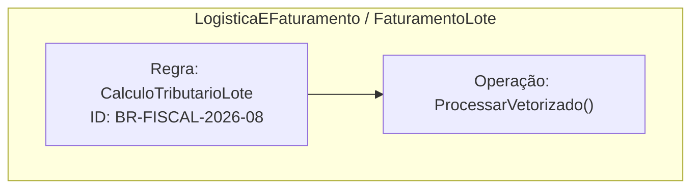

# Especificação Arquitetural e Dicionário de Domínio: ProcessamentoFaturamentoLote

## 1. Metadados de Governança (ISO/IEC/IEEE 42010)

| Atributo | Valor |
| :--- | :--- |
| **Domínio** | LogisticaEFaturamento |
| **Subdomínio** | FaturamentoLote |
| **Camada** | Dominio |
| **Versão** | 2.2.0 |
| **Autor** | Lucas Thomaz |
| **SLO Latência** | 15ms |
| **Conformidade** | SOX-404, LGPD-Art7 |

> **Compatibilidade:** programa declara `VERSAO_LINGUAGEM "2.2"`.

## 2. Estruturas de Dados e Layout Colunar

### Estrutura: `ItemFatura` *(Layout Colunar / SIMD)*

| Campo | Tipo |
| :--- | :--- |
| `id_transacao` | `UUID` |
| `codigo_produto` | `TEXTO` |
| `quantidade` | `NATURAL32` |
| `valor_unitario` | `DECIMAL(12,4)` |
| `aliquota_imposto` | `DECIMAL(5,2)` |
| `valor_total_liquido` | `DECIMAL(14,4)` |

**Invariantes (`INVARIANTE`):**

- `valor_total_liquido >= 0.0000`

## 4. Regras de Negócio e Contratos Formais

### Regra: `CalculoTributarioLote` (ID: `BR-FISCAL-2026-08`)

- **Rastreio:** `REQ-FISCAL-9102`
- **Descrição:** Aplica isenção para insumos essenciais e calcula ICMS/PIS/COFINS em lote vetorizado.

**Pré-condições (`EXIGE`):**

- `itens.quantidade > 0`
- `itens.valor_unitario >= 0.0000`

**Pós-condições (`GARANTE`):**

- `itens.valor_total_liquido >= 0.0000`

**Operação:** `ProcessarVetorizado(itens: FATIA[ItemFatura]) : DECIMAL(18,4)` — corpo executável com 3 comando(s)

## 5. Diagrama de Fluxo e Arquitetura Viva

