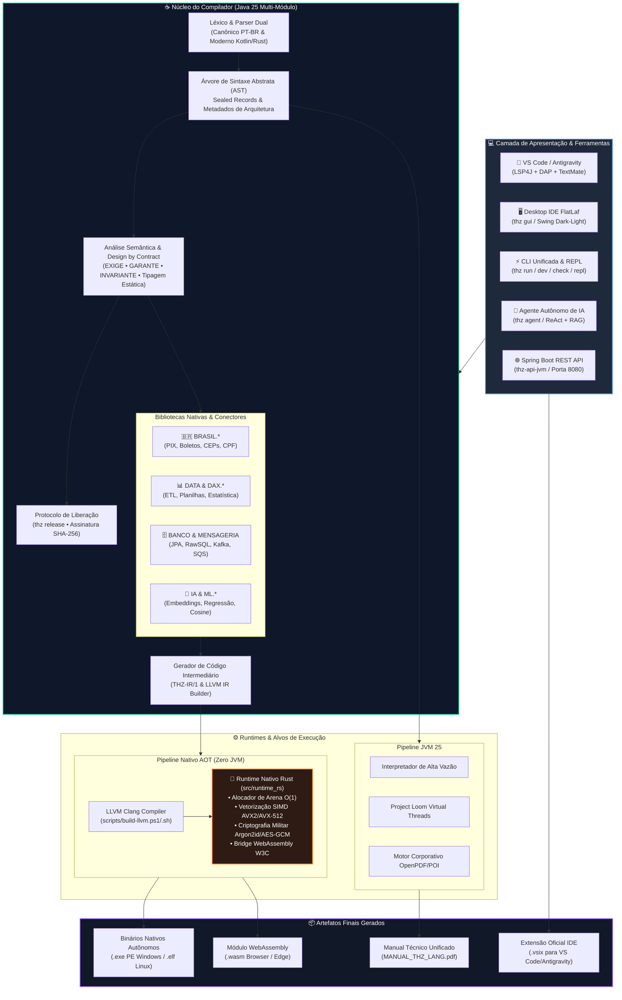

# THZ-LANG

<div align="center">

[](https://github.com/thz-lang/thz-lang/actions/workflows/ci.yml)
[](LICENSE)
[](https://openjdk.org/projects/jdk/25/)
[](src/runtime_rs)
[](https://llvm.org/)
[](docs/DOCKER_PODMAN_DEVCONTAINER.md)
[](.devcontainer/devcontainer.json)
[](version.txt)
[](#-visão-geral)

### A Linguagem Corporativa para Sistemas Críticos, Governança Viva e Dados em Escala

**Aritmética Financeira Exata (ISO/IEC 10967) • Design by Contract • Memória em Arena $O(1)$ • SIMD AVX-512 • Paradigma Dual • AOT Nativo • IA On-Device**

---

[Visão Geral](#-visão-geral) •
[O Que Torna o THZ Único?](#-o-que-torna-o-thz-único) •
[Arquitetura do Ecossistema](#-arquitetura-do-ecossistema) •
[O Showcase One-Shot](#-o-showcase-one-shot-todos-os-recursos-em-ação) •
[Paradigma Dual](#-paradigma-dual-corporativo-vs-moderno) •
[Quick Start](#-quick-start-em-3-passos) •
[CLI & Ferramentas](#-manual-de-comandos-da-cli-17-comandos) •
[Mapa do Monorepo](#-estrutura-do-monorepo) •
[Documentação Completa](#-documentação-oficial)

</div>

---

## 🌟 Visão Geral

O **THZ-LANG** (`.thz`, `.thzui`) é uma linguagem de programação corporativa de sistemas projetada para eliminar o abismo histórico entre as **regras de negócio do mundo corporativo** e a **engenharia de software de ultra-alta performance**.

Tradicionalmente, empresas precisam escolher entre linguagens de alto nível legíveis (onde regras de negócio são expressivas, mas a performance e o controle de memória são limitados) ou linguagens de baixo nível (rápidas, porém excessivamente complexas para auditorias e analistas). O **THZ-LANG** resolve essa equação combinando:

1. **Governança e Contratos como Código:** Cláusulas executáveis de pré e pós-condições (`EXIGE`/`GARANTE`), invariantes e metadados arquiteturais de rastreabilidade (SOX, BACEN, LGPD) integrados nativamente na AST.
2. **Aritmética Financeira Determinística (ISO/IEC 10967 & ISO 4217):** Proibição categórica de ponto flutuante binário IEEE 754 para moedas e decimais, garantindo precisão absoluta com arredondamento bancário meio-par (*Half-Even*).
3. **Engenharia Orientada a Dados (DoD):** Alocação linear em Arenas contíguas descartáveis em $O(1)$, layout colunar *Structure of Arrays* (SoA) e laços vetorizados via instruções SIMD de hardware (AVX2/AVX-512).
4. **Paradigma Dual Moderno ("Kotlin/Rust Corporativo"):** Fluência completa tanto na clássica sintaxe corporativa estruturada em língua portuguesa quanto na moderna sintaxe concisa com chaves `{ ... }`, `fn`, `struct`, `var`, `val`, `=` e `:=`.
5. **Autonomia AOT e Soberania Tecnológica:** Compilação direta para código de máquina nativo (.exe / .elf) via LLVM Clang linkando com o runtime de alta performance em Rust (`src/runtime_rs`), sem qualquer dependência de JVM em produção.
6. **Tooling Industrial Completo:** Desktop IDE moderna em Swing FlatLaf, servidor LSP com depurador DAP nativo, assistente autônomo de código em terminal (`thz agent`) e protocolo oficial de liberação para produção (`thz release`).

---

## 💎 O Que Torna o THZ Único?

| Pilar | Abordagem Tradicional (Java / Python / Go) | Abordagem THZ-LANG | Benefício Real |
| :--- | :--- | :--- | :--- |
| **Aritmética Monetária** | `double`/`float` geram dízimas; `BigDecimal` gera overhead massivo no Heap | Inteiros escalados `DecimalFixo` e `i128` nativos com escala fixa | **Zero desvio financeiro** com velocidade de inteiros de hardware |
| **Contratos de Negócio** | Anotações `@Valid`, `assert` desligado ou `if` disperso | Cláusulas formais de primeira classe: `EXIGE`, `GARANTE`, `INVARIANTE` | **Auditoria 100% verificável** em tempo de compilação e execução |
| **Processamento Massivo** | `List<Objeto>` com ponteiros espalhados, cache misses e GC pauses | `LAYOUT_COLUNAR` (SoA), `USAR_BLOCO_MEMORIA` (Arena $O(1)$) e SIMD | **Vetorização AVX nativa** e descarte de memória contígua em 0ms |
| **Arquitetura Viva** | Documentação estática desatualizada no Confluence | `METADADOS_ARQUITETURA` e `RASTREIO_REQUISITO` compiláveis | **Rastreabilidade regulatória** (SOX, BACEN, LGPD) ligada ao código |
| **IA & Machine Learning** | Dependência de ecossistemas pesados em Python / C++ | Embeddings determinísticos e ML tabular on-device (`IA.*`, `ML.*`) | **Zero latência externa**, zero custos de API e soberania LGPD |
| **Entrega para Produção** | Deploys baseados em pipelines opacos de CI | Protocolo criptográfico `thz release` com evidências SHA-256 | **Laudo formal auditável** emitido a cada homologação |

---

## 🏛️ Arquitetura do Ecossistema

O THZ-LANG adota uma arquitetura unificada de camadas onde a **experiência do desenvolvedor**, o **núcleo de governança** e os **mecanismos de execução** operam em perfeita sintonia:



---

## 🔥 O Showcase One-Shot: Todos os Recursos em Ação!

Abaixo está um programa completo demonstrando em um único arquivo a expressividade, o rigor matemático e a engenharia de alta performance do **THZ-LANG**:

```thz
programa SistemaFinanceiroConsolidado {

    // 1. ARQUITETURA VIVA: Governança, Rastreio Regulatório e Metadados Formais
    metadados {
        SISTEMA: "LiquidacaoInstantanea"
        MODULO: "MotorTributarioESIMD"
        DOMINIO: "Financeiro"
        VERSAO: "0.4.0"
        SLO_LATENCIA_MS: 10
        CONFORMIDADE: "ISO-10967", "BACEN-Res4893", "LGPD-Art7"
    }

    // 2. ENGENHARIA ORIENTADA A DADOS (DoD): Layout Colunar (Structure-of-Arrays) para SIMD
    struct TransacaoLote LAYOUT_COLUNAR {
        id: String,
        cpfTitular: String,
        quantidade: Int,
        valorUnitario: Decimal(18, 2),
        aliquotaImposto: Decimal(5, 4),
        valorLiquido: Decimal(18, 2)
    }

    // 3. FUNÇÕES PURAS & DESIGN BY CONTRACT
    fn calcularTarifa(base: Decimal(18, 2)): Decimal(18, 2) = base * 0.0015

    regra ProcessarLoteFiscal {
        RASTREIO_REQUISITO: "REQ-PIX-2026"
        exige: tamanho(lote) > 0
        garante: lote.valorLiquido[0] >= 0.00

        operacao ExecutarCalculo(lote: TransacaoLote) {
            // 4. MEMÓRIA EM ARENA O(1): Alocação contígua sem Garbage Collection
            usar_bloco_memoria {
                
                // 5. VETORIZAÇÃO SIMD: Aceleração vetorial por hardware (AVX2 / AVX-512)
                vetorizar_para i de 0 ate tamanho(lote) - 1 passo_simd 8 {
                    var bruto = lote.quantidade[i] * lote.valorUnitario[i]
                    var imposto = bruto * lote.aliquotaImposto[i]
                    lote.valorLiquido[i] = bruto - imposto
                }

            }
        }
    }

    // 6. PROCEDIMENTO PRINCIPAL (PONTO DE ENTRADA)
    fn main(): Int {
        print "=== THZ-LANG v0.4.0: MOTOR EXECUTIVO & PERFORMANCE ==="

        // 7. BRASIL DIGITAL: Validação fiscal de documentos e geração de PIX EMVco
        var cpfValido = BRASIL.validarCPF("123.456.789-00")
        var payloadPix = BRASIL.gerarPix("chave@empresa.com.br", 1500.50, "SP", "PAGTO-01")
        print "Payload PIX Copia e Cola:"
        print payloadPix

        // 8. CONSULTAS TIPADAS INTEGRADAS (LINQ / Query DSL)
        var contasAprovadas = consultar Conta
                              onde saldo > 1000.00 e status = "ATIVO"
                              ordenar_por saldo desc
                              limite 10

        // 9. CONECTORES DE BANCO & MENSAGERIA DISTRIBUÍDA
        BANCO.executar("UPDATE parametros SET ultimo_processamento = CURRENT_TIMESTAMP")
        MENSAGERIA.publicar("topico.liquidacoes", "Lote processado com sucesso!")

        // 10. IA & MACHINE LEARNING ON-DEVICE (Zero Dependência de Python)
        var embedding1 = IA.embedding("Transação Financeira Suspeita")
        var embedding2 = IA.embedding("Transferência de Alto Valor")
        var similaridade = IA.similaridade(embedding1, embedding2)
        print "Similaridade Semântica Calculada On-Device:"
        print similaridade

        print "Processamento concluído com sucesso e conformidade ISO/IEC 10967 garantida."
        retorne 0
    }
}
```

> [!TIP]
> O código acima compila e executa **tanto no interpretador JVM 25** com Virtual Threads quanto em **binário nativo compilado AOT via LLVM Clang (.exe / .elf)**, linkando com o runtime Rust sem alteração de uma única linha de código.

---

## ⚖️ Paradigma Dual: Corporativo vs Moderno

O THZ-LANG entende que diferentes contextos exigem diferentes níveis de cerimônia. Por isso, a linguagem oferece **Paridade 1:1** entre o estilo clássico corporativo e o estilo moderno conciso:

<div align="center">

| Recurso | Estilo Corporativo Clássico (PT-BR) | Estilo Moderno ("Kotlin/Rust Corporativo") |
| :--- | :--- | :--- |
| **Declaração de Módulo** | `PROGRAMA NEGOCIO Faturamento ... FIM_PROGRAMA` | `programa Faturamento { ... }` |
| **Metadados de Arquitetura** | `METADADOS_ARQUITETURA ... FIM_METADADOS` | `metadados { ... }` |
| **Definição de Tipos** | `ESTRUTURA Pedido ... FIM_ESTRUTURA` | `struct Pedido { ... }` |
| **Declaração de Variável** | `VARIAVEL total : INTEIRO <- 100` | `var total: Int = 100` ou `var total = 100` |
| **Constante Imutável** | `CONSTANTE taxa : DECIMAL <- 0.05` | `val taxa: Decimal = 0.05` |
| **Funções & Expressões** | `FUNCAO somar(a: INT): INT ... FIM_FUNCAO` | `fn somar(a: Int, b: Int): Int = a + b` |
| **Condicionais** | `SE condicao ENTAO ... SENAO ... FIM_SE` | `se condicao { ... } senao { ... }` |
| **Laços de Repetição** | `PARA i DE 0 ATE 10 PASSO 1 ... FIM_PARA` | `para i de 0 ate 10 passo 1 { ... }` |
| **Saída no Console** | `EXIBA "Mensagem"` | `print "Mensagem"` |
| **Retorno de Função** | `RETORNE total` | `ret total` ou `retorne total` |

</div>

---

## ⚡ Quick Start em 3 Passos

### 1. Clonar o Repositório
```bash
git clone https://github.com/thz-lang/thz-lang.git
cd thz-lang
```

### 2. Verificar o Ambiente e Executar os Testes
O projeto conta com scripts multiplataforma e o wrapper oficial do Gradle:

```bash
# Diagnóstico completo do ambiente (Java 25, Clang, Rust, Node, etc.)
powershell -ExecutionPolicy Bypass -File scripts/health-check.ps1  # Windows
./scripts/health-check.sh                                         # Linux / macOS

# Executar a suíte de testes JUnit 5
./gradlew test
```

### 3. Rodar seu Primeiro Programa
```bash
# Execução na JVM com hot reload e análise semântica:
./gradlew cli --args="run exemplos/gestao_pedidos_moderno.thz"

# Iniciar a Desktop IDE moderna Swing + FlatLaf:
./gradlew gui

# Iniciar o Agente Autônomo de IA no terminal:
./gradlew cli --args="agent"
```

---

## 🛠️ Manual de Comandos da CLI (17 Comandos)

A ferramenta de linha de comando (`thz`) é a central de operações do ecossistema. Use `./gradlew cli --args="<comando>"` ou invoque o binário nativo `thz`:

```
┌────────────────────────────────────────────────────────────────────────┐
│                      THZ-LANG CLI COMMAND SUITE                        │
└────────────────────────────────────────────────────────────────────────┘
```

| Comando | Descrição | Sintaxe Típica |
| :--- | :--- | :--- |
| **`check`** | Análise léxica, sintática, verificação de contratos e lint | `thz check pedido.thz --estrito` |
| **`run`** | Execução rápida de programas (canônicos ou com `fn main`) | `thz run faturamento.thz` |
| **`dev`** | Servidor de desenvolvimento com Live Reload instantâneo | `thz dev faturamento.thz` |
| **`audit`** | Matriz de governança, auditoria e rastreabilidade com Git | `thz audit pedido.thz --git` |
| **`release`** / **`liberar`** | Protocolo de homologação com evidências e assinatura SHA-256 | `thz release fat.thz --dados homolog.json` |
| **`agent`** | Inicia o Agente Autônomo de IA para codificação e RAG | `thz agent --modelo llama3` |
| **`init`** | Inicializa um novo projeto criando o manifesto `thz.config.json` | `thz init meu_sistema` |
| **`compile`** | Compilação AOT de um arquivo para código de máquina nativo | `thz compile app.thz --alvo ambos` |
| **`compile-all`** | Compilação em lote de todos os programas do projeto | `thz compile-all` |
| **`fmt`** | Formatador de código idempotente | `thz fmt --escrever pedido.thz` |
| **`doc`** | Geração de documentação viva em Markdown e diagramas Mermaid | `thz doc pedido.thz --saida docs/` |
| **`ui`** | Renderizador e compilador de formulários `.thzui` em HTML5 | `thz ui tela.thzui --html` |
| **`ir`** | Inspeção da representação intermediária THZ-IR e LLVM IR | `thz ir app.thz --llvm` |
| **`ast`** | Dump estruturado da Árvore de Sintaxe Abstrata (AST) em JSON | `thz ast app.thz` |
| **`livro`** / **`manual`** | Compilação de todos os tratados técnicos em PDF unificado | `thz livro --saida dist/MANUAL.pdf` |
| **`repl`** | Shell interativo multi-linha com inspeção em tempo real | `thz repl` |
| **`gui`** | Inicialização da Desktop IDE Swing FlatLaf | `thz gui` |

---

## 🚀 Compilação Nativa AOT (Zero Dependência de JVM)

Para ambientes de produção com contêineres mínimos (`scratch`/`alpine`), o THZ-LANG disponibiliza compilação AOT que gera binários nativos autônomos linkando diretamente com o runtime em Rust:

```bash
# No Windows (PowerShell): Gera executável PE (.exe)
powershell.exe -ExecutionPolicy Bypass -File scripts/build-llvm.ps1 -ArquivoThz exemplos/gestao_pedidos_moderno.thz

# No Linux (Bash): Gera executável ELF (.elf)
./scripts/build-llvm.sh exemplos/gestao_pedidos_moderno.thz

# Executar o binário de código de máquina nativo gerado:
./dist/bin/gestao_pedidos_moderno.exe   # Windows
./dist/bin/gestao_pedidos_moderno.elf   # Linux
```

> [!NOTE]
> Os binários nativos gerados não contêm bytecode, não necessitam do runtime Java instalado e inicializam em menos de **3 milissegundos**, consumindo menos de **12 MB** de memória residente.

---

## 🐳 Docker, Podman & Dev Containers

Execute e desenvolva sem necessidade de instalar dependências locais:

```bash
# Subir a API REST e o ambiente em contêiner (auto-detecta Podman ou Docker):
npm run docker:up

# REPL interativo dentro do contêiner:
npm run docker:repl

# Testes automatizados dentro do contêiner:
npm run docker:test
```
👉 [Consulte o Guia Completo de Docker, Podman e Dev Containers](docs/DOCKER_PODMAN_DEVCONTAINER.md)

---

## 🧱 Estrutura do Monorepo

```
thz-lang/
├── compilador/                 # 🚀 Compilador Self-Hosted escrito em THZ (.thz)
├── exemplos/                   # 💡 Coleção canônica e moderna de exemplos reais
├── scripts/                    # 🛠️ Suíte multiplataforma de automação (.ps1 e .sh)
├── src/
│   └── runtime_rs/             # 🦀 Runtime Nativo Oficial em Rust com C ABI (Arena, SIMD, Crypto, WASM)
├── JVM/                        # ☕ Monorepo Java 25 (Gradle Composite Build)
│   ├── thz-core-jvm/           # Núcleo: Lexer, Parser, AST, Semântico, Runtime, DecimalFixo, IR, DAP
│   ├── thz-cli-jvm/            # CLI unificada (17 comandos), REPL e Dev Server
│   ├── thz-gui-jvm/            # Desktop IDE Swing FlatLaf (Editor, Gutter, Formulários)
│   ├── thz-lsp-jvm/            # Servidor LSP oficial (LSP4J)
│   ├── thz-agent-jvm/          # Agente Autônomo de IA em terminal (ReAct, RAG, Tools)
│   ├── thz-bench-jvm/          # Microbenchmarks de alta precisão JMH
│   └── thz-api-jvm/            # API REST Spring Boot para integração externa
├── Extensions/
│   └── thz-lsp-vscode/         # 🔌 Extensão oficial para VS Code e Antigravity IDE
├── docs/                       # 📖 Manuais técnicos formais, tratados arquiteturais e ADRs
└── dist/                       # 📦 Pacotes e binários finais gerados (.exe, .elf, .jar, .vsix, .pdf)
```

---

## 📖 Documentação Oficial

Explore a suíte completa de documentação técnica do ecossistema:

<div align="center">

| Categoria | Documento | Conteúdo Principal |
| :--- | :--- | :--- |
| **Fundamentos** | 📘 [**Manual Completo da Linguagem**](docs/MANUAL_LINGUAGEM.md) | Guia completo da sintaxe, tipagem, contratos e regras |
| **Arquitetura** | ⚙️ [**Arquitetura de Compilação Nativa**](docs/ARQUITETURA_COMPILACAO_NATIVA.md) | Tratado completo de IR/IL, LLVM Clang, GraalVM e AOT |
| **Performance** | 🧱 [**Runtime Nativo Rust**](docs/RUNTIME_NATIVO.md) | Rust C ABI, Arenas $O(1)$, SIMD AVX-512 e WASM |
| **Performance** | ⚡ [**Guia de Performance & Tuning**](docs/GUIA_PERFORMANCE.md) | Ajustes finos de SoA, SIMD, Arenas e métricas JMH |
| **Conectores** | 🗄️ [**Banco de Dados & Mensageria**](docs/CONECTORES_BANCO_E_MENSAGERIA.md) | ORM JPA-like, Raw SQL, Busca KNN, RabbitMQ, Kafka e SQS |
| **Inovação** | 🇧🇷 [**Brasil Digital & Snapshot Engine**](docs/BRASIL_DIGITAL_E_SNAPSHOT_ENGINE.md) | PIX EMVco, Boletos Febraban, CEPs offline `.thzdbi` e Snapshots |
| **Analytics** | 📊 [**Engenharia de Dados & Analytics**](docs/ENGENHARIA_DE_DADOS_E_ANALYTICS.md) | Módulos DAX, estatística descritiva, PROCV e sanitização |
| **Big Data** | 🌊 [**Pipelines de Dados Massivos**](docs/PIPELINE_DADOS.md) | Ingestão, transformação colunar e streaming reativo |
| **Interface** | 🖼️ [**DSL Visual TELA / .thzui**](docs/TELA_THZUI.md) | Construção declarativa de interfaces gráficas e WebView |
| **Tooling** | 🛠️ [**Manual de CLI & Ferramentas**](docs/CLI_E_TOOLING.md) | Referência completa dos 17 comandos da CLI e IDEs |
| **Conformidade**| 🏛️ [**Conformidade & Normas Técnicas**](docs/CONFORMIDADE_E_NORMAS.md) | Aderência a ISO/IEC 10967, ISO 4217, ISO 42010 e LGPD |
| **Decisões** | 📚 [**ADRs (Registros Arquiteturais)**](docs/ADRs/README.md) | 6 decisões formais (LLVM, Arenas, i128, FlatLaf, Sintaxe...) |
| **Estratégia** | 🗺️ [**Roadmap Estratégico**](docs/ROADMAP.md) | Os 5 pilares de evolução técnica rumo à v1.0.0 estável |
| **Governança** | 📦 [**Changelog Oficial**](CHANGELOG.md) | Histórico de releases em conformidade com SemVer 2.0.0 |
| **Comunidade** | 🤝 [**Guia de Contribuição**](CONTRIBUTING.md) | Normas e diretrizes para colaboradores e desenvolvedores |

</div>

---

## ⚖️ Licença

Este projeto está licenciado sob a [Licença MIT](LICENSE) — livre para uso corporativo, acadêmico e comercial.
