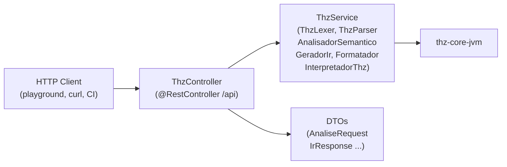

# API REST — Spring Boot (`thz-api-jvm`)

> **THZ-LANG como serviço.** `JVM/thz-api-jvm` expõe o mesmo `ThzService` usado pela CLI/LSP via REST — `POST /api/analyze|hover|ast|format|doc|audit|ir|simd|run` + `GET /api/health` — para `playground/`, CI, e integração com qualquer cliente HTTP.

Referências: `JVM/thz-api-jvm/src/main/java/thz/lang/api/controller/ThzController.java:1`, `JVM/thz-api-jvm/src/main/java/thz/lang/api/service/ThzService.java`, `JVM/thz-api-jvm/src/main/java/thz/lang/api/dto/*.java`, `docs/CLI_E_TOOLING.md:23`.

---

## 1. Arquitetura



- **Controller:** `ThzController.java:22` `@RestController @RequestMapping("/api")` injeção `ThzService` + `jakarta.validation.Valid`.
- **Service:** `ThzService.java` — orquestra `ThzLexer.tokenize()` → `ThzParser.parse()` → `AnalisadorSemantico.analisar()` → `GeradorIr`/`Formatador`/`AuditorGovernanca`/`InterpretadorThz` — mesmo pipeline de `ThzCompilerDriver.java:44`.
- **DTOs:** `JVM/thz-api-jvm/src/main/java/thz/lang/api/dto/` — `AnaliseRequest/Response`, `AstResponse`, `AuditoriaResponse`, `DocumentacaoResponse`, `ExecucaoRequest/Response`, `FormatacaoRequest/Response`, `HealthResponse`, `HoverRequest/Response`, `IrResponse`, `SimdResponse`, `SimdResultadoApi`, `DiagnosticoApi`, `SimboloApi`.

---

## 2. Endpoints — 11 rotas

| Método | Rota | Request DTO | Response DTO | Equivalente CLI | O que faz |
| :--- | :--- | :--- | :--- | :--- | :--- |
| `POST` | `/api/analyze` | `AnaliseRequest(codigo, lintEstrito?)` | `AnaliseResponse(diagnosticos, textoDiagnosticos, temErros, simbolos, astJson)` | `thz check` | Léxico+sintático+semântico + symbols |
| `POST` | `/api/hover` | `HoverRequest(codigo, linha, coluna)` | `HoverResponse(conteudo, range)` | LSP hover | Info da palavra sob cursor |
| `POST` | `/api/ast` | `AnaliseRequest` | `AstResponse(astJson, nomePrograma)` | `thz ast` | AST JSON |
| `POST` | `/api/format` | `FormatacaoRequest(codigo)` | `FormatacaoResponse(resultado, alterou)` | `thz fmt` | Formatação canônica |
| `POST` | `/api/doc` | `AnaliseRequest` | `DocumentacaoResponse(markdown)` | `thz doc` | Markdown + Mermaid |
| `POST` | `/api/audit` | `AnaliseRequest` | `AuditoriaResponse(relatorioJson, markdown)` | `thz audit` | Governança + RASTREIO_REQUISITO |
| `POST` | `/api/ir` | `AnaliseRequest` | `IrResponse(irJson, llvm)` | `thz ir` / `thz ir --llvm` | THZ-IR `thz-ir/1` + LLVM `.ll` |
| `POST` | `/api/simd` | `AnaliseRequest` | `SimdResponse(resultados: List<SimdResultadoApi>)` | `thz ir` (loopsSimd) | R1-R5 `ValidadorSimd` |
| `POST` | `/api/run` | `ExecucaoRequest(codigo, argumentos?)` | `ExecucaoResponse(saida, erros, resultado)` | `thz run` | Executa via `InterpretadorThz` |
| `GET` | `/api/health` | — | `HealthResponse(status:"UP", versao:"2.3.3", javaVersion, modulo:"thz-core-jvm")` | — | Liveness |
| `GET` | `/api` | — | 404 | — | — |

### 2.1 Exemplos `curl`

```bash
# Health
curl http://localhost:8080/api/health
# {"status":"UP","versao":"2.3.3","javaVersion":"25","modulo":"thz-core-jvm"}

# Analyze (thz check)
curl -X POST http://localhost:8080/api/analyze \
  -H "Content-Type: application/json" \
  -d '{"codigo":"PROGRAMA NEGOCIO X\nFIM_PROGRAMA","lintEstrito":false}'

# IR + LLVM
curl -X POST http://localhost:8080/api/ir \
  -H "Content-Type: application/json" \
  -d '{"codigo":"PROGRAMA NEGOCIO X\nFIM_PROGRAMA"}' | jq '.llvm'

# Run
curl -X POST http://localhost:8080/api/run \
  -H "Content-Type: application/json" \
  -d '{"codigo":"PROGRAMA NEGOCIO X\nPROCEDIMENTO Principal()\nINICIO\n EXIBA \"ola\"\nFIM\nFIM_PROGRAMA"}'

# Audit
curl -X POST http://localhost:8080/api/audit \
  -H "Content-Type: application/json" \
  -d '{"codigo":"PROGRAMA NEGOCIO X\nMETADADOS_ARQUITETURA\n SISTEMA: \"S\"\nFIM_METADADOS\nFIM_PROGRAMA"}' | jq '.markdown'
```

---

## 3. Rodar local

```bash
# Dev (Spring Boot)
./gradlew :thz-api-jvm:bootRun  # http://localhost:8080

# JAR
./gradlew :thz-api-jvm:bootJar  # JVM/thz-api-jvm/build/libs/thz-api-jvm-2.3.3.jar
java -jar JVM/thz-api-jvm/build/libs/thz-api-jvm-2.3.3.jar

# Docker (após build)
docker build -f JVM/thz-api-jvm/Dockerfile -t thz-api .
docker run -p 8080:8080 thz-api

# Teste
./gradlew :thz-api-jvm:test  # ThzApiServiceTest.java
curl http://localhost:8080/api/health
```

Config: `JVM/thz-api-jvm/src/main/resources/application.properties` — `server.port=8080`, CORS (`CorsConfig.java`) para `playground/` (`Vite + Monaco`).

---

## 4. Playground — Consumidor principal

`playground/` (`Vite + Monaco + Monarch`, `TODO.md:9` G2) chama `POST /api/analyze|run|ir|audit` direto do browser — sem `thz.exe` local. `ThzLangWeb.java`/`ThzWebViewBridge.java` também usam `ThzService` para `WEBVIEW` em `thz gui`.

---

## 5. Erros e validação

- **400** — `MethodArgumentNotValidException` se `codigo` null/vazio (`@Valid` em `ThzController.java:39`).
- **500** — exceção não tratada em `ThzService` (ex.: `AnalisadorSemantico` com `modoEstrito` e `METADADOS` ausente).
- **CORS** — `CorsConfig.java` libera `http://localhost:5173` (Vite) + `*` para playground.

---

> **Próximo:** [`LSP_VSCODE.md`](LSP_VSCODE.md) (mesmo `ThzService` via LSP), [`PIPELINE_DADOS.md`](PIPELINE_DADOS.md) (o que `POST /api/run` executa em lote).

