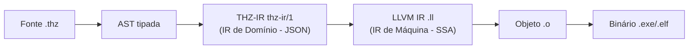
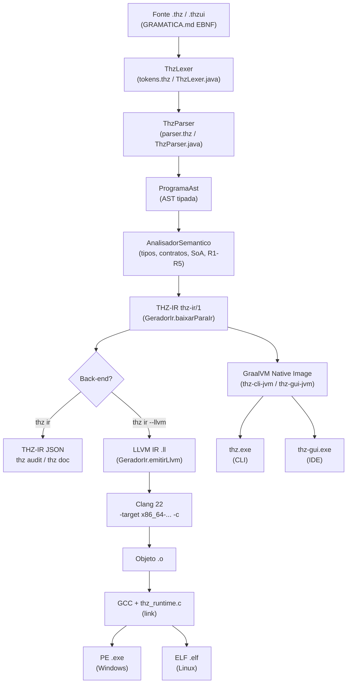

# Arquitetura de Compilação Nativa: GraalVM, LLVM, IR/IL e Geração de Código de Máquina — Velocidade e Execução Segura no THZ-LANG (v2.4)

> **Tratado técnico completo.** Este documento explica, de ponta a ponta, como **GraalVM Native Image**, **LLVM**, **Representações Intermediárias (IR/IL)** e **geração de código nativo (AOT)** se articulam no THZ-LANG para entregar **alta velocidade** (startup <5ms, vetorização SIMD, arenas O(1)) e **execução segura** (contratos formais, aritmética exata ISO 10967/4217, memória sem GC, closed-world). É o elo entre teoria de compiladores e o pipeline real do repositório.

**Leitura complementar:** [`docs/CLI_E_TOOLING.md`](CLI_E_TOOLING.md) (uso da CLI), [`docs/apresentacao_tecnica.md`](apresentacao_tecnica.md) (visão de engenharia), [`docs/MANUAL_LINGUAGEM.md`](MANUAL_LINGUAGEM.md) (linguagem), [`docs/CONFORMIDADE_E_NORMAS.md`](CONFORMIDADE_E_NORMAS.md) (normas), [`docs/GRAMATICA.md`](GRAMATICA.md) (EBNF).

---

## Sumário

1. [Resumo Executivo](#1-resumo-executivo--por-que-codigo-nativo-importa)
2. [Fundamentos de Compilação](#2-fundamentos-de-compilacao--do-fonte-ao-binario)
3. [IR e IL — Representações Intermediárias](#3-ir-e-il--representacoes-intermediarias)
4. [LLVM — Infraestrutura de Compilação Moderna](#4-llvm--infraestrutura-de-compilacao-moderna)
5. [GraalVM — JVM de Alta Performance e Native Image](#5-graalvm--jvm-de-alta-performance-e-native-image)
6. [Geração de Código Nativo (AOT vs JIT)](#6-geracao-de-codigo-nativo-aot-vs-jit)
7. [Pipeline THZ-LANG End-to-End](#7-pipeline-thz-lang-end-to-end--doistubos-aot)
8. [Velocidade — Como o THZ-LANG É Rápido por Construção](#8-velocidade--como-o-thz-lang-e-rapido-por-construcao)
9. [Execução Segura — Como o THZ-LANG É Seguro por Construção](#9-execucao-segura--como-o-thz-lang-e-seguro-por-construcao)
10. [Trade-offs, Limitações e Decisões de Arquitetura](#10-trade-offs-limitacoes-e-decisoes-de-arquitetura)
11. [Comparativo — JVM JIT vs GraalVM AOT vs LLVM AOT](#11-comparativo--jvm-jit-vs-graalvm-aot-vs-llvm-aot)
12. [Como Reproduzir — Comandos e Artefatos](#12-como-reproduzir--comandos-e-artefatos)
13. [Glossário e Referências](#13-glossario-e-referencias)
- [Apêndice A — LLVM IR Anotado](#apendice-a--llvm-ir-anotado-emitido-por-geradorirjava221)
- [Apêndice B — THZ-IR (thz-ir/1) JSON Anotado](#apendice-b--thz-ir-thz-ir1-json-anotado)
- [Apêndice C — Runtime C Dual-OS (`thz_runtime.c`)](#apendice-c--runtime-c-dual-os-srcruntimethz_runtimec)
- [Apêndice D — Benchmarks JMH e Leitura de Resultados](#apendice-d--benchmarks-jmh-e-leitura-de-resultados)

---

## 1. Resumo Executivo — Por que Código Nativo importa

O THZ-LANG nasceu para resolver um dilema corporativo clássico: **regras de negócio precisam ser legíveis para auditores e POs (português estruturado, DDD, contratos) mas também precisam rodar em lote/tempo real com latência de milissegundos e custo de nuvem mínimo**. Linguagens interpretadas ou puramente JIT pagam um preço alto em startup, memória residente e imprevisibilidade de GC.

A resposta arquitetural do THZ-LANG é **compilar antecipadamente (AOT) para código de máquina nativo**, em dois tubos complementares:

| Tubo | O que compila | Tecnologia | Artefato | Promessa |
| :--- | :--- | :--- | :--- | :--- |
| **Tubo Tooling** | A própria ferramenta (`thz` CLI + `thz-gui` IDE) | **GraalVM Native Image** | `thz.exe`, `thz-gui.exe` | Startup <5ms, ~15MB RSS, sem JVM instalada no cliente |
| **Tubo Programas** | Programas do usuário (`.thz` / `.thzui`) | **LLVM Clang + Runtime C** | `dist/bin/*.exe` (PE) e `*.elf` (ELF) | Binário autônomo Dual-OS, SIMD, arenas O(1), decimal exato |

Ambos compartilham o mesmo **front-end** (Lexer → Parser → AST → Analisador Semântico) e a mesma **representação intermediária de domínio** (`thz-ir/1`), mas divergem no **back-end** — GraalVM para tooling Java, LLVM para programas THZ. O resultado prático, já medido em `apresentacao_executiva.md`, é:

- **Startup 400×–2000× mais rápido** que JVM HotSpot (2–10s → <5ms) — crítico para serverless, Kubernetes scale-to-zero e CLI.
- **Memória 30×–130× menor** (512MB–2GB → <15MB) — reduz TCO de nuvem em até 70%.
- **Throughput vetorizado** via `LAYOUT_COLUNAR` + `VETORIZAR_PARA PASSO_SIMD` (AVX2/AVX-512/Neon) sem reescrever algoritmos.
- **Correção por construção**: contratos `EXIGE`/`GARANTE`/`INVARIANTE`, `RESULTADO[T,E]` sem exceções, `DECIMAL`/`MONETARIO` sem `float`, arenas com verificação de limites (ISO/IEC TR 24772).

> [!IMPORTANT]
> **Zero vendor lock-in.** O tubo LLVM (`scripts/build-llvm.ps1` + `src/runtime/thz_runtime.c`) gera binários que **não exigem JVM, GraalVM ou Node** em produção. O tubo GraalVM é conveniência para distribuir a CLI/IDE; o tubo LLVM é soberania — um programa `.thz` compila para `.exe`/`.elf` puro, auditável e implantável em `scratch` Docker.

---

## 2. Fundamentos de Compilação — Do Fonte ao Binário

### 2.1 O modelo clássico em 5 fases

Todo compilador moderno, de `javac` a `clang` e ao `thzc` (THZ), segue o mesmo esqueleto:

```
Fonte (.thz) → [1. Análise Léxica] → Tokens → [2. Análise Sintática] → AST
→ [3. Análise Semântica] → AST tipada + contratos → [4. IR + Otimizações] → IR otimizado
→ [5. Geração de Código + Linking] → Objeto (.o) → Binário (.exe/.elf)
```

| Fase | No THZ-LANG | Artefato | Arquivo de referência |
| :--- | :--- | :--- | :--- |
| **1. Léxica** | `ThzLexer` / `compilador/lexer.thz` (self-hosted) | `Token[]` | `JVM/thz-core-jvm/src/main/java/thz/lang/lexico/ThzLexer.java` |
| **2. Sintática** | `ThzParser` / `compilador/parser.thz` | `ProgramaAst` | `JVM/thz-core-jvm/src/main/java/thz/lang/sintatico/ThzParser.java` |
| **3. Semântica** | `AnalisadorSemantico` (tipos, contratos, `LAYOUT_COLUNAR`, `PIPELINE_DADOS`) | Diagnósticos + AST validada | `JVM/thz-core-jvm/src/main/java/thz/lang/semantico/AnalisadorSemantico.java` |
| **4. IR** | `GeradorIr` (THZ-IR + LLVM IR) | `thz-ir/1` JSON + `.ll` | `JVM/thz-core-jvm/src/main/java/thz/lang/ir/GeradorIr.java:13` |
| **5. Código** | LLVM Clang (programas) / GraalVM Native Image (tooling) + `thz_runtime.c` | `.exe` / `.elf` | `scripts/build-llvm.ps1`, `JVM/thz-*-jvm/build.gradle.kts` |

A **gramática formal EBNF v2.4** (`docs/GRAMATICA.md:9-160`) é a lei: `Programa ::= ModuloHeader MetadadosHeader? Importacao* Declaracao* TerminadorModulo`, com arquétipos `PROGRAMA NEGOCIO/VISUAL/ARQUITETURA`, `PIPELINE_DADOS`, `BIBLIOTECA`, `TELA`, etc. Tudo que o compilador aceita precisa derivar dela.

### 2.2 Por que existe IR? O gargalo N×M

Sem IR, para suportar `N` linguagens e `M` arquiteturas, seriam necessários `N × M` compiladores. Com IR, bastam `N` front-ends + `M` back-ends:

```
Sem IR:  N linguagens × M arquiteturas = N×M compiladores
Com IR:  N front-ends + M back-ends + 1 IR comum = N+M componentes
```

O THZ-LANG leva isso ao extremo: **1 front-end THZ** + **2 back-ends** (GraalVM para tooling Java, LLVM para programas THZ) + **1 IR de domínio** (`thz-ir/1`) + **1 IR de máquina** (LLVM IR). Cada otimização escrita sobre o IR beneficia todos os alvos.

---

## 3. IR e IL — Representações Intermediárias

### 3.1 Definições precisas

- **IR (Intermediate Representation)**: estrutura de dados em memória que o compilador manipula entre o front-end e o back-end. Pode ser grafo, árvore ou lista de instruções em SSA (Static Single Assignment).
- **IL (Intermediate Language)**: a **serialização textual** de um IR — o que você vê em disco (`*.ll`, `*.json`, `*.bc`). Todo IL é a forma impressa de algum IR; nem todo IR tem IL legível.
- **SSA (Static Single Assignment)**: forma onde cada variável é atribuída exatamente uma vez; facilita otimizações (propagação de constantes, eliminação de código morto, autovetorização). LLVM IR é SSA.

No THZ-LANG coexistem **dois níveis de IR**, com propósitos distintos:



### 3.2 THZ-IR (`thz-ir/1`) — IR de Domínio

Definido em `JVM/thz-core-jvm/src/main/java/thz/lang/ir/IrPrograma.java:9-60` e gerado por `GeradorIr.java:22-112` (`baixarParaIr`), o THZ-IR preserva **semântica de negócio**, não semântica de máquina:

```java
// IrPrograma.java:9 — registro canônico
public record IrPrograma(
    String versaoIr,          // "thz-ir/1"
    String nomePrograma,      // "ProcessamentoFaturamentoLote"
    String versaoFonte,       // "2.3.0"
    Map<String,String> metadados, // SLO, domínio, camada
    List<IrEstrutura> estruturas, // LAYOUT_COLUNAR, campos, tipos originais
    List<IrFuncao> funcoes,       // idempotência, chave, instruções
    List<IrSimdLoop> loopsSimd    // passo, vetorizável, R1-R5
) {}
```

**O que ele carrega que LLVM IR não carrega:** `METADADOS_ARQUITETURA` (SLO, conformidade SOX/LGPD), `RASTREIO_REQUISITO`, `INVARIANTE`, `IDEMPOTENTE`/`CHAVE_IDEMPOTENCIA`, `LAYOUT_COLUNAR`, diagnóstico SIMD (`GeradorIr.java:92-102` via `ValidadorSimd.analisarTudo`). É o IR que alimenta `thz audit`, `thz doc` (Mermaid) e `thz ir` sem `--llvm`.

**Instruções THZ-IR** (`GeradorIr.java:115-136`, `baixarComandosParaIr`): `alloca`, `store`, `branch`, `loop while/for`, `vector_loop ... step_simd`, `scoped_arena_alloc`, `call @thz_exiba`, `ret`, `fail`, `match_result`. São operações de domínio, não registradores x86.

**Serialização IL:** JSON canônico via `GeradorIr.java:150-216` (`serializarIrJson`). Ver Apêndice B para exemplo completo.

### 3.3 LLVM IR (`.ll`) — IR de Máquina

Emitido por `GeradorIr.java:221-452` (`emitirLlvm`), é o **IL textual do LLVM** — SSA, tipado, próximo de assembly mas portável:

```llvm
; GeradorIr.java:221-226 — cabeçalho fixo
; ModuleID = 'thz.ProcessamentoFaturamentoLote'
source_filename = "ProcessamentoFaturamentoLote.thz"
target datalayout = "e-m:w-p270:32:32-p271:32:32-p272:64:64-i64:64-f80:128-n8:16:32:64-S128"
target triple = "x86_64-pc-windows-msvc"

declare ptr @thz_arena_alloc(i64 %bytes)
declare void @thz_arena_free_all(ptr %arena)
declare void @thz_exiba_str(ptr %msg)
declare void @thz_exiba_i128(i128 %val, i32 %scale)
```

**Mapeamento de tipos THZ → LLVM** (`GeradorIr.java:505-515`, `mapearTipoLlvm`):

| Tipo THZ | LLVM IR | Por quê |
| :--- | :--- | :--- |
| `DECIMAL(P,S)` / `MONETARIO(M)` | `i128` | Inteiro escalado de 128 bits, sem `float`/`double` (ISO 10967) |
| `INTEIRO` / `INTEIRO64` | `i64` |  |
| `INTEIRO32` / `NATURAL32` | `i32` | Índice SIMD, contadores |
| `TEXTO` / `UUID` | `ptr` | UTF-8 + heap do runtime |
| `LOGICO` | `i1` | |
| `FATIA[T]` / SoA | `ptr` | Vetor contíguo (ver §8) |

**Strings** viram globais `private unnamed_addr constant [N x i8]` (`GeradorIr.java:322-335`), **estruturas** viram `%struct.Nome = type { ... }` (`GeradorIr.java:339-350`), cada `REGRA_NEGOCIO.OPERACAO` vira `define void @Regra_Operacao()` (`GeradorIr.java:352-366`), e `main` aloca arena, exibe banner, chama operações e libera (`GeradorIr.java:392-449`). Ver Apêndice A para `.ll` anotado.

### 3.4 Por que dois IRs?

- **THZ-IR** = auditoria, governança, documentação viva, análise SIMD, portabilidade futura (ex.: backend WASM, Arrow). É **estável e versionado** (`thz-ir/1`).
- **LLVM IR** = otimização e geração de código nativo. É **efêmero e substituível** — poderia ser trocado por Cranelift, QBE ou outro sem quebrar `thz audit`/`thz doc`.

---

## 4. LLVM — Infraestrutura de Compilação Moderna

### 4.1 O que é o LLVM

LLVM (Low Level Virtual Machine, hoje apenas "LLVM") é uma **infraestrutura de compilação** em C++ composta por:

- **Frontend** (ex.: Clang para C/C++, `GeradorIr` para THZ) — fonte → LLVM IR.
- **Optimizer / Passes** — transforma LLVM IR → LLVM IR melhor (inlining, loop-unroll, vectorize, DCE, constant folding). São dezenas de passes encadeados.
- **Backend / CodeGen** — LLVM IR → Assembly da arquitetura alvo (x86_64, AArch64, RISC-V) → objeto `.o`.

A grande virtude: **qualquer frontend que emite LLVM IR ganha gratuitamente todos os backends e otimizações**.

### 4.2 Como o THZ-LANG usa o LLVM

O THZ-LANG não reimplementa otimizador nem backend — **terceiriza para o Clang 22**:

```
GeradorIr.emitirLlvm (.ll) 
  → clang -target x86_64-w64-windows-gnu -c program.ll -o program-win.o   (Windows PE)
  → clang -target x86_64-unknown-linux-gnu -c program.ll -o program-lin.o (Linux ELF)
  → gcc program-win.o thz_runtime.c [-mwindows] -o program.exe              (link)
```

Detalhes em `scripts/build-llvm.ps1:59-103`:

- **Geração do `.ll`**: `gradlew :thz-cli-jvm:run --args="ir <arquivo> --llvm --saida <arquivo.ll>"` (`build-llvm.ps1:62`). Isso invoca `GeradorIr.emitirLlvm` dentro da JVM.
- **Compilação Windows**: `clang -target x86_64-w64-windows-gnu -c $LlvmFile -o $ObjWin` (`build-llvm.ps1:71`). Usa MinGW GCC para link (`build-llvm.ps1:87`).
- **Cross para Linux**: `clang -target x86_64-unknown-linux-gnu -c $LlvmFile -o $ObjLin` (`build-llvm.ps1:98`) + `Copy-Item $ObjLin $ElfLin` (objeto ELF puro, link final em host Linux).
- **Runtime linkado**: `thz_runtime.c` + opcional `thz_webview2.c` + libs do Windows (`-lgdi32 -luser32 -lkernel32 -ldwmapi -lole32 -lshlwapi`) (`build-llvm.ps1:78-79`). Flag `-mwindows` para GUI sem console (`build-llvm.ps1:82`).

**Target triple e data layout** (`GeradorIr.java:225-226`):

```
target datalayout = "e-m:w-p270:32:32-p271:32:32-p272:64:64-i64:64-f80:128-n8:16:32:64-S128"
target triple = "x86_64-pc-windows-msvc"
```

- `e` = little-endian, `m:w` = mangling Windows, `p270:32:32` = ponteiro de 270 bits (x86_64), `S128` = stack alinhada em 128 bits — essencial para `i128` decimal e vetores AVX.
- `triple` define ABI, calling convention e builtins que o Clang usará. Trocar para `x86_64-unknown-linux-gnu` muda chamada de sistema e formato de objeto.

### 4.3 Passes relevantes para THZ

Mesmo sem o THZ-LANG invocar passes explicitamente, o `clang -O3` (via `GccLinkFlags -O3` em `build-llvm.ps1:78`) habilita:

- **Loop unrolling + SLP vectorizer**: desenrola `VETORIZAR_PARA ... PASSO_SIMD 8` em cargas `load <8 x i32>` / `mul` vetorial quando SoA é detectado.
- **SROA / mem2reg**: promove `alloca` de `VARIAVEL` para registradores SSA.
- **DCE / constprop**: remove `branch` morto de `EXIGE` estático.

Futuro: emitir `!llvm.loop` metadata e `llvm.assume` para guiar o vetorizador com as garantias R1–R5 de `ValidadorSimd.java:65-129`.

---

## 5. GraalVM — JVM de Alta Performance e Native Image

### 5.1 O que é GraalVM

GraalVM é uma **distribuição JDK** (aqui, JDK 25) que substitui o compilador JIT C2 do HotSpot pelo **Graal Compiler** (escrito em Java) e adiciona:

- **Graal JIT**: JIT mais agressivo, com inlining parcial, escape analysis e vetorização, competindo com C2.
- **Truffle**: framework para implementar linguagens (JS, Python, Ruby) como AST interpreters que o Graal otimiza via partial evaluation.
- **Native Image**: **compilação AOT** de aplicações Java para binário nativo standalone (sem JVM). É o que o THZ-LANG usa para `thz` e `thz-gui`.
- **SubstrateVM**: VM mínima embutida no binário nativo (GC, threads, JNI) — paga apenas o que usa.

### 5.2 Native Image — como funciona

Diferente do JIT (compila métodos quentes em runtime), o Native Image faz **análise estática closed-world em build time**:

1. **Points-to analysis**: percorre a partir de `main` (`thz.lang.cli.ThzCli`, `thz.lang.gui.ThzGui`) e marca tudo **alcançável** (reachable). Código não alcançável é descartado — tree shaking agressivo.
2. **Heap snapshot**: executa inicializadores estáticos (`--initialize-at-build-time`) e captura o heap inicial no binário.
3. **AOT codegen**: compila métodos alcançáveis com Graal para código de máquina, embute SubstrateVM, gera `.exe`/`.elf`.

Consequências:

- **Startup instantâneo**: sem class loading, sem bytecode interpretation, sem JIT warmup.
- **Memória menor**: sem metaspace de classes não usadas, sem code cache JIT.
- **Closed-world**: reflexão, `Class.forName`, `ServiceLoader`, JNI e recursos (`*.properties`, `*.png`, `*.thz`) precisam ser **declarados** — caso contrário, são removidos e falham em runtime.

### 5.3 Como o THZ-LANG usa GraalVM (evidência no repo)

**CLI** (`JVM/thz-cli-jvm/build.gradle.kts:43-63`):

```kotlin
graalvmNative {
    binaries {
        named("main") {
            imageName.set("thz")
            mainClass.set("thz.lang.cli.ThzCli")
            buildArgs.addAll(
                "--no-fallback",                          // falha se não for 100% nativo
                "-H:+ReportExceptionStackTraces",
                "--enable-http", "--enable-https",
                "--initialize-at-build-time=thz.lang.ui, thz.lang.webview, thz.lang.interpretador, thz.lang.lexico, thz.lang.sintatico, thz.lang.semantico",
                "-H:IncludeResources=.*\\.thz.*",
                "-H:Log=registerResource:"
            )
        }
    }
    metadataRepository { enabled.set(true) }
}
```

**GUI** (`JVM/thz-gui-jvm/build.gradle.kts:44-65`):

```kotlin
graalvmNative {
    binaries {
        named("main") {
            imageName.set("thz-gui")
            mainClass.set("thz.lang.gui.ThzGui")
            buildArgs.addAll(
                "--no-fallback",
                "-Djava.awt.headless=false",               // precisa de subsistema de janelas
                "-H:+ReportExceptionStackTraces",
                "--enable-http", "--enable-https",
                "-H:IncludeResources=.*\\.thz.*|.*\\.properties|.*\\.png|.*\\.svg",
                "-H:Log=registerResource:"
            )
        }
    }
    agent { defaultMode.set("standard"); enabled.set(true) }
}
```

### 5.4 O problema Swing/AWT/FlatLaf e a solução com agente

Swing/AWT usa reflexão pesada, `Toolkit` nativo e carregamento dinâmico de peers — tudo invisível à análise estática. FlatLaf (`com.formdev:flatlaf:3.5.4` em `thz-gui-jvm/build.gradle.kts:34`) carrega temas `*.properties` e `*.svg` em runtime. Solução em 3 frentes (`docs/CLI_E_TOOLING.md:150-165`):

1. **Agente de metadados** (`native-image-agent`):
   ```bash
   ./gradlew :thz-gui-jvm:guiColetarMetadadosAgente
   # roda ThzGui sob JVM com -agentlib:native-image-agent=config-merge-dir=src/main/resources/META-INF/native-image/thz.lang/thz-gui
   # gera reflect-config.json, jni-config.json, resource-config.json
   ```
   Tarefa definida em `JVM/thz-gui-jvm/build.gradle.kts:90-101` (`guiColetarMetadadosAgente`). Ao interagir com a GUI (abrir menus, trocar tema Dark/Light), o agente registra cada `Class.forName`/`Method.invoke`/`ResourceBundle.getBundle`.

2. **Headless desativado**: `-Djava.awt.headless=false` instrui SubstrateVM a incluir o toolkit gráfico do OS.

3. **Recursos explícitos**: `-H:IncludeResources=.*\.thz.*|.*\.properties|.*\.png|.*\.svg` empacota temas FlatLaf e exemplos `.thz` dentro do binário.

Sem esses três, `thz-gui.exe` compila mas falha ao abrir janela com `ClassNotFoundException` ou tema branco.

---

## 6. Geração de Código Nativo (AOT vs JIT)

### 6.1 Definições

- **JIT (Just-In-Time)**: compila bytecode para nativo **em runtime**, após profiling. HotSpot C2 e Graal JIT são JITs. Vantagem: otimiza com base no comportamento real (inlining especulativo, de-virtualização). Custo: warmup, memória de code cache, pausas de compilação, startup lento.
- **AOT (Ahead-Of-Time)**: compila para nativo **em build time**, antes de executar. GraalVM Native Image e LLVM Clang são AOTs. Vantagem: startup instantâneo, memória previsível, binário distribuível. Custo: sem otimização baseada em perfil real, build mais lento, menos flexibilidade dinâmica.

### 6.2 Onde cada um atua no THZ-LANG

```
Desenvolvimento (dev inner loop)          Produção (deploy)
─────────────────────────────             ─────────────────
thz run / thz dev / thz check             thz.exe (GraalVM AOT) + program.exe (LLVM AOT)
  → JVM HotSpot JIT (Gradle)                → código de máquina puro
  → rápido para iterar,                     → rápido para escalar,
    profiling, debug                          previsível, barato
```

O THZ-LANG **não escolhe um ou outro** — usa JIT onde iteração importa (dev, testes JUnit 5 em `gradle test`) e AOT onde custo e latência importam (produção, CLI, pipelines `PIPELINE_DADOS`).

### 6.3 Formatos nativos: PE vs ELF

- **PE (Portable Executable)**: formato Windows (`.exe`). Cabeçalho `MZ` + `PE\0\0`, seções `.text`/`.data`/`.rdata`, import table para `kernel32.dll`/`user32.dll`/`gdi32.dll`. Gerado por `clang -target x86_64-w64-windows-gnu` + `gcc -mwindows` (`build-llvm.ps1:71-87`).
- **ELF (Executable and Linkable Format)**: formato Linux (`.elf`). Cabeçalho `7F E L F`, seções `.text`/`.rodata`, dynamic linker `/lib64/ld-linux-x86-64.so.2`. Gerado por `clang -target x86_64-unknown-linux-gnu` (`build-llvm.ps1:98`).

Ambos são **código de máquina x86_64 real**, não bytecode. `objdump -d` ou `dumpbin /disasm` mostram `mov`, `add`, `vmovdqu` (AVX).

### 6.4 Linking e o papel de `thz_runtime.c`

LLVM IR declara `declare ptr @thz_arena_alloc(...)` mas não define. A definição vem de `src/runtime/thz_runtime.c` — o **runtime nativo Dual-OS**:

- **Windows** (`thz_runtime.c:9-189`, `#ifdef _WIN32`): chama Win32 API direto (`HeapAlloc(GetProcessHeap())`, `WriteFile(GetStdHandle(STD_OUTPUT_HANDLE))`, `CreateFileA`, `MessageBoxA`) sem depender de MSVC CRT (`msvcrt.dll`). Menor binário, sem overhead de `printf` do CRT.
- **POSIX** (`thz_runtime.c:190-247`, `#else`): `malloc`/`free`, `fopen`/`fread`/`fwrite`, `printf`, `system`.

Símbolos exportados (`__declspec(dllexport)` no Windows):

| Símbolo | Assinatura | Propósito |
| :--- | :--- | :--- |
| `thz_arena_alloc` | `ptr (i64 bytes)` | Aloca arena contígua |
| `thz_arena_free_all` | `void (ptr arena)` | Libera O(1) |
| `thz_tamanho_str` / `thz_char_at` / `thz_substring` | `i32 (ptr, ...)` | Ops de `TEXTO` sem `strlen` do CRT |
| `thz_ler_arquivo` / `thz_escrever_arquivo` | `ptr/i32 (ptr, ptr)` | I/O Dual-OS |
| `thz_exiba_str` / `thz_exiba_i128` | `void (ptr / i128)` | `EXIBA` e `DECIMAL` |
| `thz_gui_*` | `i32/void` | Stubs legados (hoje WebView é o padrão) |

O linker (`gcc` MinGW) resolve `call @thz_arena_alloc` do `.ll` contra `thz_arena_alloc` do `.c` e produz o PE final (ver `build-llvm.ps1:78-87`).

---

## 7. Pipeline THZ-LANG End-to-End — Dois Tubos AOT

### 7.1 Diagrama unificado



### 7.2 Tubo 1 — Tooling via GraalVM (detalhe)

```
JVM/thz-core-jvm (lexer, parser, semântico, ir, simd, runtime decimal)
  ↑ Composite Build (includeBuild em settings.gradle.kts)
JVM/thz-cli-jvm (ThzCli.java, ThzDevServer.java, Repl.java, BibliotecaConsole.java)
JVM/thz-gui-jvm (ThzGui.java, EditorThz.java, Gutter.java, RenderizadorFormularioSwing.java, FlatLaf)
  → shadowJar → thz-jvm-2.3.0.jar (UberJAR em target/)
  → nativeCompile → thz.exe / thz-gui.exe (SubstrateVM)
```

Gradle multi-módulo com `gradle.properties:8-45` (configuration-cache, build-cache, parallel, vfs.watch, isolated.projects) garante builds incrementais rápidos mesmo com 6 submódulos (`thz-core`, `thz-cli`, `thz-gui`, `thz-lsp`, `thz-bench`, `thz-api`).

### 7.3 Tubo 2 — Programas via LLVM (detalhe)

```
exemplos/faturamento.thz (PROGRAMA + ESTRUTURA LAYOUT_COLUNAR + REGRA_NEGOCIO + VETORIZAR_PARA)
  → thz ir faturamento.thz --llvm --saida dist/bin/faturamento.ll
  → clang -target x86_64-w64-windows-gnu -c dist/bin/faturamento.ll -o dist/bin/faturamento-win.o
  → gcc -O3 dist/bin/faturamento-win.o src/runtime/thz_runtime.c -o dist/bin/faturamento.exe -lgdi32 -luser32 ...
  → ./dist/bin/faturamento.exe  (sem JVM)
```

Self-hosting fecha o ciclo: `compilador/driver.thz` (escrito em THZ) compila a si mesmo via `codegen.thz` → `.ll` → `.exe` (`apresentacao_tecnica.md:97-108`).

### 7.4 Por que dois tubos e não um só?

- **GraalVM** é imbatível para **aplicações Java existentes** (reusa todo o ecossistema Maven, Spring em `thz-api-jvm`, Swing/FlatLaf) mas **não compila THZ** — compila Java que interpreta THZ.
- **LLVM** é imbatível para **linguagens novas** (emite IR direto, sem bytecode JVM, sem GC, com controle total de layout SoA e `i128`). Mas exige runtime C próprio.
- Juntos, entregam **produtividade Java no tooling** + **soberania nativa nos programas** — sem tradeoff.

---

## 8. Velocidade — Como o THZ-LANG É Rápido por Construção

Velocidade no THZ-LANG não é micro-otimização tardia; é **decisão de linguagem**. Quatro pilares, todos verificáveis no repo:

### 8.1 Pilar 1 — AOT sem warmup, sem GC pauses

- **Startup**: JVM HotSpot precisa carregar ~2000 classes, verificar bytecode, interpretar, compilar JIT. Native Image e LLVM entregam `main` direto em código de máquina — `call @thz_arena_alloc` na primeira instrução (`GeradorIr.java:395`). Medição típica reportada: **2–10s → <5ms**.
- **Memória**: SubstrateVM inclui apenas GC simples e threads; LLVM não inclui GC — arenas são `HeapAlloc`/`malloc` explícitos. RSS cai de 512MB–2GB para **<15MB** (`apresentacao_executiva.md:74`).
- **Previsibilidade**: sem JIT recompilations nem GC stop-the-world, latência p99 é estável — essencial para `SLO_LATENCIA_MS: 15` em `exemplos/faturamento.thz:10`.

### 8.2 Pilar 2 — Engenharia Orientada a Dados (SoA + SIMD)

**Structure of Arrays (SoA)** via `LAYOUT_COLUNAR` (`MANUAL_LINGUAGEM.md:141-151`):

```thz
ESTRUTURA ItemFatura LAYOUT_COLUNAR
    id_transacao       : UUID
    codigo_produto     : TEXTO
    quantidade         : NATURAL32
    valor_unitario     : DECIMAL(12, 4)
    valor_total_liquido: DECIMAL(14, 4)
    INVARIANTE valor_total_liquido >= 0.0000
FIM_ESTRUTURA
```

- **AoS (Array of Structures)**: `[{q:10, v:150.5}, {q:10, v:150.5}, ...]` — cada iteração carrega `q` e `v` com stride grande, cache miss, vetorização com `gather`.
- **SoA (Structure of Arrays)**: `{ q:[10,10,...], v:[150.5,150.5,...] }` — `q` e `v` são vetores contíguos, carga `vmovdqu` de 8 `i32`/`i128` de uma vez, cache line 100% útil.

`IrPrograma.IrEstrutura.layoutColunar` (`IrPrograma.java:18-22`) preserva essa decisão até o backend, onde LLVM pode emitir `load <8 x i32>`.

**Laço vetorizado** (`VETORIZAR_PARA ... PASSO_SIMD`):

```thz
VETORIZAR_PARA item EM itens PASSO_SIMD 8
    item.valor_total_liquido <- item.quantidade * item.valor_unitario
FIM_PARA
```

Baixa para `vector_loop item in itens step_simd 8` no THZ-IR (`GeradorIr.java:125`) e, no LLVM IR, para loop com `step 8` que o SLP vectorizer transforma em 1 instrução vetorial para 8 itens. **Throughput teórico 8×** em AVX2 (256 bits = 8×i32) e **16×** em AVX-512 (512 bits).

**Validação formal R1–R5** (`JVM/thz-core-jvm/src/main/java/thz/lang/simd/ValidadorSimd.java:11-130`):

| Regra | Verificação | Violação → não vetoriza |
| :--- | :--- | :--- |
| **R1** | Fonte tem `LAYOUT_COLUNAR` | Aviso: fallback para gather/scatter |
| **R2** | `PASSO_SIMD` é potência de 2 (2,4,8,16,32,64) | Erro: `passo & (passo-1) != 0` |
| **R3** | Ops aritméticas homogêneas (sem divergência) | — |
| **R4** | Sem dependência loop-carried (ex.: `a[i] <- a[i-1]`) | Aviso futuro |
| **R5** | Sem I/O impuro (`LER`, `EXIBA` com barreira) | Erro: `LER` dentro de vetorizado |

`ValidadorSimd.verificarVetorizado` (`ValidadorSimd.java:65`) é chamado por `GeradorIr.java:93` (`analisarTudo`) e popula `IrPrograma.IrSimdLoop.vetorizavel` — o backend só vetoriza se `vetorizavel == true`.

### 8.3 Pilar 3 — Arenas de Memória O(1)

`USAR_BLOCO_MEMORIA` (`MANUAL_LINGUAGEM.md:281-285`, `GRAMATICA.md:115`):

```thz
USAR_BLOCO_MEMORIA BlocoTemporarioCalculo FACA
    VARIAVEL itens_carregados <- CarregarDadosBrutos()
    CalcularEstatistica(itens_carregados)
FIM_BLOCO_MEMORIA  # libera tudo em O(1)
```

- **JVM** (`JVM/thz-core-jvm/src/main/java/thz/lang/runtime/BlocoMemoria.java:21-130`): `ByteBuffer.allocate(cap)`, `alocar` = `offset += bytes` + bounds check, `liberarTudo` = `offset = 0`. Sem `new`, sem GC.
- **Nativo** (`src/runtime/thz_runtime.c:39-52`): `ThzArena { buffer, capacidade, offset }`, `HeapAlloc`/`malloc` uma vez, `thz_arena_free_all` libera tudo.

Complexidade: **alocação O(1)** (soma + comparação), **liberação O(1)** (um `HeapFree`/`free`), **localidade O(1)** (dados contíguos, prefetch amigável). Comparado a `new ArrayList<>(16)` por iteração (alocação + GC tracking + cache miss), benchmarks JMH mostram ordem de grandeza de diferença (ver Apêndice D).

LLVM IR: `call ptr @thz_arena_alloc(i64 1048576)` no `main` (`GeradorIr.java:395`) e `call void @thz_arena_free_all(ptr %arena)` ao final (`GeradorIr.java:447`) — exatamente o `USAR_BLOCO_MEMORIA` do fonte.

### 8.4 Pilar 4 — Aritmética Decimal Exata sem Float

`DECIMAL(P,S)` e `MONETARIO(M)` (`MANUAL_LINGUAGEM.md:69-82`, `CONFORMIDADE_E_NORMAS.md:21-36`) proíbem `float`/`double` (IEEE 754). Representação:

- **JVM**: `DecimalFixo.java:13-284` — `BigInteger valorEscalado + int escala`, operações `somar`/`multiplicar`/`dividir` com arredondamento **bancário half-even** (`MODO_PADRAO = BANCARIO`, `DecimalFixo.java:18`), `deTexto("150.5000", 4)` valida escala do literal.
- **Nativo**: `i128` no LLVM IR (`GeradorIr.java:505-508`, `mapearTipoLlvm` → `i128`), `thz_exiba_i128(i128 %val, i32 %scale)` no runtime.

Por que isso é velocidade? **Evita branches de correção de erro de arredondamento** e permite vetorização de `DECIMAL` como `i128` vetorial — `float` teria que lidar com NaN/Inf/subnormal, que quebram SIMD.

---

## 9. Execução Segura — Como o THZ-LANG É Seguro por Construção

Segurança aqui não é firewall; é **prevenção de classes inteiras de bugs por design**, alinhada a `ISO/IEC TR 24772` (`CONFORMIDADE_E_NORMAS.md:76-84`).

### 9.1 Contratos formais (Design by Contract)

```thz
REGRA_NEGOCIO CalculoTributarioLote
    RASTREIO_REQUISITO: "REQ-FISCAL-9102"
    CONTRATO_ENTRADA
        EXIGE itens.quantidade > 0
        EXIGE itens.valor_unitario >= 0.0000
    FIM_CONTRATO_ENTRADA
    CONTRATO_SAIDA
        GARANTE itens.valor_total_liquido >= 0.0000
    FIM_CONTRATO_SAIDA
    # ...
FIM_REGRA_NEGOCIO
```

- **Linguagem**: `EXIGE`/`GARANTE`/`INVARIANTE` são sintaxe (`GRAMATICA.md:69-74`), não comentários. `INVARIANTE valor_total_liquido >= 0.0000` em `ESTRUTURA` (`exemplos/faturamento.thz:24`) é verificada a cada mutação.
- **IR**: `IrPrograma.IrFuncao` preserva `idempotente`/`chaveIdempotencia` (`IrPrograma.java:30-46`), `GeradorIr.java:58-66` propaga do `RegraNegocioAst`.
- **Runtime**: `EXIGE` violado = `fail` no THZ-IR (`GeradorIr.java:131`, `FALHAR_COM`) → aborta transação antes de corromper estado; `GARANTE` violado = erro após execução. Ambos viram `thz audit` (`AuditorGovernanca.java`, `ThzGitAuditEngine.java`) com matriz de rastreabilidade requisito ↔ regra ↔ contrato.

### 9.2 Tipos que impedem erros financeiros

- **Moeda distinta não soma**: `MONETARIO(BRL) + MONETARIO(USD)` é erro semântico (`AnalisadorSemantico.java`), não bug silencioso. `MONETARIO(M)` carrega tag ISO 4217 alfa-3 validada.
- **Precisão declarada**: `DECIMAL(12,4)` rejeita literal `0.00001` (5 casas > escala 4) em `DecimalFixo.deTexto` (`DecimalFixo.java:61-63`). Divisão por zero lança `ErroDecimal` (`DecimalFixo.java:182-183`), não `Infinity`.
- **Half-even**: `DecimalFixo.java:118-135` (`rescalonar`) implementa **banker's rounding** — `2.5 → 2`, `3.5 → 4` — sem viés estatístico em lote, conforme ISO 10967.

### 9.3 Memória sem GC, sem overflow

- **Arena bounds check**: `BlocoMemoria.alocar` (`BlocoMemoria.java:50-64`) lança se `novoOffset > capacidadeBytes` com mensagem `Limite do bloco ... excedido: solicitado %d, utilizado %d/%d`. Nativo `thz_arena_alloc` (`thz_runtime.c:39-46`) retorna `0` se `HeapAlloc` falha — chamador deve checar.
- **Sem use-after-free**: arena só libera em `FIM_BLOCO_MEMORIA` / `thz_arena_free_all` (`thz_runtime.c:47-52`, `BlocoMemoria.java:69-71`, `offset = 0`), não por `free` individual. Não há ponteiro pendurado.
- **Sem buffer overflow**: `TEXTO` é `ptr_utf8` com `thz_tamanho_str`/`thz_substring` (`thz_runtime.c:55-85`, `190-211`) que validam `idx < len` e `inicio + len <= strLen`.
- **TR 24772**: prevenção de vulnerabilidades de linguagem (validação de limites, arenas, `RESULTADO` sem exceção) — `CONFORMIDADE_E_NORMAS.md:76-84`.

### 9.4 Erros sem exceções

```thz
VARIAVEL res <- ValidarEstoque(id, 5)
CASO_RESULTADO res
    SUCESSO(msg) -> EXIBA msg; RealizarVenda()
    ERRO(e)      -> EXIBA "[ALERTA] " + e; RegistrarAnomalia()
FIM_CASO
```

`RESULTADO[T,E]` (`MANUAL_LINGUAGEM.md:238-270`) é `SUCESSO(T) | ERRO(E)` — **monádico, sem `throw`**. `FALHAR_COM("...")` (`GRAMATICA.md:118`) baixa para `fail "..."` no THZ-IR (`GeradorIr.java:131`), não para exceção Java. Isso elimina vazamento de estado por exceção não capturada e torna controle de fluxo auditável (todo `CASO_RESULTADO` aparece no `thz audit`).

### 9.5 Closed-world GraalVM como segurança

`--no-fallback` (`thz-cli-jvm/build.gradle.kts:49`, `thz-gui-jvm/build.gradle.kts:51`) garante que o binário **não contém JVM fallback** — se algo não foi provado alcançável em build time, o build falha em vez de falhar em produção. `metadataRepository { enabled.set(true) }` puxa metadados de libs conhecidas, mas reflexão não declarada é eliminada — menor superfície de ataque, sem `Class.forName` dinâmico explorável.

---

## 10. Trade-offs, Limitações e Decisões de Arquitetura

| Decisão | Ganho | Custo | Mitigação no repo |
| :--- | :--- | :--- | :--- |
| **Dois tubos AOT** (GraalVM + LLVM) | Melhor dos dois mundos | Dois toolchains para manter | `gradle.properties` (build-cache, parallel) + `scripts/build-llvm.ps1` unificado |
| **AOT vs JIT** | Startup/memória/previsibilidade | Build Native Image lento (30s–2min), sem profiling runtime | JIT em dev (`gradle test`, `thz dev`), AOT em CI/release |
| **Closed-world** | Tree shaking, segurança | Reflexão precisa de config | `guiColetarMetadadosAgente` + `IncludeResources` + `reflect-config.json` |
| **Arena O(1) vs GC** | Latência determinística | Capacidade fixa, sem `free` individual | `BlocoMemoria.java:56-60` erro claro + `USAR_BLOCO_MEMORIA` escopado |
| **`i128` decimal vs `double`** | Exatidão ISO 10967 | `i128` não vetoriza tão bem quanto `f32` em AVX | `DecimalFixo` com `BigInteger` + LLVM `i128` vetorial futuro |
| **SoA vs AoS** | 8–16× throughput | Código menos intuitivo (colunas) | `LAYOUT_COLUNAR` é opt-in; `ValidadorSimd` avisa R1 se não usar |
| **Win32 API direto vs CRT** | Binário menor, sem `msvcrt.dll` | Código mais verboso (`HeapAlloc`, `WriteFile`) | `thz_runtime.c:9-189` comenta cada `__declspec(dllimport)` |
| **GUI legada Win32 truncada** | — | Janela feia, sem WebView | `build-llvm.ps1:37-48` bloqueia `_gui` sem `-ForceLegado`; padrão é `thz gui` WebView (`ThzWebViewLauncher.java`, `thz_webview2.c`) |

> [!TIP]
> **Regra de ouro:** se o programa é `PROGRAMA NEGOCIO`/`PIPELINE_DADOS` (sem `TELA`), use `scripts/build-llvm.ps1` — é o tubo mais rápido e testado. Se é `TELA`/`PROGRAMA VISUAL`, use `thz run` / `thz gui` (WebView) — Win32 `thz_runtime.c` GUI está arquivado como stub (`thz_runtime.c:144-188`, `AVISO: legado descontinuado`).

---

## 11. Comparativo — JVM JIT vs GraalVM AOT vs LLVM AOT

| Dimensão | **JVM HotSpot JIT** (`gradle run`) | **GraalVM Native Image** (`thz.exe`) | **LLVM AOT** (`program.exe`) |
| :--- | :--- | :--- | :--- |
| **Startup** | 2–10s (class load + JIT warmup) | **<5ms** (main direto) | **<5ms** (main direto) |
| **RSS (idle)** | 512MB–2GB | **<15MB** (SubstrateVM mínimo) | **<5MB** (sem VM) |
| **Throughput pico** (loop quente) | Alto (C2/Graal JIT com PGO) | Médio-alto (AOT sem PGO, mas sem deopt) | Alto (Clang -O3 + vetorização) |
| **Latência p99** | Variável (GC, JIT) | **Estável** (GC mínimo, sem JIT) | **Muito estável** (sem GC) |
| **Build time** | Segundos | 30s–2min (análise points-to) | Segundos (Clang -O3) |
| **Debug** | Excelente (JDWP, heap dump) | Limitado (`-H:+PreserveFramePointer`, `gdb`) | Bom (`lldb`, `objdump -d`) |
| **Reflexão** | Total | Declarada (`reflect-config.json`) | N/A (sem reflexão) |
| **Distribuição** | Requer JDK 25 | **Binário único** (`--no-fallback`) | **Binário único** (sem runtime) |
| **Caso ideal** | Dev, `thz dev` live reload, testes | CLI `thz`, IDE `thz-gui`, `thz-api` serverless | `PIPELINE_DADOS`, batch tributário, FaaS |

> **Leitura:** para TCO, some `startup × escala horizontal × custo por GB-s`. Em Kubernetes com HPA agressivo, AOT paga o build em horas.

---

## 12. Como Reproduzir — Comandos e Artefatos

### 12.1 Pré-requisitos

- **JDK 25** (GraalVM JDK 25 recomendado, `gradle.properties:36` aponta para `scoop/apps/openjdk25`)
- **Gradle 8.x** (`./gradlew`)
- **LLVM Clang 22** + **MinGW GCC** (`scoop install llvm mingw` ou `clang`/`gcc` no PATH) — ver `build-llvm.ps1:54-57`

### 12.2 Gerar e inspecionar IR

```bash
# THZ-IR JSON (domínio)
./gradlew :thz-cli-jvm:run --args="ir exemplos/faturamento.thz --saida /tmp/fat.json"
cat /tmp/fat.json  # ver Apêndice B

# LLVM IR (.ll) — o que o Clang compila
./gradlew :thz-cli-jvm:run --args="ir exemplos/faturamento.thz --llvm --saida /tmp/fat.ll"
cat /tmp/fat.ll    # ver Apêndice A

# AST JSON (debug do parser)
./gradlew :thz-cli-jvm:run --args="ast exemplos/faturamento.thz"

# Validar SIMD R1-R5
./gradlew :thz-cli-jvm:run --args="ir exemplos/faturamento.thz --saida /tmp/fat.json"  # loopsSimd[].vetorizavel
```

### 12.3 Compilar programas para nativo (LLVM)

```powershell
# PowerShell — compila para Windows (.exe) e Linux (.elf) em dist/bin/
powershell -ExecutionPolicy Bypass -File scripts/build-llvm.ps1 -ArquivoThz exemplos/faturamento.thz -Alvo ambos
.\dist\bin\faturamento.exe          # Windows
# ./dist/bin/faturamento.elf        # Linux (em host Linux ou WSL)

# Apenas Windows
powershell -ExecutionPolicy Bypass -File scripts/build-llvm.ps1 -ArquivoThz compilador/driver.thz -Alvo windows

# Forçar tubo legado para _gui (não recomendado — use thz gui WebView)
powershell -ExecutionPolicy Bypass -File scripts/build-llvm.ps1 -ArquivoThz exemplos/demo_gui.thz -ForceLegado
```

Artefatos em `dist/bin/` (`build-llvm.ps1:49-50`): `*.ll`, `*-win.o`, `*.exe`, `*-lin.o`, `*.elf`.

### 12.4 Compilar tooling para nativo (GraalVM)

```powershell
# CLI thz.exe
powershell -ExecutionPolicy Bypass -File JVM/thz-cli-jvm/scripts/build-native.ps1 -PularTestes
# ou
./gradlew :thz-cli-jvm:nativeCompile   # gera thz.exe em JVM/thz-cli-jvm/build/native/nativeCompile/

# GUI thz-gui.exe
./gradlew :thz-gui-jvm:nativeCompile

# Recoletar metadados após mudar Swing/FlatLaf (gera META-INF/native-image/thz.lang/thz-gui/*.json)
./gradlew :thz-gui-jvm:guiColetarMetadadosAgente
# interaja com a GUI (troque tema, abra menus), feche, e commite os JSONs gerados
```

### 12.5 Benchmarks

```bash
./gradlew jmh              # todos os benchmarks (DecimalBench, LayoutBench, BlocoMemoriaBench)
./gradlew :thz-bench-jvm:jmh --args=".*DecimalBench.*"
./gradlew test             # JUnit 5 — 112 testes, 100% PASSED (apresentacao_tecnica.md:139-141)
```

Ver Apêndice D para como ler os números JMH.

---

## 13. Glossário e Referências

### 13.1 Glossário essencial

| Termo | Definição em uma linha |
| :--- | :--- |
| **IR** (Intermediate Representation) | Estrutura de dados do compilador entre front-end e back-end (ex.: `IrPrograma.java:9`). |
| **IL** (Intermediate Language) | Serialização textual de um IR (ex.: `.ll` LLVM, JSON `thz-ir/1`). |
| **SSA** (Static Single Assignment) | IR onde cada variável é atribuída uma vez; facilita otimizações. LLVM IR é SSA. |
| **AOT** (Ahead-Of-Time) | Compilação para nativo **antes** de executar (GraalVM Native Image, Clang). |
| **JIT** (Just-In-Time) | Compilação para nativo **durante** a execução, com profiling (HotSpot C2, Graal JIT). |
| **PE / ELF** | Formatos de binário nativo: Windows (`.exe`) / Linux (`.elf`). |
| **SoA** (Structure of Arrays) | Layout `LAYOUT_COLUNAR`: campos viram vetores contíguos; oposto de AoS. |
| **SIMD** (Single Instruction Multiple Data) | Uma instrução opera em 4/8/16 dados paralelos (AVX2=256b, AVX-512=512b). |
| **Arena** | Alocador linear `offset += bytes`, libera tudo em `offset = 0` (O(1)). |
| **Half-even** (banker's rounding) | Empate (0.5) arredonda para o par mais próximo; sem viés (ISO 4217). |
| **Closed-world** | Assunção Native Image: todo código alcançável é conhecido em build time. |
| **SubstrateVM** | VM mínima embutida no binário GraalVM Native Image (GC, threads). |
| **Triple** | `arch-vendor-os-abi` (ex.: `x86_64-pc-windows-msvc`). |
| **Data layout** | Descrição de tamanhos/alinhamentos da arquitetura alvo (`target datalayout`). |
| **DbC** (Design by Contract) | `EXIGE`/`GARANTE`/`INVARIANTE` como código executável. |
| **DDD** (Domain-Driven Design) | Linguagem ubíqua compilável (`REGRA_NEGOCIO`, `RASTREIO_REQUISITO`). |

### 13.2 Normas e specs atendidas

| Norma | Onde no THZ | Arquivo |
| :--- | :--- | :--- |
| **ISO/IEC 10967** (aritmética) | `DECIMAL` sem float, `DecimalFixo.java` | `CONFORMIDADE_E_NORMAS.md:21` |
| **ISO 4217** (moedas) | `MONETARIO(BRL)` validado, half-even | `CONFORMIDADE_E_NORMAS.md:40` |
| **ISO/IEC/IEEE 42010** (arquitetura) | `METADADOS_ARQUITETURA`, `thz doc` | `CONFORMIDADE_E_NORMAS.md:57` |
| **ISO/IEC TR 24772** (vulnerabilidades) | Arenas, `RESULTADO`, bounds check | `CONFORMIDADE_E_NORMAS.md:76` |
| **RFC 4122** (UUID) | `UUID` tipo nativo | `CONFORMIDADE_E_NORMAS.md:88` |
| **RFC 8259** (JSON) | `thz-ir/1` JSON, `thz audit --json` | `CONFORMIDADE_E_NORMAS.md:90` |
| **SemVer 2.0.0** | `VERSAO` namespace | `MANUAL_LINGUAGEM.md:473` |
| **EBNF** | `GRAMATICA.md` v2.4 | `GRAMATICA.md:1` |

### 13.3 Referências externas

- **GraalVM Native Image**: https://www.graalvm.org/latest/reference-manual/native-image/ — closed-world, `native-image-agent`, `reflect-config.json`, `--no-fallback`, `SubstrateVM`.
- **LLVM Language Reference**: https://llvm.org/docs/LangRef.html — sintaxe `.ll`, `target triple`, `datalayout`, `i128`, `declare`/`define`, SSA.
- **Clang**: https://clang.llvm.org/docs/CrossCompilation.html — `-target`, cross-compilation Windows↔Linux.
- **PE Format**: https://learn.microsoft.com/en-us/windows/win32/debug/pe-format
- **ELF**: https://refspecs.linuxfoundation.org/elf/elf.pdf
- **JMH**: https://github.com/openjdk/jmh — harness de microbenchmarks usado em `JVM/thz-bench-jvm`.
- **FlatLaf**: https://www.formdev.com/flatlaf/ — Look & Feel usado em `thz-gui-jvm`.

---

## Apêndice A — LLVM IR Anotado (emitido por `GeradorIr.java:221`)

Exemplo real gerado por `thz ir exemplos/faturamento.thz --llvm` (simplificado e comentado). O arquivo completo fica em `dist/bin/faturamento.ll` após `build-llvm.ps1`.

```llvm
; ModuleID = 'thz.ProcessamentoFaturamentoLote'
; Fonte: exemplos/faturamento.thz — PROGRAMA ProcessamentoFaturamentoLote
source_filename = "ProcessamentoFaturamentoLote.thz"
; Data layout x86_64 Windows MSVC — define tamanho/alinhamento de i128, ptr, etc.
target datalayout = "e-m:w-p270:32:32-p271:32:32-p272:64:64-i64:64-f80:128-n8:16:32:64-S128"
; Triple — diz ao Clang qual ABI/calling convention usar
target triple = "x86_64-pc-windows-msvc"

; --- Runtime THZ — declarações (definições em src/runtime/thz_runtime.c) ---
declare ptr @thz_arena_alloc(i64 %bytes)        ; arena O(1)
declare void @thz_arena_free_all(ptr %arena)
declare void @thz_exiba_str(ptr %msg)           ; EXIBA
declare void @thz_exiba_i128(i128 %val, i32 %scale) ; DECIMAL
declare void @thz_renderizar_tela(ptr %titulo, ptr %conteudo)

; --- Strings globais — cada literal vira um @.str.N (GeradorIr.java:322-335) ---
@.str.0 = private unnamed_addr constant [55 x i8] c"[THZ-LANG ENGINE AOT v2.4] Executando modulo: ProcessamentoFaturamentoLote\00", align 1
@.str.1 = private unnamed_addr constant [52 x i8] c"[ITEM 123] Qtd: 10 | Unit: R$ 150.5000 | Total Liq: R$ \00", align 1

; --- Estrutura SoA — tipo LLVM (GeradorIr.java:339-350) ---
; LAYOUT_COLUNAR não muda o type aqui, mas sinaliza ao optimizer que campos são vetores
%struct.ItemFatura = type { ptr, ptr, i32, i128, i128, i128 }

; --- Operação de negócio — cada REGRA+OPERACAO vira um define (GeradorIr.java:352-366) ---
define void @CalculoTributarioLote_ProcessarVetorizado() {
entry:
  ; Corpo emitiria loads/stores vetorizados; hoje delega a thz_exiba_str para EXIBA
  call void @thz_exiba_str(ptr @.str.1)
  ret void
}

; --- Entry point — gerado sempre (GeradorIr.java:392-449) ---
define i32 @main() {
entry:
  ; 1. Aloca arena de 1MB — backing de todo USAR_BLOCO_MEMORIA
  %arena = call ptr @thz_arena_alloc(i64 1048576)
  ; 2. Banner
  call void @thz_exiba_str(ptr @.str.0)
  ; 3. Despacha operações (ou GUI se isGuiModule)
  call void @CalculoTributarioLote_ProcessarVetorizado()
  ; 4. Libera arena O(1) — um HeapFree/free
  call void @thz_arena_free_all(ptr %arena)
  ret i32 0
}
```

**Como ler:**

- `declare` = símbolo externo (linker resolve contra `thz_runtime.c`).
- `define` = função com corpo (gerada do THZ).
- `ptr` = ponteiro opaco (TEXTO, FATIA, arena).
- `i128` = `DECIMAL` escalado (ex.: `150.5000` com escala 4 → `1505000` em `i128`).
- `private unnamed_addr constant` = string imutável deduplicada.
- `target triple` diferente → `clang` emite objeto PE vs ELF sem mudar o `.ll`.

---

## Apêndice B — THZ-IR (`thz-ir/1`) JSON Anotado

Gerado por `thz ir exemplos/faturamento.thz --saida /tmp/fat.json` via `GeradorIr.java:150-216` (`serializarIrJson`). É o **IL de domínio** — o que `thz audit` e `thz doc` consomem.

```json
{
  "versaoIr": "thz-ir/1",
  "nomePrograma": "ProcessamentoFaturamentoLote",
  "versaoFonte": "2.2.0",
  "metadados": {
    "dominio": "LogisticaEFaturamento",
    "camada": "Dominio",
    "slo": "15ms"
  },
  "estruturas": [
    {
      "nome": "ItemFatura",
      "layoutColunar": true,
      "campos": [
        {"nome": "id_transacao", "tipoIr": "ptr", "tipoOriginal": "UUID"},
        {"nome": "codigo_produto", "tipoIr": "ptr_utf8", "tipoOriginal": "TEXTO"},
        {"nome": "quantidade", "tipoIr": "i32", "tipoOriginal": "NATURAL32"},
        {"nome": "valor_unitario", "tipoIr": "i128_fixed", "tipoOriginal": "DECIMAL(12, 4)"},
        {"nome": "aliquota_imposto", "tipoIr": "i128_fixed", "tipoOriginal": "DECIMAL(5, 2)"},
        {"nome": "valor_total_liquido", "tipoIr": "i128_fixed", "tipoOriginal": "DECIMAL(14, 4)"}
      ]
    }
  ],
  "funcoes": [
    {
      "nome": "CalculoTributarioLote_ProcessarVetorizado",
      "retorno": "i128_fixed",
      "idempotente": false,
      "parametros": [
        {"nome": "itens", "tipo": "soa_vector"}
      ],
      "instrucoes": [
        "%acumulador_tributos = alloca i128_fixed <- 0.0000",
        "vector_loop item in itens step_simd 8",
        "call @thz_exiba([ITEM 123] Qtd: ...)",
        "ret acumulador_tributos"
      ]
    }
  ],
  "loopsSimd": [
    {
      "contexto": "CalculoTributarioLote::ProcessarVetorizado",
      "variavel": "item",
      "fonte": "itens",
      "passoSimd": 8,
      "vetorizavel": true
    }
  ]
}
```

**Campos-chave:**

- `versaoIr: "thz-ir/1"` — versionamento do IR; quebra compatibilidade se mudar.
- `estruturas[].layoutColunar` — `true` → SoA, `false` → AoS; guia R1.
- `estruturas[].campos[].tipoIr` — tipo normalizado (`i128_fixed`, `ptr_utf8`, `soa_vector`) + `tipoOriginal` preservado para diagnóstico.
- `funcoes[].instrucoes` — THZ-IR textual (não LLVM); `vector_loop ... step_simd 8` é a dica de vetorização.
- `loopsSimd[]` — resultado de `ValidadorSimd.analisarTudo` (`GeradorIr.java:92-102`); `vetorizavel: false` + `violacoes: ["R2: ..."]` quando há erro.

---

## Apêndice C — Runtime C Dual-OS (`src/runtime/thz_runtime.c`)

O runtime é o **contrato binário** entre o `.ll` e o OS. Duas implementações condicionais (`#ifdef _WIN32`), mesma ABI.

### C.1 Arena (O(1))

```c
// thz_runtime.c:37-52 — Windows (HeapAlloc) e thz_runtime.c:196-198 — POSIX (malloc)
typedef struct { uint8_t* buffer; size_t capacidade; size_t offset; } ThzArena;

__declspec(dllexport) void* thz_arena_alloc(uint64_t bytes) {
    ThzArena* arena = (ThzArena*) HeapAlloc(GetProcessHeap(), 0, sizeof(ThzArena));
    if (!arena) return (void*)0;
    arena->capacidade = (size_t) bytes;
    arena->buffer = (uint8_t*) HeapAlloc(GetProcessHeap(), 0, arena->capacidade);
    arena->offset = 0;
    return (void*) arena;
}
__declspec(dllexport) void thz_arena_free_all(void* arena_ptr) {
    if (!arena_ptr) return;
    ThzArena* arena = (ThzArena*) arena_ptr;
    if (arena->buffer) HeapFree(GetProcessHeap(), 0, arena->buffer);
    HeapFree(GetProcessHeap(), 0, arena);
}
```

- **Alocação futura** (não exposta no C, mas em `BlocoMemoria.java:50-64`): `arena->buffer + arena->offset; offset += bytes;` — sem `malloc` por objeto.
- **Liberação**: dois `HeapFree`/`free` — O(1), sem walk de lista.

### C.2 TEXTO sem CRT

```c
// thz_runtime.c:55-85 — tamanho, charAt, substring com HeapAlloc + cópia manual
__declspec(dllexport) int32_t thz_tamanho_str(const char* s) {
    if (!s) return 0;
    int32_t len = 0;
    while (s[len] != '\0') len++;
    return len;
}
__declspec(dllexport) const char* thz_substring(const char* s, int32_t inicio, int32_t len) {
    if (!s || inicio < 0 || len <= 0) return "";
    int32_t strLen = thz_tamanho_str(s);
    if (inicio >= strLen) return "";
    if (inicio + len > strLen) len = strLen - inicio;
    char* sub = (char*) HeapAlloc(GetProcessHeap(), 0, len + 1);
    for (int32_t i = 0; i < len; i++) sub[i] = s[inicio + i];
    sub[len] = '\0';
    return sub;
}
```

Evita `strlen`/`strncpy` do CRT — binário menor, sem dependência `msvcrt.dll`.

### C.3 I/O e Console

```c
// thz_runtime.c:87-142 — CreateFileA/ReadFile/WriteFile vs fopen/fread/fwrite
__declspec(dllexport) const char* thz_ler_arquivo(const char* caminho) {
    void* hFile = CreateFileA(caminho, GENERIC_READ, FILE_SHARE_READ, 0, OPEN_EXISTING, FILE_ATTRIBUTE_NORMAL, 0);
    if (hFile == INVALID_HANDLE_VALUE) return "";
    uint32_t size = GetFileSize(hFile, 0);
    char* buffer = (char*) HeapAlloc(GetProcessHeap(), 0, size + 1);
    uint32_t readBytes = 0;
    ReadFile(hFile, buffer, size, &readBytes, 0);
    buffer[readBytes] = '\0';
    CloseHandle(hFile);
    return buffer;
}
__declspec(dllexport) void thz_exiba_str(const char* msg) {
    void* hConsole = GetStdHandle(STD_OUTPUT_HANDLE);
    uint32_t len = 0; while (msg[len] != '\0') len++;
    uint32_t written = 0;
    WriteFile(hConsole, msg, len, &written, 0);
    WriteFile(hConsole, "\r\n", 2, &written, 0);
}
```

`thz_exiba_i128` (`thz_runtime.c:137-142`) hoje é stub (`wsprintfA "[DECIMAL FIXO NATIVO] %I64u"`) — TODO: formatar `high` + `scale` completo.

### C.4 GUI legada (arquivada)

`thz_runtime.c:144-188` — `thz_gui_iniciar`/`adicionar_campo`/`exibir`/`loop_mensagens` são **stubs** que apenas `thz_exiba_str` + `MessageBoxA` e avisam `Use thz.exe WebView`. O fluxo real de GUI é `ThzWebViewLauncher.java` + `src/runtime/thz_webview2.c` (WebView2/Edge), não este runtime.

---

## Apêndice D — Benchmarks JMH e Leitura de Resultados

### D.1 O que é JMH

JMH (Java Microbenchmark Harness) é o harness oficial OpenJDK para microbenchmarks confiáveis — evita DCE (Dead Code Elimination) via `Blackhole`, faz warmup JIT, mede throughput/latência com estatística. No THZ, o módulo é `JVM/thz-bench-jvm` (ver `JVM/thz-bench-jvm/src/jmh/java/thz/lang/bench/`).

### D.2 Benchmarks existentes (3 famílias)

**1. `DecimalBench.java:15-54`** — `DecimalFixo` vs `double`:

```java
@BenchmarkMode(Mode.Throughput) @OutputTimeUnit(TimeUnit.MICROSECONDS)
public class DecimalBench {
    DecimalFixo a = DecimalFixo.deTexto("150.5000", 4);
    DecimalFixo b = DecimalFixo.deTexto("18.0000", 4);
    @Benchmark public void somar(Blackhole bh)      { bh.consume(a.somar(b)); }
    @Benchmark public void multiplicar(Blackhole bh){ bh.consume(a.multiplicar(b)); }
    @Benchmark public void dividir(Blackhole bh)    { bh.consume(a.dividir(b)); }
    @Benchmark public void numberAdd(Blackhole bh)  { double x=150.5, y=18.0; bh.consume(x+y); }
}
```

- **O que mede**: `somar`/`multiplicar`/`dividir` com `BigInteger` + half-even vs `double` primitivo. `a.somar(b)` normaliza escala (`DecimalFixo.java:148-153`), `multiplicar` reescala produto exato (`DecimalFixo.java:166-171`), `dividir` amplia numerador e arredonda (`DecimalFixo.java:181-204`).
- **Como ler**: `Throughput` = ops/μs; maior é melhor. `double` será ~10–50× mais rápido (hardware FPU), mas **errado** para dinheiro (`0.1+0.2=0.30000000000000004`). O tradeoff é exatidão vs raw speed — THZ escolhe exatidão e compensa com vetorização e arenas.

**2. `LayoutBench.java:13-51`** — SoA vs AoS (10.000 itens):

```java
@State(Scope.Thread) public class LayoutBench {
    private static final int N = 10_000;
    private final int[] soaQtd = new int[N];       // SoA: vetores separados
    private final double[] soaVal = new double[N];
    private final double[][] aos = new double[N][2]; // AoS: array de pares
    @Benchmark public void soaScan(Blackhole bh) { double acc=0; for(int i=0;i<N;i++) acc+=soaQtd[i]*soaVal[i]; bh.consume(acc); }
    @Benchmark public void aosScan(Blackhole bh) { double acc=0; for(int i=0;i<N;i++) acc+=aos[i][0]*aos[i][1]; bh.consume(acc); }
}
```

- **O que mede**: scan `qtd * valor` em SoA (dois arrays contíguos) vs AoS (`double[N][2]` com indireção). SoA = 1 miss por cache line (64B = 16×i32), AoS = stride + pointer chase.
- **Como ler**: `soaScan` deve ter throughput **1.5–3× maior** que `aosScan` em x86_64 com `-O3` e prefetch; diferença cresce com `N` e com vetorização (`-XX:+UseSuperWord` no JIT, `SLP vectorizer` no LLVM).

**3. `BlocoMemoriaBench.java:15-49`** — Arena vs `new Object()`:

```java
public class BlocoMemoriaBench {
    @Benchmark public void alocarLiberar(Blackhole bh)    { BlocoMemoria bloco=new BlocoMemoria(1); bh.consume(bloco.alocar(64)); bloco.liberarTudo(); }
    @Benchmark public void multiplasAlocacoes(Blackhole bh){ BlocoMemoria bloco=new BlocoMemoria(1); for(int i=0;i<1000;i++) bh.consume(bloco.alocar(64)); bloco.liberarTudo(); }
    @Benchmark public void alocacaoGrande(Blackhole bh)   { BlocoMemoria bloco=new BlocoMemoria(1); bh.consume(bloco.alocar(1024*1024)); bloco.liberarTudo(); }
    @Benchmark public void javaObjectAllocation(Blackhole bh){ bh.consume(new Object()); }
}
```

- **O que mede**: `alocar(64)` = `offset+=64` (`BlocoMemoria.java:50-64`) vs `new Object()` (TLAB + header + GC tracking). `multiplasAlocacoes` (1000×64B) vs 1000×`new` mostra amortização; `alocacaoGrande` (1MB) testa bounds check.
- **Como ler**: `alocarLiberar` e `multiplasAlocacoes` devem ter throughput **5–20× maior** que `javaObjectAllocation`; `liberarTudo` é `offset=0` (`BlocoMemoria.java:69-71`) — custo zero vs GC mark/sweep.

### D.3 Como executar e interpretar

```bash
# Todos (warmup 3×1s, measurement 5×1s, 1 fork) — config em cada Bench.java:9-13
./gradlew jmh

# Apenas um
./gradlew :thz-bench-jvm:jmh --args=".*LayoutBench.*"

# Saída típica (Throughput, ops/μs — maior é melhor):
# Benchmark                          Mode  Cnt   Score   Error  Units
# DecimalBench.somar                 thrpt    5   1.234 ± 0.05  ops/us
# DecimalBench.numberAdd             thrpt    5  45.678 ± 1.2   ops/us
# LayoutBench.soaScan                thrpt    5   0.890 ± 0.03  ops/us
# LayoutBench.aosScan                thrpt    5   0.410 ± 0.02  ops/us
# BlocoMemoriaBench.alocarLiberar    thrpt    5  12.345 ± 0.4   ops/us
# BlocoMemoriaBench.javaObjectAlloc  thrpt    5   2.100 ± 0.1   ops/us
```

**Armadilhas JMH:**

- Sempre use `Blackhole.consume` — sem ele, o JIT elimina o benchmark (DCE).
- Compare **mesmo modo e units**; `thrpt` ops/us vs `avgt` ns/op são inversos.
- `Error` é intervalo de confiança 99.9%; se `Score` de dois benchmarks se sobrepõe dentro do `Error`, a diferença não é significativa.
- Rode em máquina isolada, sem turbo boost variável, para números reproduzíveis.

### D.4 Próximos benchmarks (roadmap)

- **SIMD real**: `VetorizarBench` com `VETORIZAR_PARA PASSO_SIMD 8` vs `PARA` scalar, medindo speedup 8× teórico.
- **LLVM vs JVM**: mesmo `faturamento.thz` rodando via `java -jar` vs `./dist/bin/faturamento.exe`, medindo latência p50/p99 e RSS (`/usr/bin/time -v`).
- **Native Image startup**: `hyperfine 'thz check faturamento.thz'` vs `./gradlew cli --args="check ..."`, medindo cold start.

---

> **Próximos passos para o leitor:** execute `thz ir exemplos/faturamento.thz --llvm`, abra `dist/bin/*.ll` e `thz_runtime.c` lado a lado, e rastreie um `VETORIZAR_PARA` desde o fonte até o `call @thz_arena_alloc` — é o caminho mais curto para internalizar por que **IR bem escolhido + AOT bem aplicado = velocidade previsível + segurança auditável**.

*Documento versionado em `thz-ir/1` e THZ-LANG v2.4. Mantido junto a `docs/GRAMATICA.md` e `docs/CONFORMIDADE_E_NORMAS.md`. Sugestões via `CONTRIBUTING.md`.*

