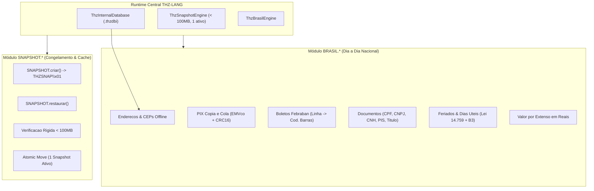

# Brasil Digital, Banco Interno (.thzdbi) & Motor de Snapshot — THZ-LANG v3.0

Este documento formaliza o motor nativo de **Funcionalidades do Brasil Digital (`BRASIL.*`)**, o banco interno protegido **`.thzdbi`** e o **Motor Próprio de Snapshots e Compactação de Estado (`SNAPSHOT.*`)** da linguagem **THZ-LANG**.

---

## 1. Visão Geral da Arquitetura

---

## 2. Banco de Dados Interno Protegido (`.thzdbi`)

### O que é o `.thzdbi`?
O formato **`.thzdbi`** (*THZ Database Internal*) é uma extensão proprietária para bancos de dados físicos SQLite de uso exclusivo do runtime da linguagem. Ele é armazenado em `.thz/internal/core.thzdbi`.

* **Proteção e Transparência:** O usuário final da linguagem não precisa configurar strings de conexão JDBC nem gerenciar schemas; o motor gerencia o ciclo de vida e a integridade de forma 100% autônoma.
* **Tabelas Internas Nativas:**
  - `thz_ceps`: Base de CEPs, logradouros, bairros, municípios, UFs, códigos IBGE e DDDs.
  - `thz_municipios`: Mapeamento oficial do IBGE.
  - `thz_cache_interno`: Cache determinístico de compilação e estados efêmeros.
* **Resiliência e Fallback:** Se um CEP consultado não estiver previamente cadastrado no `.thzdbi`, o motor infere automaticamente o Estado (UF) e Região com base na faixa canônica oficial dos Correios.

---

## 3. Guia de Funções do Brasil Digital (`BRASIL.*`)

### 3.1. CEPs e Endereços Brasileiros
| Função | Assinatura | Descrição |
|---|---|---|
| `BRASIL.cep` | `(cep: TEXTO) -> TEXTO` | Formata para o padrão `XXXXX-XXX` |
| `BRASIL.consultarCep` | `(cep: TEXTO) -> REGISTRO` | Consulta offline no `.thzdbi` retornando `{ cep, logradouro, bairro, cidade, uf, ibge, ddd, regiao }` |
| `BRASIL.cadastrarCep` | `(cep, logr, bairro, cid, uf, ibge, ddd)` | Registra offline novo CEP no `.thzdbi` |
| `BRASIL.validarUf` | `(uf: TEXTO) -> LOGICO` | Valida se a sigla pertence às 27 Unidades Federativas do Brasil |
| `BRASIL.regiaoUf` | `(uf: TEXTO) -> TEXTO` | Retorna `"Sudeste"`, `"Sul"`, `"Nordeste"`, `"Centro-Oeste"` ou `"Norte"` |
| `BRASIL.formatarEndereco` | `(logr, num, compl, bairro, cid, uf, cep)` | Formata endereço canônico ABNT / Correios |

### 3.2. Pagamentos Digitais: PIX & Boletos Bancários
| Função | Assinatura | Descrição |
|---|---|---|
| `BRASIL.pixCopiaECola` | `(chave, nome, cidade, valor, txId)` | Gera payload oficial EMVco / BR Code do Banco Central com checksum CRC16-CCITT |
| `BRASIL.validarChavePix` | `(chave, [tipo]) -> LOGICO` | Valida chave PIX (`CPF`, `CNPJ`, `EMAIL`, `TELEFONE`, `EVP`/Aleatória ou `AUTO`) |
| `BRASIL.validarLinhaDigitavel` | `(linha: TEXTO) -> LOGICO` | Valida os 47 dígitos do boleto bancário com módulo 10 em cada campo |
| `BRASIL.linhaParaCodigoBarras` | `(linha: TEXTO) -> TEXTO` | Converte linha digitável de 47 posições para os 44 dígitos do código de barras Febraban |
| `BRASIL.valorBoleto` | `(linha: TEXTO) -> DECIMAL` | Extrai o valor nominal exato do boleto a partir do campo de centavos |

### 3.3. Documentos Oficiais e Identidades
| Função | Assinatura | Descrição |
|---|---|---|
| `BRASIL.formatarCpf` | `(cpf: TEXTO) -> TEXTO` | Formata para `XXX.XXX.XXX-XX` |
| `BRASIL.formatarCnpj` | `(cnpj: TEXTO) -> TEXTO` | Formata para `XX.XXX.XXX/XXXX-XX` |
| `BRASIL.formatarTelefone` | `(tel: TEXTO) -> TEXTO` | Formata celular `(XX) 9XXXX-XXXX` ou fixo `(XX) XXXX-XXXX` |
| `BRASIL.validarTituloEleitor` | `(titulo: TEXTO) -> LOGICO` | Valida os 2 dígitos verificadores do Título de Eleitor da Justiça Eleitoral |
| `BRASIL.validarCnh` | `(cnh: TEXTO) -> LOGICO` | Validação matemática dos 11 dígitos da Carteira Nacional de Habilitação (Detran) |
| `BRASIL.validarPis` | `(pis: TEXTO) -> LOGICO` | Validação de PIS/PASEP/NIT pelo algoritmo de módulo 11 |

### 3.4. Feriados Nacionais, Dias Úteis e Valor por Extenso
| Função | Assinatura | Descrição |
|---|---|---|
| `BRASIL.ehFeriadoNacional` | `(data: TEXTO/DATA) -> LOGICO` | Valida feriados fixos (inclusive Consciência Negra - Lei 14.759/23) e móveis (Páscoa/Carnaval/Corpus Christi) |
| `BRASIL.ehDiaUtil` | `(data: TEXTO/DATA) -> LOGICO` | Verifica se é dia útil conforme regras bancárias da Febraban e B3 |
| `BRASIL.proximoDiaUtil` | `(data: TEXTO/DATA) -> TEXTO` | Prorroga o vencimento para o próximo dia útil útil caso caia em feriado ou fim de semana |
| `BRASIL.valorPorExtenso` | `(valor: DECIMAL) -> TEXTO` | Converte valor monetário para texto formal em Reais (ex.: `"mil duzentos e cinquenta reais e cinquenta centavos"`) |

---

## 4. Motor de Snapshot e Compactação de Estado (`SNAPSHOT.*`)

O motor de snapshot permite congelar instantaneamente o estado do workspace, cache de compilação, bancos `.thzdbi` e artefatos gerados.

### Invariantes de Engenharia:
1. **Apenas 1 Snapshot Ativo:** Cada workspace mantém estritamente 1 único snapshot (`.thz/internal/active_workspace.thzsnap`). Ao criar um novo snapshot, a substituição é realizada de forma atômica (`ATOMIC_MOVE`).
2. **Cota Rígida < 100MB:** O tamanho total do snapshot gerado **não pode ultrapassar 100MB** (104.857.600 bytes). Se a cota for atingida, a operação é abortada atomicamente e o arquivo temporário é expurgado.
3. **Cabeçalho Mágico e Formato:** Utiliza o cabeçalho binário `THZSNAP\x01` com compressão `Deflater` nível 9.

### Funções do Módulo:
* `SNAPSHOT.criar(origem, destino)`: Gera o snapshot compactado.
* `SNAPSHOT.restaurar(arquivo, destino)`: Descompacta e valida o snapshot.
* `SNAPSHOT.tamanho()`: Retorna o tamanho em bytes do snapshot ativo.
* `SNAPSHOT.limpar()`: Remove o snapshot ativo.
* `SNAPSHOT.verificar(arquivo)`: Valida a integridade do cabeçalho mágico.

---

## 5. Exemplos Canônicos Disponíveis

* [`exemplos/brasil_enderecos_ceps_thzdbi.thz`](file:///c:/Users/lucas/Projetos/thz-lang/exemplos/brasil_enderecos_ceps_thzdbi.thz): Consulta e cadastro no `.thzdbi` e formatação de endereços.
* [`exemplos/brasil_pix_boletos_dia_a_dia.thz`](file:///c:/Users/lucas/Projetos/thz-lang/exemplos/brasil_pix_boletos_dia_a_dia.thz): PIX com CRC16, Boletos, Documentos, Feriados e Extenso.
* [`exemplos/snapshot_compactacao_workspace.thz`](file:///c:/Users/lucas/Projetos/thz-lang/exemplos/snapshot_compactacao_workspace.thz): Compactação com cabeçalho `THZSNAP\x01`, cota < 100MB e restauração.
