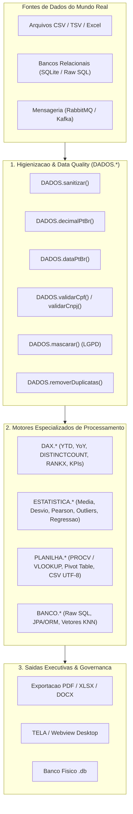

# Engenharia de Dados, Analytics, DAX, Excel & Estatística — THZ-LANG v3.0

Este documento formaliza o ecossistema de **Engenharia de Dados, Business Intelligence (DAX), Automação de Planilhas (Excel) e Estatística Preditiva** da linguagem **THZ-LANG**, projetado para resolver o caos real de dados no ambiente corporativo brasileiro e internacional com tipagem estática e precisão decimal exata (**ISO/IEC 10967**).

---

## 1. O Desafio do Mundo Real: O Caos de Dados Corporativos

No ambiente empresarial real, pipelines de dados enfrentam continuamente dados sujos, inconsistentes e formatos conflitantes:
* **Moedas e Decimais Heterogêneos:** Mistura de padrão brasileiro (`"R$ 1.250.500,75"`), notação contábil com parênteses (`"(450,20)"`), negativos com espaços (`"- 1500.50"`) e floats com erros de arredondamento de IEEE 754.
* **Datas em Formatos Híbridos:** Mistura de `"DD/MM/YYYY"`, `"YYYY-MM-DD"`, `"DD.MM.YY"`, timestamps e datas com fusos não normalizados.
* **Inconsistências Cadastrais:** CPFs e CNPJs com dígitos verificadores corrompidos ou máscaras parciais.
* **Conformidade Regulatória Estrita:** Exigências da LGPD (Art. 7) e GDPR para anonimização e mascaramento de dados sensíveis.
* **Dispersão de Ferramentas:** Dependência de múltiplos ambientes incompatíveis (Python/Pandas para estatística, Power BI/DAX para KPIs, Excel para PROCV e SQL para agregações relacionais).

O **THZ-LANG v3.0** unifica todos esses domínios em um único motor determinístico, compilável para binários nativos AOT (LLVM/Rust) e WebAssembly (WASM), sem necessidade de runtime Python ou dependências externas pesadas.

---

## 2. Visão Geral da Arquitetura Analítica Unificada



---

## 3. Módulos & Funções da Biblioteca Analítica

### 3.1. Módulo `ESTATISTICA.*` (Estatística Descritiva, Inferencial e Preditiva)

Fornece funções matemáticas rigorosas sem ponto flutuante binário, operando com fatias numéricas (`FATIA[DECIMAL]` ou `FATIA[INTEIRO]`):

| Função | Assinatura | Descrição |
|---|---|---|
| `ESTATISTICA.media` | `(valores: FATIA) -> DECIMAL` | Média aritmética exata com arredondamento meio-par |
| `ESTATISTICA.mediana` | `(valores: FATIA) -> DECIMAL` | Valor central ou média dos elementos medianos |
| `ESTATISTICA.moda` | `(valores: FATIA) -> DECIMAL` | Elemento de maior frequência na amostra |
| `ESTATISTICA.desvioPadrao` | `(valores: FATIA, [amostral: LOGICO]) -> DECIMAL` | Desvio padrão amostral ($n-1$) ou populacional ($n$) |
| `ESTATISTICA.variancia` | `(valores: FATIA, [amostral: LOGICO]) -> DECIMAL` | Variância amostral ou populacional |
| `ESTATISTICA.correlacao` | `(x: FATIA, y: FATIA) -> DECIMAL` | Coeficiente de Correlação Linear de Pearson ($r \in [-1, 1]$) |
| `ESTATISTICA.percentil` | `(valores: FATIA, p: DECIMAL) -> DECIMAL` | Percentil $P$ ($0 \le P \le 100$) com interpolação linear |
| `ESTATISTICA.zScore` | `(valor: DECIMAL, amostra: FATIA) -> DECIMAL` | Escores padronizados $Z = \frac{X - \mu}{\sigma}$ |
| `ESTATISTICA.outliers` | `(valores: FATIA) -> FATIA[DECIMAL]` | Detecção de anomalias por amplitude interquartil (IQR / Tukey) |
| `ESTATISTICA.regressao` | `(x: FATIA, y: FATIA) -> REGISTRO` | Regressão Linear Simples via Mínimos Quadrados ($Y = aX + b$, com $R^2$) |

#### Exemplo em Código:
```thz
VARIAVEL meses : FATIA[DECIMAL] <- [1.0000, 2.0000, 3.0000, 4.0000, 5.0000, 6.0000]
VARIAVEL receita : FATIA[DECIMAL] <- [120.0000, 135.0000, 148.0000, 160.0000, 175.0000, 190.0000]

VARIAVEL r : DECIMAL <- ESTATISTICA.correlacao(meses, receita)
VARIAVEL modelo : REGISTRO <- ESTATISTICA.regressao(meses, receita)

EXIBA "Correlacao: " + TEXTO.deDecimal(r)
EXIBA "Inclinacao (a): " + TEXTO.deDecimal(modelo.inclinacao)
EXIBA "Intercepto (b): " + TEXTO.deDecimal(modelo.intercepto)
EXIBA "Aderencia (R2): " + TEXTO.deDecimal(modelo.rQuadrado)

# Projeção para o mês 7
VARIAVEL projecaoMes7 : DECIMAL <- (modelo.inclinacao * 7.0000) + modelo.intercepto
EXIBA "Previsao Mes 7: R$ " + TEXTO.deDecimal(projecaoMes7) + " mil"
```

---

### 3.2. Módulo `DAX.*` (Métricas de BI, Inteligência Temporal & KPIs)

Traz o poder de expressões do Power BI e Analysis Services para o runtime tipado:

| Função | Assinatura | Equivalente DAX | Descrição |
|---|---|---|---|
| `DAX.acumuladoAno` | `(tabela, campoData, campoValor, ano)` | `TOTALYTD(SUM(...), 'Calendario'[Data])` | Soma acumulada Year-To-Date |
| `DAX.variacaoPeriodo` | `(valorAtual, valorAnterior)` | `DIVIDE(Atual - Anterior, Anterior)` | Variação percentual YoY / MoM |
| `DAX.contagemDistintos` | `(tabela, campo)` | `DISTINCTCOUNT('Tabela'[Coluna])` | Contagem de valores únicos |
| `DAX.ranking` | `(tabela, campoValor, [desc])` | `RANKX(ALL('Tabela'), [Medida])` | Gera coluna ordinal `_ranking` |
| `DAX.percentualTotal` | `(tabela, campoValor)` | `DIVIDE([Valor], CALCULATE(SUM(...), ALL()))` | Gera coluna `_percentualTotal` |
| `DAX.kpi` | `(nome, realizado, meta, [tolerancia])` | Status Indicator / Cartão KPI | Gera registro com status (VERDE/AMARELO/VERMELHO) |

#### Exemplo em Código:
```thz
VARIAVEL acumulado2026 : DECIMAL <- DAX.acumuladoAno(tabelaVendas, "data", "valor", 2026)
VARIAVEL yoy : DECIMAL <- DAX.variacaoPeriodo(acumulado2026, 18000.0000)
VARIAVEL kpiVendas : REGISTRO <- DAX.kpi("Vendas2026", acumulado2026, 60000.0000, 5.0)

EXIBA "YTD 2026: R$ " + TEXTO.deDecimal(acumulado2026)
EXIBA "YoY: " + TEXTO.deDecimal(yoy) + " %"
EXIBA "Status do KPI: " + kpiVendas.status
```

---

### 3.3. Módulo `PLANILHA.*` (Interoperabilidade Excel, PROCV & Tabelas Dinâmicas)

| Função | Assinatura | Equivalente Excel | Descrição |
|---|---|---|---|
| `PLANILHA.procv` | `(tabela, campoBusca, valorBusca, campoRetorno)` | `=PROCV(val; matriz; col; FALSO)` / `=XLOOKUP()` | Localiza valor e retorna coluna desejada |
| `PLANILHA.pivotar` | `(tabela, linha, coluna, valor, [op])` | Tabela Dinâmica (Pivot Table) | Agrupa matricialmente com SUM/AVG/COUNT/MAX/MIN |
| `PLANILHA.lerCsv` | `(caminho, [separador])` | Importar Texto/CSV | Carrega CSV com detecção de delimitador e aspas |
| `PLANILHA.escreverCsv` | `(destino, tabela, [separador])` | Salvar Como CSV UTF-8 | Grava fatias em CSV formatado com escape seguro |

#### Exemplo em Código:
```thz
# VLOOKUP no catálogo de produtos
VARIAVEL preco : TEXTO <- PLANILHA.procv(catalogo, "sku", "SKU-200", "precoBase")
EXIBA "Preco SKU-200: R$ " + preco

# Tabela Dinâmica de Vendas por Categoria e Filial
VARIAVEL pivot : FATIA[REGISTRO] <- PLANILHA.pivotar(vendas, "categoria", "filial", "valor", "SUM")
```

---

### 3.4. Módulo `DADOS.*` (Higienização, Sanitização e Caos Corporativo)

| Função | Assinatura | Descrição |
|---|---|---|
| `DADOS.decimalPtBr` | `(texto) -> DECIMAL` | Converte `"R$ 1.250,50"`, `"(450,20)"`, `"- 1500.50"` em `DecimalFixo` |
| `DADOS.dataPtBr` | `(texto) -> TEXTO` | Converte `"25/08/2026"`, `"25.08.26"`, `"2026-08-25 14:00"` para ISO `"YYYY-MM-DD"` |
| `DADOS.validarCpf` | `(cpf) -> LOGICO` | Validação matemática dos dois dígitos verificadores da Receita Federal |
| `DADOS.validarCnpj` | `(cnpj) -> LOGICO` | Validação matemática de módulo 11 oficial de CNPJ |
| `DADOS.mascarar` | `(texto, inicio, fim) -> TEXTO` | Anonimização e mascaramento para conformidade com a LGPD |
| `DADOS.removerDuplicatas` | `(tabela, [chaves]) -> FATIA[REGISTRO]` | Deduplicação determinística preservando a primeira ocorrência |
| `DADOS.imputarNulos` | `(tabela, campo, padrao) -> FATIA[REGISTRO]` | Preenchimento de células vazias/nulas |
| `DADOS.sanitizar` | `(texto) -> TEXTO` | Limpeza de caracteres de controle ASCII e espaços repetidos |

---

## 4. Tabela Comparativa: SQL vs DAX vs Excel vs THZ-LANG

| Operação | SQL Relacional | DAX (Power BI) | Excel | THZ-LANG |
|---|---|---|---|---|
| **Média Ponderada / Simples** | `AVG(coluna)` | `AVERAGE(Tabela[Col])` | `=MÉDIA(A1:A10)` | `ESTATISTICA.media(fatia)` |
| **Desvio Padrão** | `STDEV(coluna)` | `STDEV.S(Tabela[Col])` | `=DESVPAD.A(A1:A10)` | `ESTATISTICA.desvioPadrao(fatia, VERDADEIRO)` |
| **Correlação Linear** | `CORR(x, y)` | N/A (requer R/Python) | `=CORREL(A1:A10; B1:B10)` | `ESTATISTICA.correlacao(x, y)` |
| **Busca Vertical** | `JOIN ... ON id = id` | `LOOKUPVALUE(...)` | `=PROCV(val; matriz; col; 0)` | `PLANILHA.procv(tab, "id", val, "nome")` |
| **Tabela Dinâmica** | `GROUP BY lin, col` | `SUMMARIZECOLUMNS(...)` | Tabela Dinâmica | `PLANILHA.pivotar(tab, "lin", "col", "val", "SUM")` |
| **Acumulado no Ano** | Window Function com `BETWEEN` | `TOTALYTD(SUM(...), Data)` | Acumulador manual | `DAX.acumuladoAno(tab, "dt", "val", 2026)` |
| **Variação YoY** | `(SUM - LAG) / LAG` | `DIVIDE(YTD - LY, LY)` | `=(B2-B1)/B1` | `DAX.variacaoPeriodo(atual, anterior)` |
| **Validação de CNPJ** | Função SQL complexa | N/A | Macro VBA | `DADOS.validarCnpj(cnpj)` |
| **Tratamento de Decimais** | `CAST(... AS DECIMAL)` | `CURRENCY` | `VALOR()` | `DADOS.decimalPtBr(texto)` |

---

## 5. Exemplos Canônicos Disponíveis

1. [`exemplos/dax_kpis_analytics.thz`](file:///c:/Users/lucas/Projetos/thz-lang/exemplos/dax_kpis_analytics.thz): Cálculos de YTD, YoY, Ranking e KPIs corporativos.
2. [`exemplos/estatistica_e_previsao.thz`](file:///c:/Users/lucas/Projetos/thz-lang/exemplos/estatistica_e_previsao.thz): Análise estatística, desvio padrão, correlação de Pearson, remoção de outliers e regressão linear de previsão.
3. [`exemplos/limpeza_dados_caoticos_etl.thz`](file:///c:/Users/lucas/Projetos/thz-lang/exemplos/limpeza_dados_caoticos_etl.thz): Higienização de moedas em padrão contábil/PT-BR, datas mistas, validação de CPF/CNPJ e mascaramento LGPD.
4. [`exemplos/excel_planilhas_procv.thz`](file:///c:/Users/lucas/Projetos/thz-lang/exemplos/excel_planilhas_procv.thz): Manipulação de tabelas, PROCV / VLOOKUP e Pivot Table.

---

## 6. Histórico de Commits Atômicos

A evolução do ecossistema segue a rastreabilidade estrita de commits atômicos:

1. `feat(exemplos)`: Adicionar suíte de 25 exemplos canônicos para versões v2.6 a v3.0 (`9f761cf`).
2. `feat(config)`: Implementar manifesto de configuração `thz.config.json` e comando `thz init` (`7a38247`).
3. `feat(mensageria)`: Conectores universais para RabbitMQ, Kafka, AWS SQS/SNS e barramento reativo (`581cf51`).
4. `feat(db)`: Bridge de banco universal com camada JPA/ORM, Raw SQL e busca vetorial KNN (`ebc3eca`).
5. `docs(db,mensageria)`: Registrar documentação de conectores universais e changelog v3.0.0 (`14a0202`).
6. `feat(io)`: Localizador e resolução inteligente recursiva de recursos (`93af382`).
7. `feat(analytics)`: Motores de Estatística Descritiva/Preditiva (`ESTATISTICA.*`), Métricas DAX (`DAX.*`), Planilhas/PROCV (`PLANILHA.*`) e Data Quality para Caos Empresarial (`DADOS.*`).
