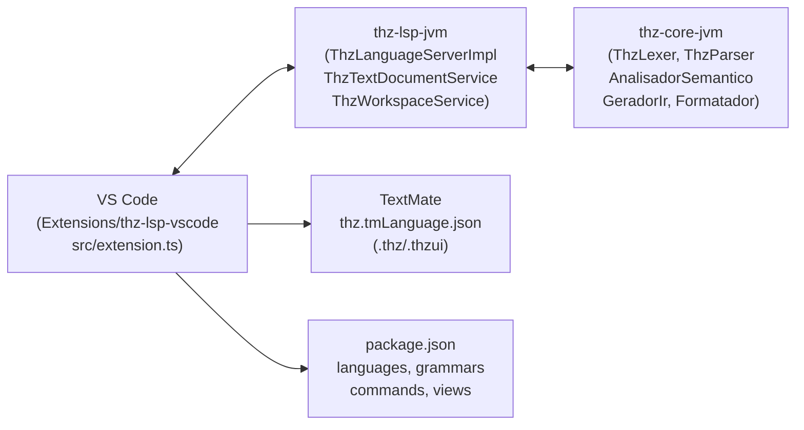

# LSP & Extensão VS Code — Arquitetura e Desenvolvimento

> **Language Server Protocol.** Este documento cobre `JVM/thz-lsp-jvm` (servidor LSP4J) e `Extensions/thz-lsp-vscode` (cliente VS Code): TextMate, diagnósticos, hover, completion, definition, symbols, formatting, comandos `thz/*` custom, e como desenvolver/debugar a extensão.

Referências: `JVM/thz-lsp-jvm/src/main/java/thz/lang/lsp/ThzLanguageServerImpl.java:30`, `Extensions/thz-lsp-vscode/package.json:1`, `Extensions/thz-lsp-vscode/syntaxes/thz.tmLanguage.json`.

---

## 1. Arquitetura — Cliente ↔ Servidor



- **Cliente:** `Extensions/thz-lsp-vscode/src/extension.ts` — `vscode-languageclient` `LanguageClient("thz", serverOptions: java -jar thz-lsp-jvm-shadow.jar)`.
- **Servidor:** `ThzLanguageServerImpl.java:30` `implements LanguageServer, LanguageClientAware`, `initialize()` (`ThzLanguageServerImpl.java:44`) anuncia `TextDocumentSyncKind.Incremental`, `hoverProvider:true`, `completionProvider trigger [".", " ", ":"]`, `documentSymbolProvider:true`, `definitionProvider:true`, `documentFormattingProvider:true`, cache `ConcurrentHashMap<String,String> documentos` (uri→conteúdo) + `lintEstrito` flag.

---

## 2. Pipeline do Servidor — Do `didChange` ao `Diagnostic`

`ThzLanguageServerImpl.java:165-196` — todo `didChange`/`didOpen` faz:

```java
tokens = new ThzLexer(conteudo).tokenize();
ast    = new ThzParser(tokens).parse();
erros  = new AnalisadorSemantico(ast).analisar(new OpcoesAnalise(lintEstrito));
diags  = paraLspDiagnostics(erros) // linha/col → Range LSP
simbolos = extrairSimbolos(ast, tokens) // para workspace/symbol
```

- `lintEstrito` (`package.json: configuration thz-lang.lintEstrito=false`) = `thz check --estrito` (exige `METADADOS_ARQUITETURA`, `RASTREIO_REQUISITO`).
- `extrairLinhaColuna(regex \[Linha (\d+):(\d+)\])` (`ThzLanguageServerImpl.java: extrairLinhaColuna`) mapeia `DiagnosticoLsp` → `Diagnostic.range`.

---

## 3. Recursos do LSP

| Recurso | Trigger | Implementação | Arquivo |
| :--- | :--- | :--- | :--- |
| **Diagnostics** | `didChange`/`didOpen`/`didSave` | `ThzLexer`+`ThzParser`+`AnalisadorSemantico` → `publishDiagnostics` | `ThzLanguageServerImpl.java:165` |
| **Hover** | `mouse hover` sobre `ESTRUTURA`/`REGRA`/`campo` | `hover(word)` switch por categoria (`estrutura, campo, regra, operacao...`) | `ThzLanguageServerImpl.java:229` |
| **Completion** | `"."` / `" "` / `":"` | `completionProvider` + `ThzTextDocumentService.completion()` — keywords, `TEXTO`, `DECIMAL`, `TELA.*` | `ThzTextDocumentService.java` |
| **Definition** | `F12` / `Ctrl+Click` | `definitionProvider` — `REGRA_NEGOCIO`/`ESTRUTURA`/`OPERACAO` | `ThzTextDocumentService.java` |
| **Symbols** | `Ctrl+Shift+O` | `documentSymbolProvider` + `extrairSimbolos` (ProgramaAst + tokens IDENTIFICADOR) | `ThzLanguageServerImpl.java: extrairSimbolos` |
| **Formatting** | `Ctrl+S` (format on save) | `documentFormattingProvider` → `Formatador.formatar(conteudo)` → `TextEdit` | `ThzLanguageServerImpl.java: formatar` |
| **CodeLens** | Sempre | `codeLensProvider` (se `thz-lang.codeLens:true`) | `package.json: configuration` |

### 3.1 Comandos custom `thz/*` (`ThzLanguageServerImpl.java:99-146`)

| Comando | `@JsonRequest` | O que faz |
| :--- | :--- | :--- |
| `thz/audit` | `thz/audit` | `AuditorGovernanca.auditar(ast)` + `gerarMarkdownGovernanca` |
| `thz/ir` | `thz/ir` | `GeradorIr.baixarParaIr` + `serializarIrJson` |
| `thz/llvm` | `thz/llvm` | `GeradorIr.emitirLlvm` |

Usados por `thz.showAudit`/`showIr`/`showLlvm` no VS Code (`package.json: commands`).

---

## 4. Cliente VS Code — `package.json:1-378`

### 4.1 `contributes`

- `languages: id:"thz" extensions [".thz",".thzui"]` + `language-configuration.json` (brackets, comments `#`, autoClosing)
- `grammars: scopeName source.thz → syntaxes/thz.tmLanguage.json` — TextMate para `PROGRAMA`, `PIPELINE_DADOS`, `TELA`, `VETORIZAR_PARA PASSO_SIMD`, `DECIMAL(12,4)`, `MONETARIO(BRL)`, `EXIGE/GARANTE`
- `snippets: thz.json` — `prog`→`PROGRAMA NEGOCIO`, `estr`→`ESTRUTURA LAYOUT_COLUNAR`, `vet`→`VETORIZAR_PARA ... PASSO_SIMD 8`
- `breakpoints + debuggers type:"thz"` — stub para futuro DAP
- `viewsContainers activitybar id:"thz-sidebar"` + 4 views: `Cockpit de Comando`, `Estrutura & Arquitetura Viva`, `Galeria de Exemplos`, `Ambiente & Runtime`

### 4.2 Comandos (12) e keybindings

| Comando | Título | Atalho | O que faz |
| :--- | :--- | :--- | :--- |
| `thz.run` | Executar THZ | `F5` | `thz run ${file}` |
| `thz.check` | Verificar | `Shift+F5` | `thz check --estrito` |
| `thz.previewArchitecture` | Preview Arquitetura | — | `thz doc` → Mermaid |
| `thz.previewUi` | Preview UI | — | `thz ui --html` → WebView |
| `thz.openRepl` | REPL | — | `thz repl` terminal |
| `thz.openGui` | IDE Swing | — | `thz gui` |
| `thz.showAudit` | Auditoria | — | `thz/audit` → markdown |
| `thz.showIr` | THZ-IR | — | `thz/ir` → JSON |
| `thz.showLlvm` | LLVM IR | — | `thz/llvm` → `.ll` |
| `thz.toggleLintEstrito` | Lint Estrito | — | toggle `lintEstrito` flag |
| `thz.refreshCockpit` | Refresh | — | recarrega views |

`menus editor/title, editor/context` + `keybindings F5/Ctrl+F5/Shift+F5`.

### 4.3 Configuração

`package.json: configuration.properties`: `thz-lang.cliPath` (path para `thz.exe`), `thz-lang.lspJarPath` (para `thz-lsp-jvm-shadow.jar`), `thz-lang.lintEstrito` (bool, default `false`), `thz-lang.codeLens` (`true`), `thz-lang.trace.server` (`off|messages|verbose`).

---

## 5. Desenvolvimento — Como rodar e debugar

```bash
# 1. Build do servidor LSP
./gradlew :thz-lsp-jvm:shadowJar  # gera JVM/thz-lsp-jvm/build/libs/thz-lsp-jvm-*-shadow.jar

# 2. Cliente VS Code
cd Extensions/thz-lsp-vscode
npm ci
npm run compile  # esbuild src/extension.ts --bundle --outfile=dist/extension.js

# 3. Rodar extensão em host de desenvolvimento
code --extensionDevelopmentPath=Extensions/thz-lsp-vscode  # F5 no VS Code também

# 4. Logs LSP (trace)
# settings.json: "thz-lang.trace.server": "verbose" → Output > THZ-LANG
```

**Debugar servidor:** `ThzLanguageServerImpl.main()` com `java -agentlib:jdwp=transport=dt_socket,server=y,suspend=n,address=5005 -jar thz-lsp-jvm-shadow.jar` + attach VS Code Java debugger.

**TextMate:** edite `syntaxes/thz.tmLanguage.json`, `Ctrl+Shift+P → Developer: Reload Window` para testar.

---

## 6. Build e distribuição

```bash
# VSIX
./scripts/build-vsix.ps1  # npm ci && npm run compile && vsce package
# gera Extensions/thz-lsp-vscode/thz-lang-0.3.0.vsix

# Marketplace
vsce publish  # precisa publisher thz-lang + token
```

CI (`ci.yml:49`): `vscode-extension` job só `npm ci && npm run compile` — sem publish.

---

> **Próximo:** [`API_REST.md`](API_REST.md) (mesmo `ThzService` exposto via REST), [`TELA_THZUI.md`](TELA_THZUI.md) (o que `previewUi` renderiza).

