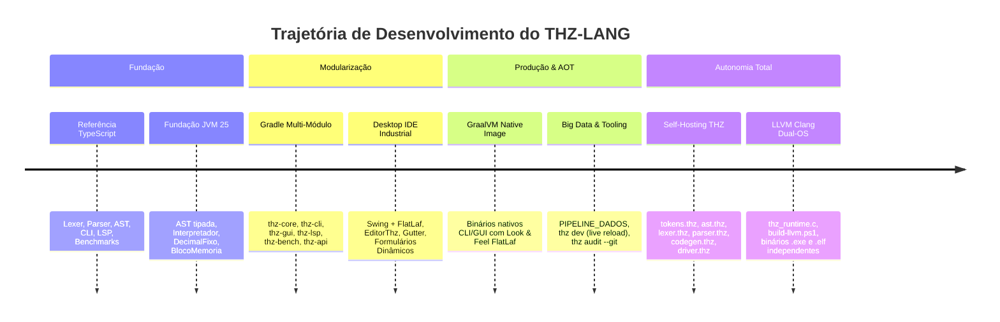

# Relatório de Evolução Histórica — THZ-LANG

> Histórico técnico consolidado do ecossistema **THZ-LANG**, abrangendo desde a fundação inicial até o alcance do marco de compilação autônoma (Self-Hosting & LLVM Clang AOT).

---

## 1. Sumário Executivo

O **THZ-LANG** é uma linguagem corporativa de sistemas orientada a domínio (DDD), com contratos formais de governança, aritmética decimal exata e foco em alta taxa de transferência de dados (SIMD/SoA/Arenas de memória). 

O ecossistema evoluiu rapidamente através de fases bem delineadas:
1. **Fundação e Referência Executável:** Motor inicial em TypeScript e criação da AST canônica.
2. **Motor de Produção JVM 25:** Núcleo de alta precisão, AST imutável e runtime em Java 25.
3. **Multi-Módulo Gradle & Tooling Industrial:** Separação estrita em módulos autônomos (`thz-core`, `thz-cli`, `thz-gui`, `thz-lsp`, `thz-bench`, `thz-api`).
4. **Desktop IDE Nativa & GraalVM AOT:** Interface gráfica em Swing + FlatLaf com consistência visual universal e geração de binários nativos de inicialização instantânea (`thz.exe`, `thz-desktop.exe`).
5. **Expansão de Domínio & Big Data:** Arquétipo `PIPELINE_DADOS` para ingestão massiva em lote e streaming, dev server (`thz dev`) e auditoria integrada ao Git (`thz audit --git`).
6. **Autonomia Total & Self-Hosting (Zero JVM):** Compilador escrito na própria linguagem (`compilador/*.thz`), emissão de LLVM IR, runtime C Dual-OS (`src/runtime/thz_runtime.c`) e pipeline AOT Clang Dual-OS (`scripts/build-llvm.ps1`).

---

## 2. Linha do Tempo e Marcos Arquiteturais

---

## 3. Detalhamento dos Marcos Técnicos

### Marco 1 — Núcleo Multi-Módulo JVM 25
- **Desacoplamento Rigoroso:** O módulo `thz-core-jvm` tornou-se estritamente agnóstico a interfaces gráficas ou terminais, expondo contratos públicos e pontos de extensão via `BibliotecaPadrao.registrar()`.
- **Governança e Verificação 1 a 1:** Implementação da suíte de conformidade de normas internacionais (ISO/IEC 10967, ISO 4217, ISO/IEC/IEEE 42010, ISO/IEC TR 24772, RFC 4122, RFC 8259 e SemVer 2.0.0).

### Marco 2 — Desktop IDE Swing FlatLaf & GraalVM AOT
- **Experiência de Desenvolvimento:** Criação do `EditorThz` com realce léxico em tempo real, numeração ancorada (`Gutter`), paleta de comandos e integração assíncrona com o motor de execução.
- **Formulários Dinâmicos:** O `RenderizadorFormularioSwing` constrói interfaces gráficas reativas a partir de definições `ESTRUTURA`, validando restrições de contrato e exportando dados estruturados.
- **Compilação Nativa GraalVM:** Integração do agente de reachability metadata e sinalizadores `-Djava.awt.headless=false`, viabilizando compilação AOT da aplicação Swing completa.

### Marco 3 — Tooling Ágil & Big Data Pipelines
- **`thz dev`:** Servidor de desenvolvimento com recarga a quente (*Live Reload*), detectando alterações em arquivos `.thz` e reexecutando análises e testes imediatamente.
- **`thz audit --git`:** Auditoria de conformidade regulatória conectada diretamente ao status do repositório Git, validando requisitos afetados no último commit ou stage.
- **`PIPELINE_DADOS`:** Arquétipo nativo de linguagem para ingestão contínua (*Streaming*) ou em lote (*Batch*) a partir de conectores heterogêneos (PostgreSQL, MySQL, MongoDB, JSONB, CSV).

### Marco 4 — Compilador Self-Hosted & Autonomia LLVM Clang (Zero JVM)
- **Compilador na Própria Linguagem:** A suíte em `compilador/*.thz` implementa o pipeline completo de compilação em código THZ nativo:
  - `tokens.thz`: Tipos léxicos e estruturas de token.
  - `ast.thz`: Definição da Árvore de Sintaxe Abstrata.
  - `lexer.thz`: Tokenizador e scanner léxico determinístico.
  - `parser.thz`: Analisador sintático com recuperação panic-mode.
  - `codegen.thz`: Emissor de LLVM IR otimizado.
  - `driver.thz`: Ponto de entrada CLI e orquestrador.
- **Runtime Nativo C Dual-OS (`src/runtime/thz_runtime.c`):** Camada de baixo nível compatível com Win32 (Windows) e POSIX (Linux), implementando alocação em Arena $O(1)$, strings dinâmicas, I/O de arquivos, matemática, criptografia AES-256 e UUIDs.
- **Build AOT Dual-OS (`scripts/build-llvm.ps1`):** Pipeline automatizado que converte fontes `.thz` diretamente em executáveis nativos Windows PE (`.exe`) e Linux ELF (`.elf`) via LLVM Clang e MinGW GCC, atingindo independência total e zero dependência de JVM em produção.

---

## 4. Indicadores de Qualidade e Cobertura

- **Suíte de Testes JUnit 5:** Mais de 110 testes automatizados no motor JVM (100% aprovados).
- **Suíte de Testes TypeScript:** 149 testes verdes cobrindo a referência e serviços LSP.
- **Compilação Self-Host Validada:** Testes unitários do compilador THZ executados e validados no pipeline de CI/CD.
- **CI/CD Automatizado:** GitHub Actions moderno compilando projetos Java 25, Gradle multi-módulo e binários nativos LLVM Clang AOT em Windows e Linux.
