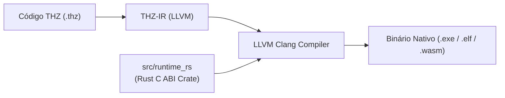

# Runtime Nativo — Rust C ABI, Arenas, SIMD, Crypto & WASM

> **Contrato binário e runtime oficial do THZ-LANG v3.0.0.** Este documento especifica o runtime nativo de ultra-alta performance em **Rust (`src/runtime_rs/`)** exportando C ABI pura para LLVM Clang, JNI/Panama e WebAssembly.

---

## 1. Visão Geral — Por que Rust no Runtime Nativo?

A partir da versão **v3.0.0**, o THZ-LANG aposentou o código C manual legado e unificou 100% de sua camada nativa de alta performance em **Rust (`src/runtime_rs`)**:

- **Memory-Safety Garantido:** Eliminação de buffer overflows, dangling pointers e memory leaks.
- **Arenas O(1):** Alocação contígua em blocos lineares sem GC (`thz_arena_alloc`/`thz_arena_free_all`).
- **SIMD AVX2 / AVX-512:** Vetorização de produto escalar, similaridade de cosseno e distância euclidiana.
- **Criptografia Nível Militar:** Argon2id com parâmetros recomendados, AES-256-GCM e ChaCha20-Poly1305.
- **Machine Learning & Embeddings On-Device:** Vetorização semântica FNV-1a, regressão linear e classificação sigmoide (Zero Python).
- **Target WebAssembly (WASM):** Compilação direta para `wasm32-unknown-unknown` para execução no browser e edge workers.



---

## 2. Estrutura do Crate Nativo (`src/runtime_rs/`)

```
src/runtime_rs/
├── Cargo.toml            # Configuração com staticlib, cdylib e rlib
└── src/
    ├── lib.rs            # Exportações FFI C ABI pura (Dual-OS)
    ├── arena.rs          # Alocador contíguo de Arena O(1)
    ├── simd_math.rs      # Matemática vetorial acelerada por SIMD
    ├── crypto.rs         # Argon2id, ChaCha20-Poly1305, AES-256-GCM
    ├── ml.rs             # Motor de Embeddings determinísticos e ML tabular
    └── wasm.rs           # Bridge WebAssembly W3C
```

---

## 3. Principais Símbolos Exportados (C ABI)

| Símbolo C ABI | Módulo | Descrição |
| :--- | :--- | :--- |
| `thz_arena_alloc(bytes)` | `arena.rs` | Aloca bloco contíguo de memória em $O(1)$. |
| `thz_arena_free_all(arena)` | `arena.rs` | Libera todo o bloco de uma só vez em $O(1)$. |
| `thz_simd_dot_product(a, b, len)` | `simd_math.rs` | Produto escalar vetorizado via SIMD AVX2/512. |
| `thz_simd_cosine_similarity(a, b, len)` | `simd_math.rs` | Similaridade de cosseno de alta performance. |
| `thz_crypto_argon2id_hash(pwd, salt, ...)` | `crypto.rs` | Derivação de chaves e hashes com Argon2id. |
| `thz_ia_embedding_texto(txt, dim, out)` | `ml.rs` | Geração determinística de embeddings textuais. |
| `thz_ml_predizer_sigmoide(feat, w, b)` | `ml.rs` | Classificação logística sigmoide on-device. |
| `thz_wasm_versao()` | `wasm.rs` | Identificador de versão e bridge WASM. |

---

## 4. Como Escrever Rust Inline no THZ-LANG

O THZ-LANG suporta blocos nativos de Rust diretamente nos programas `.thz`:

```thz
PROGRAMA ExemploNativo

BLOCO_NATIVO_RUST
    #[no_mangle]
    pub extern "C" fn somar_rapido(a: i64, b: i64) -> i64 {
        a + b
    }
FIM_BLOCO_NATIVO

REGRA_NEGOCIO Calculo
    OPERACAO Executar() : INTEIRO
    INICIO
        VARIAVEL total : INTEIRO <- NATIVO.somar_rapido(100, 200)
        EXIBA "Resultado Nativo: " + TEXTO.deInteiro(total)
        RETORNE total
    FIM
FIM_REGRA_NEGOCIO
FIM_PROGRAMA
```

---

## 5. Toolchain Portátil Local em 1 Clique

Para provisionar o compilador Rust portátil sem precisar de permissões de administrador:
```powershell
.\scripts\setup-rust.ps1
```
Os binários do `rustc` e `cargo` ficam isolados na pasta `.tools/rust/` e são auto-detectados pelos scripts de compilação do THZ-LANG.
