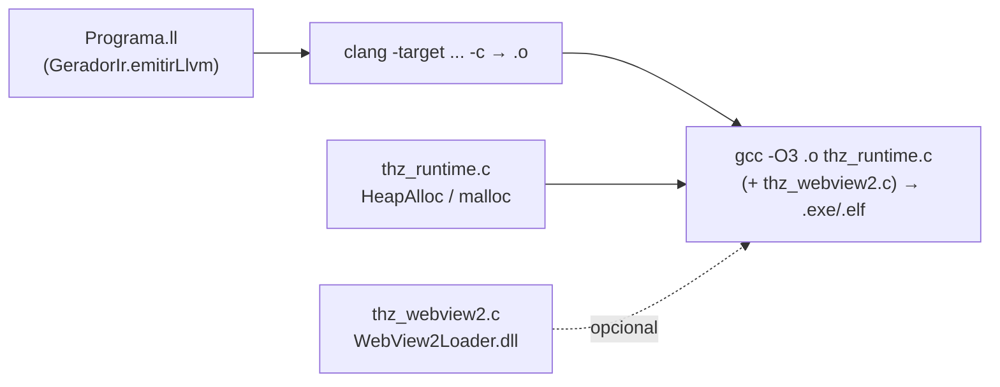

# Runtime Nativo — ABI Dual-OS, Arenas e Linking LLVM

> **Contrato binário do THZ-LANG.** Este documento especifica a camada `src/runtime/thz_runtime.c` (e `thz_webview2.c`) que o LLVM IR chama via `declare` — a ponte entre `define @main` gerado por `GeradorIr.java:221` e o sistema operacional (Win32 HeapAlloc vs POSIX malloc, WriteFile vs printf, linking `clang → gcc`).

Leitura complementar: [`ARQUITETURA_COMPILACAO_NATIVA.md`](ARQUITETURA_COMPILACAO_NATIVA.md) §6/Apêndice C, [`SELF_HOSTING.md`](SELF_HOSTING.md) §3.5, `src/runtime/thz_runtime.c:1`.

---

## 1. Visão Geral — Por que um Runtime em C?

LLVM IR é **portável mas incompleto**: `declare ptr @thz_arena_alloc(i64)` precisa de uma definição nativa que converse com o OS. O runtime fornece:

- **Arenas O(1)** — alocação linear sem GC (`thz_arena_alloc`/`free_all`).
- **Strings/TEXTO** — `tamanho`, `charAt`, `substring` sem `msvcrt.dll`.
- **I/O** — `ler_arquivo`/`escrever_arquivo`/`exibir` Dual-OS.
- **Decimal** — `thz_exiba_i128` (hoje stub).
- **GUI legada** — `thz_gui_*` (arquivada; WebView é o padrão).

Ele é **um arquivo C, duas implementações** (`#ifdef _WIN32` vs `#else`) com **mesma ABI** — o mesmo `.ll` linka nos dois OS mudando só o `.c` e o `target triple`.



---

## 2. Estrutura do Arquivo (`thz_runtime.c:1-248`)

```
thz_runtime.c
├─ 1-4   Header + TODO "Validar efetividade, ainda não testado"
├─ 6-7   #include <stdint.h>/<stddef.h>
├─ 9-188 #ifdef _WIN32  (Win32 API direto, sem windows.h)
│        ├─ 9-35   Constantes + dllimport __stdcall/__cdecl
│        ├─ 37-52  ThzArena + thz_arena_alloc/free_all (HeapAlloc)
│        ├─ 54-85  thz_tamanho_str/char_at/substring
│        ├─ 87-126 thz_ler_arquivo/escrever_arquivo/executar_comando
│        ├─ 129-142 thz_exiba_str/i128
│        └─144-188 thz_gui_* + thz_renderizar_tela (stubs legados)
└─190-247 #else (POSIX)
         ├─192-196 #include <stdio/stdlib/string/unistd> + ThzArena (malloc)
         ├─199-235 Funções POSIX (strlen, fopen, printf, system)
         └─239-245 GUI POSIX stubs
```

---

## 3. ABI — Application Binary Interface

### 3.1 Convenções de chamada

| OS | Convenção | Atributo | Onde |
| :--- | :--- | :--- | :--- |
| Windows | `__stdcall` (callee limpa pilha) | `__declspec(dllimport) ... __stdcall` | `thz_runtime.c:23-33` |
| Windows varargs | `__cdecl` (caller limpa) | `__cdecl wsprintfA` | `thz_runtime.c:33` |
| POSIX | System V AMD64 (caller/callee) | sem atributo | `thz_runtime.c:197` |

Todas as exports são `__declspec(dllexport)` no Windows (`thz_runtime.c:39,47,55,62,72,87,111,123,129,137,152`) — símbolo visível ao `gcc` linker e ao LLVM `declare`.

### 3.2 Tipos e assinaturas

| Símbolo | Assinatura C | LLVM `declare` | Notas |
| :--- | :--- | :--- | :--- |
| `thz_arena_alloc` | `void* (uint64_t bytes)` | `ptr @thz_arena_alloc(i64)` | `GeradorIr.java:229` |
| `thz_arena_free_all` | `void (void* arena)` | `void @thz_arena_free_all(ptr)` | `GeradorIr.java:230` |
| `thz_tamanho_str` | `int32_t (const char*)` | — (chamado via runtime) | `thz_runtime.c:55` |
| `thz_char_at` | `int32_t (const char*, int32_t idx)` | — | `thz_runtime.c:62` |
| `thz_substring` | `const char* (const char*, int32_t inicio, int32_t len)` | — | `thz_runtime.c:72` |
| `thz_ler_arquivo` | `const char* (const char* caminho)` | — | `thz_runtime.c:87` |
| `thz_escrever_arquivo` | `int32_t (const char*, const char*)` | — | `thz_runtime.c:111` |
| `thz_executar_comando` | `int32_t (const char* cmd)` | — | `thz_runtime.c:123` |
| `thz_exiba_str` | `void (const char* msg)` | `void @thz_exiba_str(ptr)` | `GeradorIr.java:231` |
| `thz_exiba_i128` | `void (uint64_t low, uint64_t high, int32_t scale)` | `void @thz_exiba_i128(i128,i32)` | `thz_runtime.c:137` |
| `thz_renderizar_tela` | `void (const char* titulo, const char* conteudo)` | `void @thz_renderizar_tela(ptr,ptr)` | `GeradorIr.java:233` |
| `thz_gui_iniciar` | `int32_t (const char* titulo, const char* estrutura)` | `i32 @thz_gui_iniciar(ptr,ptr)` | `thz_runtime.c:152` |
| `thz_gui_*` (4) | `void (i32, ptr, ...)` | `void @thz_gui_*` | `thz_runtime.c:161-183` |

`thz_exiba_i128` recebe `i128` do THZ como `low+high` (Windows `wsprintfA %I64u` só imprime `low`, `thz_runtime.c:137-142`; POSIX `printf %lu`, `thz_runtime.c:238`) — **TODO**: formatar `high`+`scale` completo.

### 3.3 Sem `windows.h` — por quê?

`thz_runtime.c:9-35` define `STD_OUTPUT_HANDLE=-11`, `GENERIC_READ=0x80000000`, `INVALID_HANDLE_VALUE=-1`, `__declspec(dllimport)` para `GetStdHandle`, `WriteFile`, `CreateFileA`, `HeapAlloc`, `MessageBoxA` **manualmente**, sem `#include <windows.h>`. Benefícios: build determinístico (sem SDK versionado), binário menor, sem macros poluindo namespace.

---

## 4. Arenas — Alocação Linear O(1)

### 4.1 Estrutura

```c
// thz_runtime.c:37 e 196 — idêntica nos dois OS
typedef struct { uint8_t* buffer; size_t capacidade; size_t offset; } ThzArena;
```

| Campo | Propósito |
| :--- | :--- |
| `buffer` | Bloco contíguo (HeapAlloc/malloc) |
| `capacidade` | Total em bytes (`uint64_t bytes` do chamador) |
| `offset` | Próximo byte livre (bump-pointer) |

### 4.2 Alocação e liberação

```c
// thz_runtime.c:39-52 — Windows
__declspec(dllexport) void* thz_arena_alloc(uint64_t bytes) {
    ThzArena* arena = (ThzArena*) HeapAlloc(GetProcessHeap(), 0, sizeof(ThzArena));
    if (!arena) return (void*)0;
    arena->capacidade = (size_t) bytes;
    arena->buffer = (uint8_t*) HeapAlloc(GetProcessHeap(), 0, arena->capacidade);
    arena->offset = 0;
    return (void*) arena;
}
__declspec(dllexport) void thz_arena_free_all(void* arena_ptr) {
    if (!arena_ptr) return;
    ThzArena* arena = (ThzArena*) arena_ptr;
    if (arena->buffer) HeapFree(GetProcessHeap(), 0, arena->buffer);
    HeapFree(GetProcessHeap(), 0, arena);
}
```

```c
// thz_runtime.c:197-198 — POSIX (mesma semântica, malloc/free)
void* thz_arena_alloc(uint64_t bytes) { ThzArena* a=malloc(sizeof(ThzArena)); a->capacidade=bytes; a->buffer=malloc(a->capacidade); a->offset=0; return a; }
void thz_arena_free_all(void* p) { ThzArena* a=p; if(a->buffer) free(a->buffer); free(a); }
```

**O que falta expor:** bump-pointer `thz_arena_bump(arena, bytes) → ptr = buffer+offset; offset+=bytes` — hoje o runtime só aloca/libera o contêiner, o bump é em `BlocoMemoria.java:50` (`offset += bytes` + `if(novoOffset>capacidade) throw`). Próximo passo é exportar `thz_arena_push` para o LLVM IR chamar direto.

### 4.3 JVM vs Nativo — mesma API, heaps diferentes

| | JVM (`BlocoMemoria.java:21`) | Nativo (`thz_runtime.c:37`) |
| :--- | :--- | :--- |
| Backing | `ByteBuffer.allocate(cap)` (heap Java) | `HeapAlloc`/`malloc(cap)` (heap OS) |
| `alocar` | `enderecoInicial=offset; novoOffset=offset+bytes; if(>cap) throw; offset=novoOffset; return enderecoInicial` (`BlocoMemoria.java:50-64`) | `HeapAlloc` por arena (hoje); futuro `buffer[offset]` |
| `liberarTudo` | `offset=0` (`BlocoMemoria.java:69`) — reusa buffer | `HeapFree`/`free` buffer+struct — libera OS |
| DTOs | `getCapacidadeBytes`/`getUtilizacaoBytes`/`getPorcentagemUso` (`BlocoMemoria.java:76-100`) | — (adicionar `thz_arena_info` se necessário) |

Ambos: **alocação O(1)**, **liberação O(1)**, **cache-friendly** (contíguo).

### 4.4 Uso no LLVM IR

```llvm
; GeradorIr.java:395,447 — main sempre aloca 1MiB e libera ao final
%arena = call ptr @thz_arena_alloc(i64 1048576)
; ... programa ...
call void @thz_arena_free_all(ptr %arena)
```

Equivale a `USAR_BLOCO_MEMORIA BlocoTemporario FACA ... FIM_BLOCO_MEMORIA` (`MANUAL_LINGUAGEM.md:281`). Cada `USAR_BLOCO_MEMORIA` futuro pode virar um par `alloc`/`free_all` aninhado.

---

## 5. Strings e TEXTO — Sem CRT no Windows

### 5.1 Por que não usar `strlen`/`strncpy`?

No Windows, `thz_runtime.c` evita `msvcrt.dll` — chama `HeapAlloc`/`WriteFile` direto. Strings são `const char*` UTF-8, `thz_tamanho_str` é loop manual:

```c
// thz_runtime.c:55-60
__declspec(dllexport) int32_t thz_tamanho_str(const char* s) {
    if (!s) return 0;
    int32_t len = 0;
    while (s[len] != '\0') len++;
    return len;
}
```

### 5.2 `thz_char_at` e `thz_substring`

```c
// thz_runtime.c:62-85 — com bounds check e correção de len
int32_t thz_char_at(const char* s, int32_t idx) { if(!s||idx<0) return 0; ... if(i==idx) return (uint8_t)s[i]; }
const char* thz_substring(const char* s, int32_t inicio, int32_t len) {
    if(!s||inicio<0||len<=0) return "";
    int32_t strLen = thz_tamanho_str(s);
    if(inicio >= strLen) return "";
    if(inicio+len > strLen) len = strLen - inicio;
    char* sub = HeapAlloc(GetProcessHeap(),0,len+1);
    for(int32_t i=0;i<len;i++) sub[i]=s[inicio+i];
    sub[len]='\0'; return sub;
}
```

POSIX (`thz_runtime.c:199-211`) usa `strlen`/`memcpy`/`malloc` — mais curto, mesma semântica, sem `HeapAlloc`.

### 5.3 I/O de Arquivos

```c
// thz_runtime.c:87-121 — CreateFileA + GetFileSize + ReadFile/WriteFile
const char* thz_ler_arquivo(const char* caminho) {
    void* hFile = CreateFileA(caminho, GENERIC_READ, FILE_SHARE_READ, 0, OPEN_EXISTING, FILE_ATTRIBUTE_NORMAL, 0);
    if(hFile==INVALID_HANDLE_VALUE) return "";
    uint32_t size = GetFileSize(hFile,0);
    char* buffer = HeapAlloc(GetProcessHeap(),0,size+1);
    uint32_t readBytes=0; ReadFile(hFile,buffer,size,&readBytes,0);
    buffer[readBytes]='\0'; CloseHandle(hFile); return buffer;
}
int32_t thz_escrever_arquivo(const char* caminho,const char* conteudo){
    void* hFile=CreateFileA(caminho,GENERIC_WRITE,0,0,CREATE_ALWAYS,FILE_ATTRIBUTE_NORMAL,0);
    uint32_t len=thz_tamanho_str(conteudo); uint32_t written=0;
    int32_t ok=WriteFile(hFile,conteudo,len,&written,0); CloseHandle(hFile);
    return (ok && written==len)?1:0;
}
int32_t thz_executar_comando(const char* cmd){ return WinExec(cmd,1); } // thz_runtime.c:123
```

POSIX (`thz_runtime.c:212-236`): `fopen/fread/fwrite/fclose/system` — idêntico para o chamador LLVM, que só vê `thz_ler_arquivo(ptr)→ptr`.

### 5.4 Console

```c
// thz_runtime.c:129-142 — WriteFile no STD_OUTPUT + CRLF
void thz_exiba_str(const char* msg){
    void* hConsole=GetStdHandle(STD_OUTPUT_HANDLE);
    uint32_t len=0; while(msg[len]) len++;
    uint32_t written=0;
    WriteFile(hConsole,msg,len,&written,0);
    WriteFile(hConsole,"\r\n",2,&written,0);
}
void thz_exiba_i128(uint64_t low,uint64_t high,int32_t scale){
    char buf[64]; wsprintfA(buf,"[DECIMAL FIXO NATIVO] %I64u",low); thz_exiba_str(buf);
}
```

POSIX (`thz_runtime.c:237-238`): `printf("%s\n",msg)` / `printf("[DECIMAL] %lu\n",low)`.

---

## 6. GUI Legada — Arquivada (Stubs)

`thz_runtime.c:144-188` — `THZ_GUI_MAX_FORMS 8`, arrays estáticos `g_titulos/g_estruturas/g_operacoes`, `thz_gui_iniciar` só `thz_exiba_str("[THZ GUI] Win32 legado descontinuado — use thz.exe WebView")` + `MessageBoxA`; `thz_gui_loop_mensagens` não bloqueia.

**Padrão atual:** `thz gui` / `thz run` via `LancadorWebviewNativo.java` + `src/runtime/thz_webview2.c` (WebView2/Edge Chromium). O runtime Win32 GUI gerava `.exe` feio/truncado — `scripts/build-llvm.ps1:1-8` bloqueia `_gui` sem `-ForceLegado`.

---

## 7. WebView2 Host (`thz_webview2.c:1-91`)

Host dedicado que o `build-llvm.ps1:79` linka junto quando `thz_webview2.c` existe:

```c
// thz_webview2.c:5 — como linkar
// gcc thz_runtime.c thz_webview2.c -o app.exe -lgdi32 -luser32 -lkernel32 -ldwmapi -lole32 -lshlwapi
```

- `thz_webview2.c:31-49` — ABI COM: `PFN_CreateCoreWebView2EnvironmentWithOptions(__stdcall)` + `thz_webview_is_available()` → `LoadLibraryA("WebView2Loader.dll")` + `GetProcAddress("CreateCoreWebView2EnvironmentWithOptions")` — **dllimport dinâmico**, não link estático; retorna `0` se ausente (fallback para `LancadorWebviewNativo` que abre `Edge --app`).
- `thz_webview2.c:52-72` — `thz_webview_navigate(url,titulo,largura,altura)` — roadmap Fase 3: `CreateWindowExA` → `OleInitialize` → `CreateCoreWebView2EnvironmentWithOptions(%TEMP%\thz_webview_profile)` → `CreateCoreWebView2Controller` → `Navigate` → `AddHostObjectToScript`.
- `thz_webview2.c:81-89` — POSIX stub `return 0` ("só Windows").

No JVM, `LancadorWebviewNativo.java:65-79` tenta primeiro `ThzWebView2ComHost.tentarAbrir`, depois `ThzWebView2Detector.caminhosWindowsOrdenados()` (Edge stable→Beta→WebView2 Fixed→Chrome) + `--app=url` + `userDataDir=%TEMP%\thz_webview_profile`.

---

## 8. Linking — `clang → gcc` (`scripts/build-llvm.ps1:53-103`)

```
[1/3] Gerar LLVM IR:  gradlew :thz-cli-jvm:run --args="ir \"$FullArquivoThz\" --llvm --saida \"$LlvmFile\""  → dist/bin/$NomeBase.ll
[2/3] Windows PE:     clang -target x86_64-w64-windows-gnu -c $LlvmFile -o $ObjWin
                      gcc -O3 $ObjWin thz_runtime.c [thz_webview2.c] -o $ExeWin
                          -lgdi32 -luser32 -lkernel32 -ldwmapi -lole32 -lshlwapi [-mwindows se _gui]
[3/3] Linux ELF:      clang -target x86_64-unknown-linux-gnu -c $LlvmFile -o $ObjLin
                      Copy-Item $ObjLin $ElfLin  (objeto ELF puro; link final em host Linux)
```

- `Clang` (`scoop/llvm/current/bin/clang.exe` ou `clang` no PATH, `build-llvm.ps1:54`) faz **compile-only** (`-c`) — não linka.
- `Gcc` (`scoop/mingw/current/bin/gcc.exe` ou `gcc`, `build-llvm.ps1:56`) faz **link** + `-O3` + libs Win32. `-mwindows` (`build-llvm.ps1:82`) = subsistema Windows (sem console ao duplo-clique).
- `target triple` (`GeradorIr.java:226` `x86_64-pc-windows-msvc`) define ABI; `clang -target ...` ignora host e emite PE/ELF conforme pedido — cross-compilação real.
- `scripts/package-all.ps1:19` orquestra `jpackage` (padrão) + opcional GraalVM/LLVM via `-WithNative -WithLlvm`.

---

## 9. Como Reproduzir e Diagnosticar

```bash
# Gerar e inspecionar LLVM IR
./gradlew :thz-cli-jvm:run --args="ir exemplos/faturamento.thz --llvm --saida /tmp/fat.ll"
grep "declare.*thz_" /tmp/fat.ll   # deve listar arena/exiba/render
grep "target triple" /tmp/fat.ll

# Compilar e listar símbolos do runtime
# Windows (PowerShell)
powershell -ExecutionPolicy Bypass -File scripts/build-llvm.ps1 -ArquivoThz exemplos/faturamento.thz -Alvo windows
dumpbin /symbols dist/bin/faturamento-win.o | findstr thz_
dumpbin /headers dist/bin/faturamento.exe | findstr "subsystem"

# Linux/WSL
clang -target x86_64-unknown-linux-gnu -c /tmp/fat.ll -o /tmp/fat.o
nm /tmp/fat.o | grep thz_
objdump -d /tmp/fat.o | head -40

# Testar runtime isolado (sem THZ)
gcc -O3 src/runtime/thz_runtime.c -DTEST_RUNTIME -o /tmp/test_runtime  # se adicionar main de teste
```

**Diagnóstico `WebView2Loader.dll` ausente:** `thz_webview_loader_status()` (`thz_webview2.c:74`) retorna string; `LancadorWebviewNativo` faz fallback para `Edge --app`.

---

## 10. Limitações e Roadmap

| Item | Estado | Próximo passo |
| :--- | :--- | :--- |
| `thz_exiba_i128` stub | Só imprime `low` | Formatar `high` (128b) + `scale` → `low + high*2^64` / `10^scale` com `wsprintfA`/`snprintf` |
| Sem `thz_arena_push` | Bump exposto só em `BlocoMemoria.java` | Exportar `void* thz_arena_push(ptr arena, i64 bytes)` (`buffer+offset`) |
| Sem `free` parcial | Só `free_all` | Adicionar `thz_arena_reset(ptr, offset)` se necessário |
| `TODO Validar efetividade` | `thz_runtime.c:3` | Testes nativos (`nm`+`dumpbin`+execução `driver.elf` em CI já faz `native-aot-clang:95`) |
| GUI Win32 arquivada | Stubs | Remover ou manter como fallback sem `MessageBoxA` |
| `thz_webview2.c` stub Fase 3.0 | `thz_webview_navigate` retorna 1 sem criar janela | Implementar `CreateWindowExA`+COM completo (roadmap em `thz_webview2.c:52`) |

---

> **Próximo:** [`PIPELINE_DADOS.md`](PIPELINE_DADOS.md) (o que consome `thz_ler_arquivo` em lote), [`DEPLOYMENT.md`](DEPLOYMENT.md) (como empacotar `dist/bin/*.exe`).

