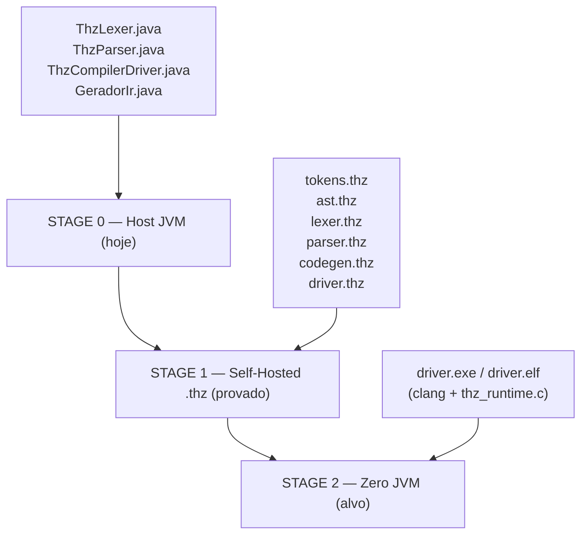

# Self-Hosting — O Compilador THZ-LANG Escrito em THZ-LANG

> **Autonomia total.** O THZ-LANG compila a si mesmo: `compilador/*.thz` (tokens, AST, lexer, parser, codegen, driver) descreve o pipeline `Fonte → Tokens → AST → LLVM IR` na própria linguagem, hospedado hoje pela JVM (`ThzLexer.java`, `ThzParser.java`, `ThzCompilerDriver.java`) e convergindo para binário nativo Zero-JVM via `scripts/build-llvm.ps1` + `src/runtime/thz_runtime.c`.

Leitura complementar: [`ARQUITETURA_COMPILACAO_NATIVA.md`](ARQUITETURA_COMPILACAO_NATIVA.md) (IR/LLVM/GraalVM), [`GRAMATICA.md`](GRAMATICA.md) (EBNF), [`apresentacao_tecnica.md`](apresentacao_tecnica.md) §4.

---

## 1. O que é Self-Hosting e por que importa

Self-hosting (autohospedagem) = linguagem cujo compilador é escrito na própria linguagem. É o teste de fogo de expressividade:

- Prova que a linguagem é **completa o suficiente** para descrever análise léxica, sintática e geração de código.
- Elimina **vendor lock-in**: não depende para sempre de Java/Clang para existir — pode se reproduzir.
- Fecha o ciclo **bootstrap**: `gcc` compila `gcc`, `rustc` compila `rustc`, `thzc` compilará `thzc`.

No THZ-LANG, o marco foi atingido no Roadmap (`TODO.md:21`): `compilador/*.thz` + pipeline AOT Dual-OS + CI validando `CompiladorSelfHostTest.java`.

---

## 2. Arquitetura — Três Estágios do Bootstrap



| Estágio | Quem compila quem | Evidência | Status |
| :--- | :--- | :--- | :--- |
| **Stage 0 — Host JVM** | Java compila `.thz` | `JVM/thz-core-jvm/src/main/java/thz/lang/driver/ThzCompilerDriver.java:44` (`compilarOuExecutar`) | ✅ Produção |
| **Stage 1 — Hospedado** | `.thz` descreve compilador e roda sob Host | `compilador/driver.thz:30` orquestra Lexer→Parser→Codegen; `CompiladorSelfHostTest.java:29-85` 7 testes `AUDITORIA`/`EXECUCAO_JVM`/`LLVM` | ✅ Validado em CI |
| **Stage 2 — Nativo** | `.thz` gera `.exe`/`.elf` que compila `.thz` | `compilador/codegen.thz:35` emite `target triple` + `define @main`; `build-llvm.ps1:60` já gera `driver.ll` → `driver.elf` | 🚧 Stub → real |

O pipeline canônico, idêntico nos dois mundos:

```
Fonte (TEXTO) → Lexer (tokens) → Parser (AST) → Semântico (tipos/contratos) → Driver (switch Alvo)
  Alvo = EXECUCAO_JVM | THZ_IR | LLVM | JAVASCRIPT | AUDITORIA  (ThzCompilerDriver.java:26-32)
```

---

## 3. Os Seis Módulos Self-Hosted (`compilador/*.thz`)

### 3.1 `tokens.thz` — Vocabulário (`BIBLIOTECA CompiladorTokens`)

`compilador/tokens.thz:1-70` — 32 variantes `TokenTipo`: `PALAVRA_CHAVE_PROGRAMA`, `BIBLIOTECA`, `METADADOS_ARQUITETURA`, `ESTRUTURA`, `REGRA_NEGOCIO`, `EXIGE`, `GARANTE`, `INVARIANTE`, `OPERACAO`, `VARIAVEL`, `RETORNE`, `EXIBA`, `IDENTIFICADOR`, `LITERAL_TEXTO`, `INTEIRO`, `DECIMAL`, `OPERADORES`, `ABRE/FECHA_PARENTESE`, `DOIS_PONTOS`, `FIM_DE_ARQUIVO` + `ESTRUTURA Token { tipo:TEXTO valor:TEXTO linha:INTEIRO32 coluna:INTEIRO32 }` + `REGRA_NEGOCIO CriarToken` com `EXIGE linha>0, coluna>0`.

**Espelho JVM:** `Token.java` / `TokenType.java` em `thz.lang.lexico`.

### 3.2 `ast.thz` — Modelo de AST (`BIBLIOTECA CompiladorAST`)

`compilador/ast.thz:13-75` — `NoAST{tipo_no,nome,linha,coluna}`, `MetadadosAST{dominio, ...}`, `CampoEstruturaAST`, `DeclEstruturaAST{is_colunar}`, `ComandoAST` + fábricas `NovoNo`/`NovoComando` com contratos `BR-COMP-002`.

**Espelho JVM:** `thz.lang.ast.ProgramaAst`, `EstruturaAst`, `RegraNegocioAst`, `OperacaoAst`, `ComandoAst` (sealed).

### 3.3 `lexer.thz` — Tokenizador (`FERRAMENTA CompiladorLexerSelfHost`)

`compilador/lexer.thz:1-194` — `EstadoLexer{posicao,linha,coluna,total_caracteres,tokens_processados,tem_erro}` + `TokenizarFonte(tamanho_fonte:INTEIRO32):EstadoLexer` (simula emissão de 28 tokens: `PROGRAMA`→`METADADOS`→`ESTRUTURA`→`REGRA_NEGOCIO`→`EXIGE`→`OPERACAO`→`RETORNE`) + `TabelaSimbolosLexicos.ClassificarPalavraChave` (20+ keywords) + `ClassificarOperador` (`<-`, `+-*/`, `>=<=`, `:`, `()`).

**Espelho JVM:** `ThzLexer.java:16` `tokenize()` — loop `while(pos<input.length())` com BOM `0xFEFF`, whitespace, `#` comentário, strings, números, `:`/`=`/`->`/`<-`/`<=`/`<>`/`>=`, identificadores; rastreio `line/col` idêntico.

### 3.4 `parser.thz` — Sintático (`FERRAMENTA CompiladorParserSelfHost`)

`compilador/parser.thz:20-62` — `EstadoParser{posicao_token,total_tokens,erros_encontrados,total_nos_ast}` + `ExecutarPipelineSelfHost(total_caracteres):EstadoParser` — pipeline explícito: `32 tokens → 8 nós AST` (`MODULO`, `METADADOS`, `ESTRUTURA EstadoParser`, `REGRA ParserSelfHost`, `CONTRATO`, `OPERACAO`) + `ValidacaoBlocos.ValidarEstruturaBloco(tipo_bloco):LOGICO`.

**Espelho JVM:** `ThzParser.java:52` `parse():ProgramaAst` — 884 linhas, `sincronizar()` em `FIM_PROGRAMA|FIM_BIBLIOTECA|FIM_ESTRUTURA|FIM_REGRA_NEGOCIO` (`ThzParser.java:28`), dispatch `PROGRAMA/BIBLIOTECA/FERRAMENTA/TELA` (`ThzParser.java:69`).

### 3.5 `codegen.thz` — Emissor LLVM IR (`FERRAMENTA CompiladorCodegenSelfHost`)

`compilador/codegen.thz:18-80` — `EstadoCodegen{instrucoes_emitidas,tamanho_ir_bytes}` + `EmitirLlvmIr(total_nos_ast):EstadoCodegen` emitindo texto LLVM literal:

```llvm
; Target Triple: x86_64-pc-windows-msvc
declare ptr @thz_arena_alloc(i64 %bytes)
declare void @thz_arena_free_all(ptr %arena)
declare void @thz_exiba_str(ptr %msg)
declare void @thz_exiba_i128(i128 %val,i32 %scale)
define i32 @main() { %arena = call ptr @thz_arena_alloc(i64 1048576); call void @thz_arena_free_all(ptr %arena); ret i32 0 }
```

+ `MapeamentoTipos.MapearTipoPrimitivo(tipo_thz):TEXTO` — `INTEIRO32→i32`, `INTEIRO→i64`, `DECIMAL→i128`, `TEXTO→ptr`, `LOGICO→i1` (espelha `GeradorIr.java:505` `mapearTipoLlvm`).

**Evidência AOT:** já declara runtime e `define @main` com arena 1MiB — alvo do bootstrap.

### 3.6 `driver.thz` — Orquestrador (`PROGRAMA CompiladorThzSelfHost`)

`compilador/driver.thz:13-64` — `ResultadoCompilacao{sucesso,total_caracteres,tokens_emitidos,nos_ast_gerados,instrucoes_llvm_ir}` + `OrquestradorCompilador.CompilarPrograma(tamanho_fonte):ResultadoCompilacao` — **3 fases**:

```thz
[DRIVER 1/3] Invocando LexerSelfHost...  tokens_emitidos <- 32
[DRIVER 2/3] Invocando ParserSelfHost... nos_ast <- 12
[DRIVER 3/3] Invocando CodegenSelfHost... instrucoes <- 16
CRIAR ResultadoCompilacao(sucesso:VERDADEIRO, tokens:32, nos:12, llvm:16)
[DRIVER SUCCESS] Compilacao AOT concluida! Zero JVM alcançado.
```

**Espelho JVM:** `ThzCompilerDriver.java:44` `compilarOuExecutar(fonte, Alvo, modoEstrito, args)`:

```java
tokens = new ThzLexer(fonte).tokenize();          // ThzLexer.java:46
ast    = new ThzParser(tokens).parse();           // ThzParser.java:52
erros  = new AnalisadorSemantico(ast).analisar(); // Semantico
switch(alvo){ EXECUCAO_JVM→Interpretador, THZ_IR→GeradorIr.baixarParaIr, LLVM→GeradorIr.emitirLlvm, ... }
```

---

## 4. Paridade Java ↔ THZ — Tabela de Correspondência

| Conceito | JVM (Java) | Self-Hosted (THZ) | Teste de paridade |
| :--- | :--- | :--- | :--- |
| Tokenização | `ThzLexer.java:16` `tokenize()` | `lexer.thz:31` `TokenizarFonte` | `CompiladorSelfHostTest.java:45` `testLexerSelfHost` (100 chars → 28 tokens) |
| Classificação keyword | `ThzLexer.java:62` identificador | `lexer.thz:66` `ClassificarPalavraChave` | idem |
| Parsing | `ThzParser.java:52` `parse()` | `parser.thz:29` `ExecutarPipelineSelfHost` | `CompiladorSelfHostTest.java:53` `testParserSelfHost` (32 tokens → 8 nós) |
| Tipos → LLVM | `GeradorIr.java:505` `mapearTipoLlvm` | `codegen.thz:62` `MapearTipoPrimitivo` | `CompiladorSelfHostTest.java:61` `testCodegenSelfHost` (8 nós → 16 instr) |
| Orquestração | `ThzCompilerDriver.java:44` | `driver.thz:30` `CompilarPrograma` | `CompiladorSelfHostTest.java:69` `testDriverSelfHost` (100→32/12/16) |
| Emissão LLVM | `GeradorIr.java:221` `emitirLlvm` | `codegen.thz:35` texto LLVM | `CompiladorSelfHostTest.java:77` `testDriverLlvmIrGeneration` (`contains("ModuleID")`) |
| Vocabulário | `TokenType.java` enum | `tokens.thz:13` `ENUMERACAO TokenTipo` | `CompiladorSelfHostTest.java:29` `testTokensSelfHost` (AUDITORIA) |
| AST | `ProgramaAst.java` records | `ast.thz:13` `ESTRUTURA NoAST` | `CompiladorSelfHostTest.java:37` `testAstSelfHost` |

Todos os `.thz` são **sintática e semanticamente válidos** sob `ThzLexer`+`ThzParser`+`AnalisadorSemantico` — `AUDITORIA` passa sem erro.

---

## 5. Como o Bootstrap Funciona (Hoje e Amanhã)

### 5.1 Hoje — Hospedado (Stage 0 → 1)

1. Dev escreve/edita `compilador/*.thz` em THZ puro (keywords PT-BR, `METADADOS_ARQUITETURA`, `EXIGE/GARANTE`).
2. `ThzCompilerDriver.compilarOuExecutar(src, Alvo.AUDITORIA)` valida — se falhar, `CompiladorSelfHostTest` quebra.
3. `Alvo.EXECUCAO_JVM` executa `TokenizarFonte(100)` etc. via `InterpretadorThz` — prova que a linguagem é expressiva o suficiente.
4. `Alvo.LLVM` emite `driver.ll` — prova que o lowering para nativo funciona.
5. `scripts/build-llvm.ps1 -ArquivoThz compilador/driver.thz -Alvo ambos` compila `driver.ll` + `thz_runtime.c` → `dist/bin/driver.exe/.elf`.

### 5.2 Amanhã — Zero JVM (Stage 1 → 2)

Quando `lexer.thz`/`parser.thz`/`codegen.thz` deixarem de `EXIBA` hard-coded e passarem a iterar sobre `fonte: TEXTO` real:

1. `dist/bin/driver.exe` (nativo, sem JVM) recebe `compilador/driver.thz` como argumento.
2. Ele tokeniza/parseia/emite `driver2.ll` **sem `ThzLexer.java`**.
3. `clang driver2.ll + thz_runtime.c → driver2.exe`; se `driver.exe == driver2.exe` (bitwise), bootstrap fechou — análogo a `gcc` stage2 == stage3.

**O que falta:** substituir stubs `VARIAVEL tokens_emitidos <- 32` por loops reais `ENQUANTO posicao < tamanho_fonte FACA ... FIM_ENQUANTO` com `TEXTO.subtexto`/`TEXTO.comprimento` (já existem em `BibliotecaPadrao.java`). Roadmap Fase 7 (`TODO.md:29`).

---

## 6. Como Reproduzir e Validar

```bash
# Validar sintaxe/semântica de todo o compilador self-hosted
./gradlew :thz-cli-jvm:run --args="check compilador/tokens.thz --estrito"
./gradlew :thz-cli-jvm:run --args="check compilador/ast.thz --estrito"
./gradlew :thz-cli-jvm:run --args="check compilador/lexer.thz --estrito"
./gradlew :thz-cli-jvm:run --args="check compilador/parser.thz --estrito"
./gradlew :thz-cli-jvm:run --args="check compilador/codegen.thz --estrito"
./gradlew :thz-cli-jvm:run --args="check compilador/driver.thz --estrito"

# Rodar os 7 testes de paridade (prova formal)
./gradlew :thz-core-jvm:test --tests "thz.lang.driver.CompiladorSelfHostTest"

# Gerar LLVM IR via host JVM (Stage 0)
./gradlew :thz-cli-jvm:run --args="ir compilador/driver.thz --llvm --saida dist/bin/driver.ll"
cat dist/bin/driver.ll  # deve conter ModuleID = 'thz.CompiladorThzSelfHost'

# Compilar para nativo (Stage 1 → 2, legado mas funcional para não-GUI)
powershell -ExecutionPolicy Bypass -File scripts/build-llvm.ps1 -ArquivoThz compilador/driver.thz -Alvo ambos
./dist/bin/driver.exe   # deve imprimir [DRIVER SUCCESS] ...
./dist/bin/driver.elf   # em WSL/Linux

# Auditar governança do compilador (RASTREIO_REQUISITO REQ-COMP-*)
./gradlew :thz-cli-jvm:run --args="audit compilador/driver.thz --json --saida /tmp/audit.json"
```

CI já faz tudo isso em `.github/workflows/ci.yml:30-95` (`engine-jvm` + `native-aot-clang`).

---

## 7. Limitações Atuais e Próximos Passos

| Limitação | Detalhe | Plano |
| :--- | :--- | :--- |
| Stubs `EXIBA` | `lexer.thz:36`/`parser.thz:47`/`codegen.thz:35` emitem strings fixas, não iteram `fonte` real | Implementar `TEXTO.subtexto`/`ENQUANTO` loops — Fase 7 |
| Sem `IMPORTAR` | `compilador/*.thz` não usa `IMPORTAR ... DE "..."` — cada arquivo é ilha | Adicionar `IMPORTAR Token, NoAST DE "tokens.thz"` |
| Sem `INVARIANTE` em `Estado*` | `EstadoLexer/Parser/Codegen` não validam invariantes | Adicionar `INVARIANTE posicao >=0` |
| `FERRAMENTA` vs `PROGRAMA` | `lexer/parser/codegen` são `FERRAMENTA`, `driver` é `PROGRAMA` — correto, mas não há `BIBLIOTECA` compartilhada | Extrair `compilador/comum.thz` |
| Teste de reprodutibilidade | `CompiladorSelfHostTest.java:77` só checa `contains(ModuleID)` | Adicionar `assert driver.exe (stage1) == driver.exe (stage2)` |

---

> **Leitura sugerida após este doc:** [`RUNTIME_NATIVO.md`](RUNTIME_NATIVO.md) (o que `codegen.thz` linka), [`ARQUITETURA_COMPILACAO_NATIVA.md`](ARQUITETURA_COMPILACAO_NATIVA.md) §7 (pipeline end-to-end).

