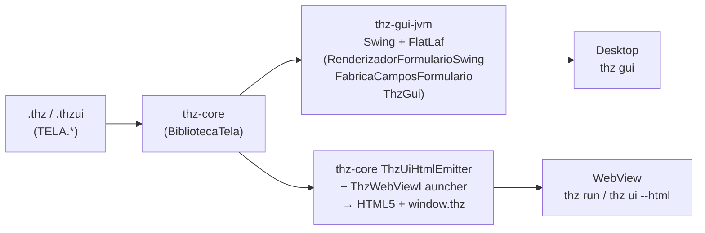

# TELA / .thzui — DSL Declarativa de Interfaces Gráficas

> **Arquétipo visual nativo.** `TELA` (e arquivos `.thzui`) é o arquétipo da linguagem para UIs declarativas — formulários, dashboards e apps visuais escritos em THZ puro, renderizáveis em **Swing + FlatLaf (Desktop)** e **WebView/HTML5 (navegador)** a partir do mesmo fonte, com governança (`METADADOS_ARQUITETURA`, `RASTREIO_REQUISITO`) e binding reativo a `ESTRUTURA` e `REGRA_NEGOCIO`.

Referências: [`GRAMATICA.md`](GRAMATICA.md) §1, [`MANUAL_LINGUAGEM.md`](MANUAL_LINGUAGEM.md) §11, `exemplos/*.thzui`, `exemplos/*_gui.thz`, `JVM/thz-gui-jvm/src/main/java/thz/lang/gui/`.

---

## 1. Sintaxe — Arquétipo e Terminador

```ebnf
ArquetipoModulo  ::= "TELA" IDENTIFICADOR
TerminadorModulo ::= "FIM_TELA"
Declaracao       ::= Importacao | DeclaracaoEstrutura | DeclaracaoEnum | RegraNegocio | Procedimento
Procedimento     ::= "PROCEDIMENTO" IDENTIFICADOR "(" Parametros? ")" (":" TipoDado)? BlocoCodigo "FIM"
BlocoCodigo      ::= "INICIO" Comando*   // inclui chamadas TELA.*, WEBVIEW.*, UI.*
```

`TELA` compila como `PROGRAMA` — `ThzParser.java:69` despacha `TELA` como módulo, `AnalisadorSemantico.java` valida `ESTRUTURA`/`REGRA_NEGOCIO` e `BibliotecaTela.registrar()` injeta `TELA.*` no stdlib.

**Arquivos:**
- `*.thz` com `TELA`/`PROGRAMA VISUAL` — `exemplos/cadastro_produto_gui.thz` (115 linhas), `hello_world_gui.thz`, `pedido_vendas_gui.thz`, `showcase_widgets_gui.thz`, `simulador_credito_gui.thz`
- `*.thzui` — DSL pura de tela: `exemplos/faturamento_dashboard.thzui` (22 linhas), `thz_studio_ide.thzui` (26 linhas)

Ambos aceitos por `thz check`, `thz run`, `thz ui` e `thz ir`.

---

## 2. Exemplo Mínimo — Dashboard em 22 linhas

`exemplos/faturamento_dashboard.thzui:1`:

```thz
TELA DashboardFaturamento

METADADOS_ARQUITETURA
    DOMINIO: "Vendas"
    CAMADA: "Apresentacao"
FIM_METADADOS

PROCEDIMENTO MontarInterface()
INICIO
    TELA.criarContainer("raiz", "CONTAINER")
    TELA.criarCard("card_faturamento", "Gestão de Faturamento & Métricas")
    TELA.adicionarMetrica("kpi_receita", "Receita Diária", "R$ 1.450.000,00")
    TELA.adicionarCampoTexto("txt_cliente", "Cliente", "Filtrar por razão social...")
    TELA.adicionarCampoMoeda("txt_valor_min", "Valor Mínimo", "BRL")
    TELA.adicionarBotao("btn_filtrar", "Filtrar Resultados", "AplicarFiltro")
    TELA.exibir("DashboardFaturamento")
FIM

FIM_TELA
```

```bash
./gradlew :thz-cli-jvm:run --args="check exemplos/faturamento_dashboard.thzui"
./gradlew :thz-cli-jvm:run --args="ui exemplos/faturamento_dashboard.thzui --html" > /tmp/dash.html && open /tmp/dash.html
./gradlew :thz-cli-jvm:run --args="run exemplos/faturamento_dashboard.thzui" # abre WebView
```

---

## 3. Componentes — Referência de `TELA.*`

Registrados por `JVM/thz-gui-jvm/src/main/java/thz/lang/gui/BibliotecaTela.java:1` (`BibliotecaTela.registrar()`) e `JVM/thz-core-jvm/src/main/java/thz/lang/interpretador/BibliotecaPadrao.java:12`.

| Procedimento | Assinatura THZ | O que faz | Render Swing | Render HTML |
| :--- | :--- | :--- | :--- | :--- |
| `criarContainer` | `(id:TEXTO, tipo:TEXTO)` | Root/layout | `JPanel` | `<div class="container">` |
| `criarCard` | `(id:TEXTO, titulo:TEXTO)` | Card com título | `JPanel` + `Border` | `<section class="card">` |
| `adicionarMetrica` | `(id, rotulo, valor:TEXTO)` | KPI | `JLabel` grande | `<div class="metric">` |
| `adicionarCampoTexto` | `(id, rotulo, placeholder:TEXTO)` | Input texto | `JTextField` | `<input type="text">` |
| `adicionarCampoMoeda` | `(id, rotulo, moeda:TEXTO)` | Input monetário ISO 4217 | `JFormattedTextField` | `<input data-moeda>` |
| `adicionarBotao` | `(id, rotulo, operacao:TEXTO)` | Botão → `REGRA_NEGOCIO` | `JButton` + `ActionListener` | `<button onclick="window.thz.operacao">` |
| `adicionarMetrica` | `(id, rotulo, valor)` | Métrica | — | — |
| `exibir` | `(nomeTela:TEXTO)` | Monta e mostra | `ThzGui` + `RenderizadorFormularioSwing` | `ThzUiHtmlEmitter` |
| `renderizarFormulario` | `(registro:REGISTRO, operacao:TEXTO):TEXTO` | Gera form a partir de `ESTRUTURA` | `FabricaCamposFormulario.java` | `ThzUiMaker.java` |
| `alerta`/`confirmar`/`pedirTexto` | `(titulo, mensagem:TEXTO)` | Diálogos | `JOptionPane` | `alert/confirm/prompt` |

**PPIs adicionais (via `exemplos/cadastro_produto_gui.thz:1`):** `TELA.renderizarFormulario(form,"GestaoEstoque.SalvarProduto")` — gera campos automaticamente de `ESTRUTURA Produto LAYOUT_COLUNAR` + valida `INVARIANTE`.

### 3.1 Namespaces irmãos

- `WEBVIEW.*` (`MANUAL_LINGUAGEM.md:554`): `iniciar(html:TEXTO):TEXTO`, `emitir(evento, json)`, `parar()` — ponte `window.thz` bidirecional.
- `UI.*` (`MANUAL_LINGUAGEM.md:567`): `temaPadrao()`, `renderizarHtml(titulo, botaoAcao)`, `gerarCodigo(nomeApp)` — gera `.thzui` a partir de `ThzUiMaker`.

---

## 4. Dois Renderizadores — Mesmo Fonte, Dois Alvos



| Dimensão | Swing + FlatLaf (`thz gui`) | WebView/HTML5 (`thz run`/`thz ui --html`) |
| :--- | :--- | :--- |
| Engine | `JVM/thz-gui-jvm` (`ThzGui.java`, `EditorThz.java`, `Gutter.java`, `RenderizadorFormularioSwing.java`, `FabricaCamposFormulario.java`, `ExportadorFormularioGui.java`) | `ThzUiHtmlEmitter` + `ThzWebViewLauncher.java` + `ThzWebViewBridge.java` + `thz_webview2.c` |
| Tema | FlatLaf Dark/Light Glassmorphism (`com.formdev:flatlaf:3.5.4`, `thz-gui-jvm/build.gradle.kts:34`) | CSS Glassmorphism (`ThzUiHtmlEmitter`) |
| Janela | `JFrame` nativo (GraalVM `-Djava.awt.headless=false`, `thz-gui-jvm/build.gradle.kts:52`) | `Edge --app` ou `ThzWebView2ComHost` (COM sem `--app`, `ThzWebViewLauncher.java:65`) |
| Eventos | `JButton.addActionListener → Operacao` | `window.thz.operacao → ThzWebViewBridge.emitir` |
| Nativo | `thz-gui.exe` via `nativeCompile` (precisa `reflect-config.json` via `guiColetarMetadadosAgente:90`) | `thz.exe` + `thz_webview2.c` (`LoadLibraryA WebView2Loader.dll`, `thz_webview2.c:42`) |
| Quando usar | IDE `thz gui`, apps desktop instalados via `jpackage` | `thz run *.thzui`, `thz ui --html > out.html`, serverless |

**Reatividade:** `RenderizadorFormularioSwing` constrói `JPanel` reativo validando `EXIGE/GARANTE` do `REGRA_NEGOCIO` alvo do botão; `ThzUiHtmlEmitter` injeta `fetch(/api/run)` para mesma regra.

---

## 5. Padrões — Da Estrutura ao Formulário

### 5.1 Geração automática de formulário

```thz
ESTRUTURA Produto LAYOUT_COLUNAR
    sku        : TEXTO
    nome       : TEXTO
    quantidade : NATURAL32
    preco      : DECIMAL(12, 2)
    INVARIANTE preco >= 0.00
    INVARIANTE quantidade >= 0
FIM_ESTRUTURA

REGRA_NEGOCIO GestaoEstoque
    OPERACAO SalvarProduto(p: Produto): RESULTADO[TEXTO,TEXTO]
    INICIO
        EXIGE: p.preco >= 0.00
        FALHAR_COM("Preço inválido")  # se violar
        RETORNAR RESULTADO("Salvo: " + p.sku)
    FIM
FIM_REGRA_NEGOCIO

# Em TELA:
TELA.renderizarFormulario(produto, "GestaoEstoque.SalvarProduto")
# → Swing: FabricaCamposFormulario cria JTextField/JFormattedTextField por campo + valida INVARIANTE
# → HTML:  <input data-tipo="DECIMAL(12,2)" data-invariante="preco>=0.00">
```

### 5.2 Dashboard corporativo (`thz_studio_ide.thzui:1`)

```thz
TELA ThzStudioIde

METADADOS_ARQUITETURA
    DOMINIO: "EngenhariaFerramentas"
    CAMADA: "Apresentacao"
FIM_METADADOS

ESTRUTURA PainelIde LAYOUT_COLUNAR
    id    : TEXTO
    titulo: TEXTO
FIM_ESTRUTURA

PROCEDIMENTO MontarInterface()
INICIO
    TELA.criarContainer("ide_root", "CONTAINER")
    TELA.criarCard("card_editor", "Editor THZ-LANG")
    TELA.adicionarBotao("btn_run", "Executar", "ThzGui.Executar")
    TELA.exibir("ThzStudioIde")
FIM

FIM_TELA
```

### 5.3 Hello World GUI (`exemplos/hello_world_gui.thz`)

```thz
PROGRAMA VISUAL HelloWorldGui
TELA.criarContainer("root","CONTAINER")
TELA.adicionarBotao("btn","Clique aqui","HelloWorldGui.DizerOla")
TELA.exibir("HelloWorldGui")
FIM_PROGRAMA
# → thz run hello_world_gui.thz  abre janela WebView com botão → chama DizerOla → thz_exiba_str / MessageBoxA
```

---

## 6. CLI — Comandos TELA

```bash
# Validar
./gradlew :thz-cli-jvm:run --args="check exemplos/faturamento_dashboard.thzui --estrito"

# Renderizar para HTML estático
./gradlew :thz-cli-jvm:run --args="ui exemplos/faturamento_dashboard.thzui --html" > dashboard.html

# Rodar (abre WebView)
./gradlew :thz-cli-jvm:run --args="run exemplos/cadastro_produto_gui.thz"

# Abrir IDE (edita .thz/.thzui com gutter + FlatLaf)
./gradlew :thz-gui-jvm:run --args=""  # ou thz gui
./gradlew gui

# Nativo (após jpackage/nativeCompile)
dist/thz/bin/thz.exe run exemplos/faturamento_dashboard.thzui
dist/thz/bin/thz-gui.exe
```

`CLI_E_TOOLING.md:23` tabela `thz ui --html`, `thz gui`.

---

## 7. Nativo e `build-llvm.ps1` — Por que `_gui` é bloqueado

`scripts/build-llvm.ps1:1-8` está **DEPRECIADO Fase 3** para GUI — Win32 `thz_runtime.c:144` gerava janela feia/truncada. O script bloqueia `*_gui.thz` sem `-ForceLegado` (`build-llvm.ps1:38`).

**Padrão:**

- `PROGRAMA NEGOCIO`/`PIPELINE_DADOS` → `build-llvm.ps1` ✅ (LLVM AOT puro)
- `TELA`/`PROGRAMA VISUAL` → `thz run`/`thz gui` (WebView) + `scripts/package-all.ps1` (`jpackage` com `thz_webview2.c`) ✅
- Forçar legado: `build-llvm.ps1 -ArquivoThz exemplo_gui.thz -ForceLegado` → `-mwindows` (`build-llvm.ps1:82`) sem console, mas feio.

---

## 8. Resolução de Problemas (Troubleshooting)

| Sintoma | Causa | Solução |
| :--- | :--- | :--- |
| `thz run *.thzui` não abre janela | `WebView2Loader.dll` ausente | Instale Edge WebView2 Runtime; `thz_webview_loader_status()` (`thz_webview2.c:74`) |
| `thz gui` branco/sem tema | `reflect-config.json` desatualizado | `./gradlew :thz-gui-jvm:guiColetarMetadadosAgente` e recommit `META-INF/native-image` |
| `TELA.renderizarFormulario` não valida | `INVARIANTE` sem `EXIGE` na `OPERACAO` | Adicione `EXIGE preco>=0` + `RASTREIO_REQUISITO` |
| `thz check *.thzui` falha | `FIM_TELA` ausente | `TELA` exige `FIM_TELA` (`GRAMATICA.md:24`) |

---

> **Próximo:** [`DEPLOYMENT.md`](DEPLOYMENT.md) (como distribuir `.thzui` via `jpackage`), [`RUNTIME_NATIVO.md`](RUNTIME_NATIVO.md) (o que `thz_webview2.c` linka).

