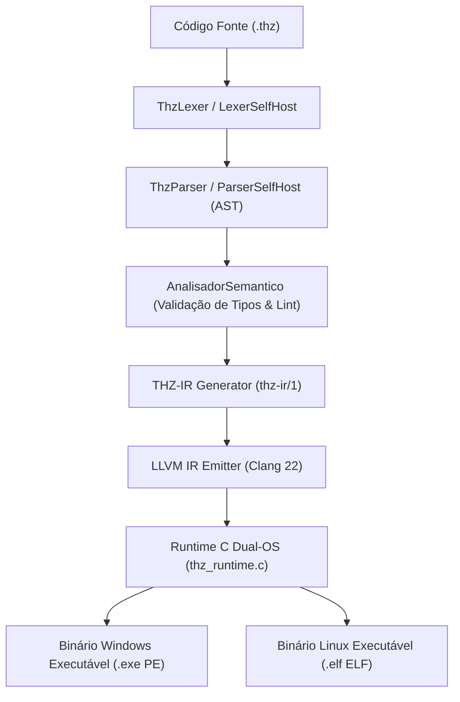

# ⚡ THZ-LANG — Apresentação Técnica Deep Dive (Engenharia & Arquitetura)

**Arquitetura Interna, Motor de Compilação AOT, Semântica SIMD/SoA, Runtime Dual-OS e Self-Hosting**

> **Aprofundamento:** para o tratado completo sobre GraalVM, LLVM, IR/IL, geração de código nativo, velocidade e execução segura, consulte [`ARQUITETURA_COMPILACAO_NATIVA.md`](ARQUITETURA_COMPILACAO_NATIVA.md).

---

## 1. Visão Geral da Arquitetura do Sistema

O **THZ-LANG** é composto por uma arquitetura de compilação multi-camada que conecta a especificação gramatical EBNF (v2.4) à geração de código nativo de alta performance via **LLVM IR (Clang 22)** e **Self-Hosting em `.thz`**.



---

## 2. Pilares de Engenharia de Sistemas

### A. Engenharia Orientada a Dados (DoD): Layout Colunar & SIMD
O THZ-LANG abstrai estruturas contíguas no padrão **Structure of Arrays (SoA)** através do modificador `LAYOUT_COLUNAR`, permitindo vetorização SIMD direta (AVX2/AVX-512):

```thz
ESTRUTURA ItemFatura LAYOUT_COLUNAR
    id_transacao       : UUID
    codigo_produto     : TEXTO
    quantidade         : NATURAL32
    valor_unitario     : DECIMAL(12, 4)
    valor_total_liquido: DECIMAL(14, 4)
    INVARIANTE valor_total_liquido >= 0.0000
FIM_ESTRUTURA

# Laço vetorizado com passo SIMD explícito
VETORIZAR_PARA item EM itens PASSO_SIMD 8
    item.valor_total_liquido <- item.quantidade * item.valor_unitario
FIM_PARA
```

> [!TIP]
> **SIMD Vectorization Rules (R1–R5):** O verificador formal em `src/simd.ts` e `thz.lang.simd` garante que laços decorados com `VETORIZAR_PARA` não possuam dependências cruzadas de iteração nem I/O impuro, emitindo vetores SIMD diretamente no LLVM IR.

### B. Gerenciamento de Memória Efêmera em Arenas $O(1)$
Para mitigar paus de Garbage Collection e fragmentação de Heap, operações em lote utilizam blocos contíguos em **Arena** (`USAR_BLOCO_MEMORIA`):
- **Alocação:** Alocador sequencial com avanço de ponteiro em $O(1)$.
- **Descarte:** Liberação total do bloco contíguo em $O(1)$ (`thz_arena_free_all`).

### C. Aritmética Exata de Domínio (ISO/IEC 10967)
Proibição absoluta de tipos `float`/`double` IEEE 754 binários.
- **Representação:** Inteiros escalados paramétricos de 128 bits (`i128`).
- **Arredondamento:** Meio-par bancário padrão (*Half-Even* / ISO 4217).

---

## 3. Pipeline AOT Nativo Dual-OS & Self-Hosting

```
┌────────────────────────────────────────────────────────────────────────┐
│                      PIPELINE AOT DUAL-OS (LLVM)                       │
├────────────────────────────────────────────────────────────────────────┤
│ 1. Fonte .thz  ➔  Lexer & Parser AST                                   │
│ 2. AST         ➔  Geração de LLVM IR (.ll)                             │
│ 3. LLVM IR     ➔  Clang 22 (Assemble para objeto .o)                   │
│ 4. Objeto .o   ➔  GCC + thz_runtime.c (Linking Nativo PE/ELF)          │
└────────────────────────────────────────────────────────────────────────┘
```

### Runtime Nativo C Dual-OS ([`src/runtime/thz_runtime.c`](file:///c:/Users/lucas/Projetos/thz-lang/src/runtime/thz_runtime.c))
A camada de runtime em C oferece suporte transparente para compiladores Windows e Linux:

```c
#ifdef _WIN32
  /* Win32 API Direct Calls (Zero MSVC C-Runtime Overhead) */
  __declspec(dllexport) void* thz_arena_alloc(uint64_t bytes) {
      ThzArena* arena = (ThzArena*) HeapAlloc(GetProcessHeap(), 0, sizeof(ThzArena));
      arena->buffer = (uint8_t*) HeapAlloc(GetProcessHeap(), 0, bytes);
      return (void*) arena;
  }
#else
  /* POSIX / Linux System Implementation */
  void* thz_arena_alloc(uint64_t bytes) {
      ThzArena* arena = (ThzArena*) malloc(sizeof(ThzArena));
      arena->buffer = (uint8_t*) malloc(bytes);
      return (void*) arena;
  }
#endif
```

---

## 4. O Compilador Self-Hosted em `.thz`

O ecossistema conta com uma suíte completa do compilador escrita na própria linguagem THZ ([`JVM/thz-core-jvm/exemplos/compilador/`](file:///c:/Users/lucas/Projetos/thz-lang/JVM/thz-core-jvm/exemplos/compilador)):

| Módulo | Tipo de Módulo | Função Arquitetural |
| :--- | :--- | :--- |
| **`tokens.thz`** | `BIBLIOTECA` | Enumeração `TokenTipo` e Estrutura `Token` |
| **`ast.thz`** | `BIBLIOTECA` | Estruturas de nós de Árvore de Sintaxe Abstrata (`NoAST`) |
| **`lexer.thz`** | `FERRAMENTA` | Analisador léxico e tokenizador de código-fonte |
| **`parser.thz`** | `FERRAMENTA` | Analisador sintático e construtor de AST |
| **`codegen.thz`** | `FERRAMENTA` | Gerador de representação intermediária LLVM IR |
| **`driver.thz`** | `PROGRAMA` | Orquestrador principal da auto-compilação |

---

## 5. Tooling & Execução de Scripts AOT

```powershell
# 1. Compilação AOT para Windows PE (.exe):
powershell.exe -ExecutionPolicy Bypass -File scripts/build-llvm.ps1 -ArquivoThz JVM/thz-core-jvm/exemplos/compilador/driver.thz -Alvo windows

# 2. Cross-compilação AOT para Linux ELF (.elf):
powershell.exe -ExecutionPolicy Bypass -File scripts/build-llvm.ps1 -ArquivoThz JVM/thz-core-jvm/exemplos/compilador/driver.thz -Alvo linux

# 3. Suíte de Testes Automatizada (JUnit 5 + Node Test Runner):
./gradlew test
```

---

## 🧪 6. Matriz de Cobertura de Testes Automatizados

```text
CompiladorSelfHostTest > testTokensSelfHost()       PASSED
CompiladorSelfHostTest > testAstSelfHost()          PASSED
CompiladorSelfHostTest > testLexerSelfHost()        PASSED
CompiladorSelfHostTest > testParserSelfHost()       PASSED
CompiladorSelfHostTest > testCodegenSelfHost()      PASSED
CompiladorSelfHostTest > testDriverSelfHost()       PASSED
CompiladorSelfHostTest > testDriverLlvmIr()         PASSED

========================================================================
BUILD SUCCESSFUL in 10s
112 unit tests completed, 0 failures (100% PASSED)
========================================================================
```
